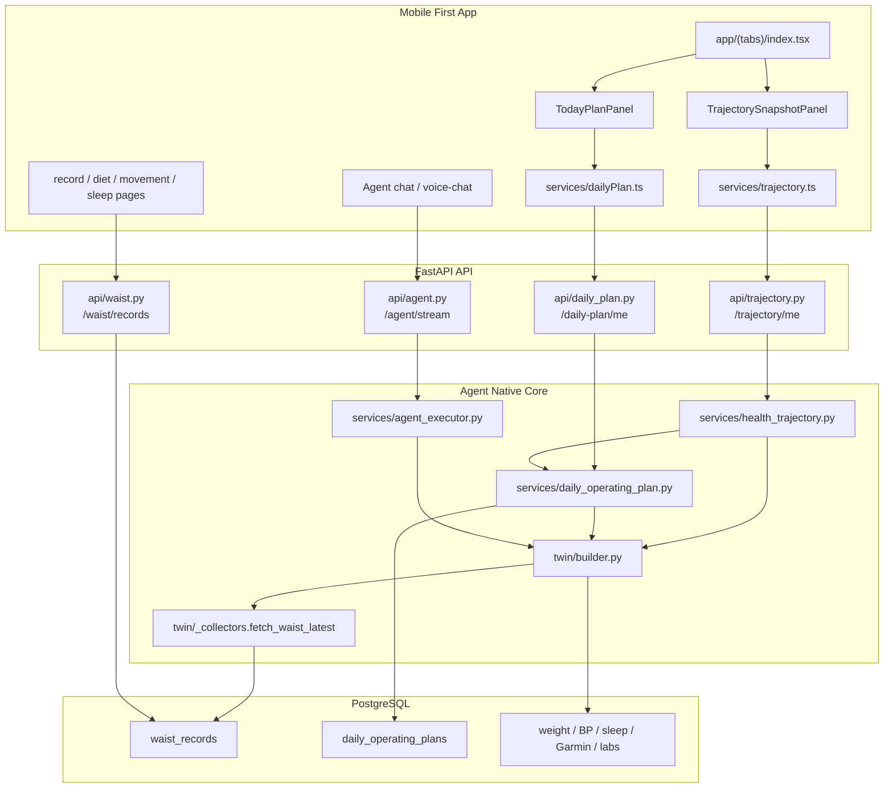
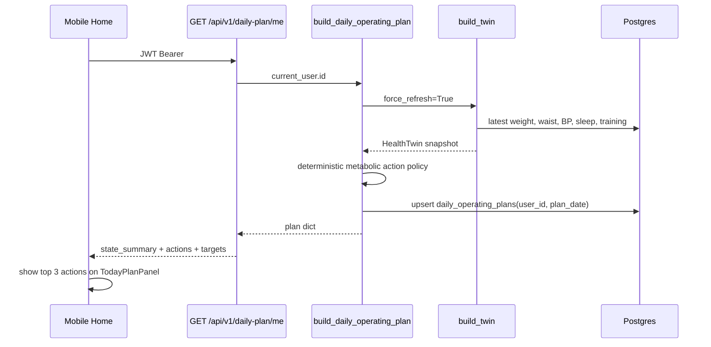
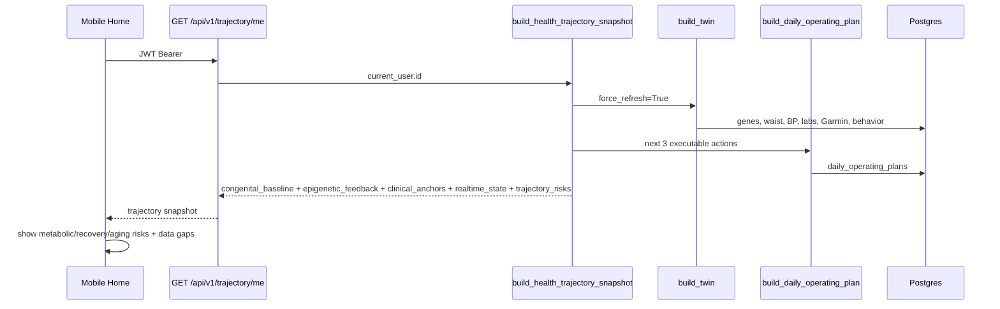
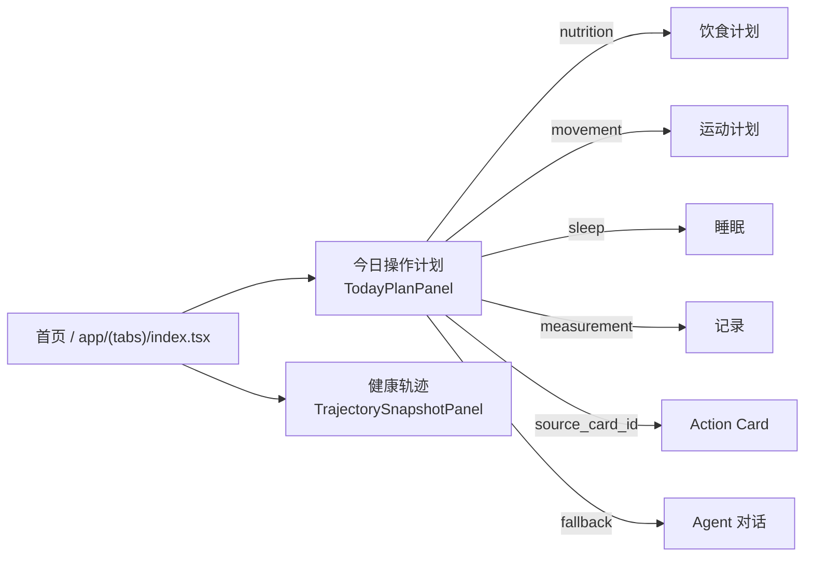

# Personal Health Trajectory Agent 架构记录

**日期**: 2026-05-15  
**状态**: Phase 0 已落地, Trajectory Snapshot 已接入
**目标**: 疾病上游 Personal Health Trajectory Agent, Mobile First, Agent Native, 先聚焦代谢健康、恢复能力和衰老速度。

---

## 1. 产品北极星

本项目的长期形态是疾病上游的 Personal Health Trajectory Agent: 以基因作为先天底图, 以甲基化作为长期健康轨迹反馈, 以体检指标作为临床锚点, 以可穿戴数据作为实时状态感知, 以饮食、运动、睡眠、情绪和环境数据作为可干预变量, 持续构建每个人的身体数字孪生。

第一阶段聚焦代谢健康、恢复能力和衰老速度:

- 体重、腰围、BMI、血压、血脂、血糖、睡眠、训练表现。
- HRV、训练准备度、睡眠债、压力和恢复敏感基因。
- 甲基化暂作为显式 data gap, 后续接入后用于校验 8-12 周干预是否改变长期轨迹。
- 每天产出可执行计划: 吃什么、怎么练、怎么睡、补什么、什么时候需要咨询医生。
- 不替代医生, 而是在疾病形成之前识别风险轨迹, 做日常健康管理入口、医生决策前后的数据助手和长期执行系统。

核心度量沿用 WSCLA: Weekly Safe Closed-Loop Actions, 即每周用户完成“建议 -> 执行 -> 反馈 -> 下次调整”的安全闭环次数。

---

## 2. 已落地代码边界

### Backend

| 模块 | 文件 | 职责 |
|---|---|---|
| 腰围记录 | `backend/app/models/waist.py` | `WaistRecord` 存储用户腰围、日期、来源、备注 |
| 腰围 API | `backend/app/api/waist.py` | `/api/v1/waist/records*` 当前用户 CRUD + latest + stats |
| Daily Operating Plan | `backend/app/models/daily_operating_plan.py` | 保存每日操作计划快照 |
| 计划生成服务 | `backend/app/services/daily_operating_plan.py` | 从 Twin 生成代谢健康行动清单; 每条 action 带证据等级、置信度和科学边界 |
| 计划 API | `backend/app/api/daily_plan.py` | `GET /api/v1/daily-plan/me` |
| Trajectory API | `backend/app/api/trajectory.py` | `GET /api/v1/trajectory/me` |
| Trajectory service | `backend/app/services/health_trajectory.py` | 基因底图、甲基化缺口、临床锚点、实时状态、可干预变量、next actions; 每条 risk 带证据等级、置信度和科学边界 |
| Twin 扩展 | `backend/app/twin/schema.py`, `_collectors.py`, `builder.py` | `body_composition` 加腰围、腰高比、中心性肥胖标记 |
| Agent bugfix | `backend/app/services/agent_executor.py` | `extra_context` 流程前置初始化 `sources_used` |
| 迁移 | `backend/migrations/create_waist_and_daily_operating_plans.sql` | PostgreSQL 建表和索引 |

### Mobile

| 模块 | 文件 | 职责 |
|---|---|---|
| Daily Plan service | `mobile/services/dailyPlan.ts` | 拉取 `/daily-plan/me`, 归一化 actions |
| Today Plan UI | `mobile/components/dashboard/TodayPlanPanel.tsx` | 首页展示今日优先行动、腰围/BP 状态提示 |
| Trajectory service | `mobile/services/trajectory.ts` | 拉取 `/trajectory/me`, 排序 high/attention/unknown risk |
| Trajectory UI | `mobile/components/dashboard/TrajectorySnapshotPanel.tsx` | 首页展示代谢/恢复/衰老速度轨迹和 data gaps |
| 首页接入 | `mobile/app/(tabs)/index.tsx` | React Query 拉计划, 刷新联动, action 路由分发 |
| Service test | `mobile/services/__tests__/dailyPlan.test.ts` | 覆盖 API 调用与 top actions 选择 |

### Tests

| 文件 | 覆盖 |
|---|---|
| `backend/tests/test_waist_and_daily_plan.py` | 腰围 create/list/upsert、Twin 腰围字段、Daily Plan API |
| `backend/tests/test_health_trajectory.py` | `/trajectory/me` 聚合基因/甲基化缺口/临床锚点/next actions |
| `backend/tests/test_health_record_amount_regression.py` | `extra_context` 入口不会在首个 SSE event 前崩溃 |
| `mobile/services/__tests__/dailyPlan.test.ts` | Daily Plan mobile service |
| `mobile/services/__tests__/trajectory.test.ts` | Trajectory mobile service + risk 排序 |

---

## 3. 当前架构图

---

## 4. Daily Operating Plan 数据流

## 4.1 Personal Health Trajectory Snapshot 数据流

当前甲基化还没有数据模型, 但在 `epigenetic_feedback` 中作为显式缺口返回。这样后续接入甲基化报告时, 不需要重做移动端产品语义。

设计约束:

- `DailyOperatingPlan` 是当天计划快照, 当前版本是确定性规则生成, 后续可在同一数据契约内接 LLM 裁决。
- `build_daily_operating_plan` 每次请求都会 fresh build Twin, 避免首页显示旧状态。
- 腰围属于代谢健康的核心客观指标, 写入后会调用 `invalidate_twin_cache(user_id)`。
- 所有 API 均使用 `get_current_user_required`, 查询必须带 `user_id`。
- Push 不能绕过 Agent 的当日恢复判断: 如果趋势分析说“运动不足”, 但 readiness/HRV/睡眠/Body Battery 或已接受行动卡显示恢复优先, push 必须改写为恢复一致文案。
- quiet-hours delayed 队列必须先去重再排队, flush 历史队列时也要折叠同 key 重复项, 避免 08:30 同一提醒连发。

## 4.2 证据等级与科学边界契约

从 2026-05-15 起, Agent 面向用户的风险和行动必须显式标注科学边界:

| 字段 | 值域 | 用途 |
|---|---|---|
| `evidence_tier` | `clinical_guideline` / `strong_behavioral` / `wearable_proxy` / `genetic_association` / `experimental` | 说明依据类型, 避免把代理指标包装成确定性结论 |
| `confidence` | `high` / `medium` / `low` | 说明当前个体数据下的置信度 |
| `claim_boundary` | 文本 | 明确“不替代医生诊断、处方或治疗”, 并说明不能推断什么 |

当前映射:

- 代谢风险: 有腰围、BMI、血压、血糖、血脂等临床锚点时为 `clinical_guideline/high`; 只有基因信号时降为 `genetic_association/low`。
- 恢复风险: 有 HRV、睡眠、readiness 等设备数据时为 `wearable_proxy/medium`; 只有恢复相关基因时为 `genetic_association/low`。
- 衰老速度: 甲基化当前为 `experimental/low`, 只作为长期代理指标和 data gap, 不能证明个体短期干预成效。
- Daily Plan: 腰围/体重测量为 `clinical_guideline/high`; 活动、蛋白、睡眠行为为 `strong_behavioral`; 基于可穿戴恢复状态调节训练为 `wearable_proxy/medium`。

---

## 5. 移动端功能地图

首页现在不是“纯 dashboard”, 而是把每日可执行计划放到第一屏:

1. `EnvironmentCard` 给当天外部约束。
2. `TodayPlanPanel` 给代谢健康的 1-3 个优先动作。
3. `TrajectorySnapshotPanel` 给疾病上游轨迹: 代谢健康、恢复能力、衰老速度与数据缺口。
4. Chat 流承接解释、调整、追问。

---

## 6. 下一阶段缺口

| 阶段 | 缺口 | 推荐实现 |
|---|---|---|
| Phase 1 | 饮食/睡眠/运动/体检/Twin 页面进入 Agent 时仍有入口缺少结构化 context | 抽 `mobile/utils/agentContext.ts`, 每个入口序列化当前页态并传 `extra_context` |
| Phase 1 | Daily Plan 只读, 用户尚不能确认、调整、完成行动 | 加 action outcome 写回, 复用 ActionCard outcome 或新增 plan action event |
| Phase 1 | 腰围移动端录入入口还未显式上首页/record tab | 在 record tab 加 waist quick input, 对接 `/waist/records` |
| Phase 1 | 甲基化只是 data gap, 尚无报告模型 | 新增 methylation report model/import/parser, 接入 `epigenetic_feedback` |
| Phase 2 | L2 一键下单尚未接入 | `MenuShareCard` 增 order_suggestions + OTA-friendly URL scheme |
| Phase 3 | WSCLA 闭环缺分享/下单/执行漏斗 | 统一 `intervention_event`, Celery 回看 diet/exercise/checkin 命中 |
| 医生协作 | 医生视图和导出摘要尚未形成稳定契约 | Web/doctor-loop 只读汇总, 不进入治疗建议自动化 |

---

## 7. 给后续编程模型的定位规则

- 改每日行动生成: 先读 `backend/app/services/daily_operating_plan.py`, 再读 `backend/app/twin/schema.py`。
- 改首页行动展示: 先读 `mobile/components/dashboard/TodayPlanPanel.tsx`, 再读 `mobile/app/(tabs)/index.tsx`。
- 改轨迹快照: 先读 `backend/app/services/health_trajectory.py`, `backend/app/api/trajectory.py`, `mobile/services/trajectory.ts`, `mobile/components/dashboard/TrajectorySnapshotPanel.tsx`。
- 改腰围能力: 先读 `backend/app/api/waist.py`, `backend/app/models/waist.py`, `backend/app/twin/_collectors.py`。
- 改 Agent context: 先读 `backend/app/api/agent.py`, `backend/app/services/agent_executor.py`, `mobile/services/chat.ts`, `mobile/hooks/useChatEngine.ts`。
- 新增健康记录类型必须同时补: model/schema/api/service 或 collector、测试、迁移、`docs/ARCHITECTURE.md`、`mobile/PRODUCT_MAP.md`。
