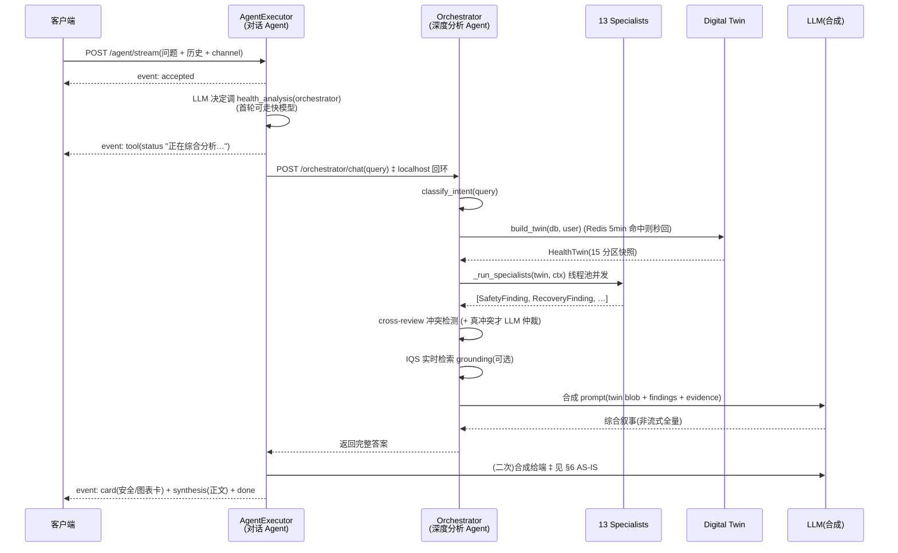

<!--
  分析 Agent 架构文档。维护规则:凡改动 agent_executor / orchestrator / specialists / twin
  的**结构**(入口、层级、委托路径、专家 roster、Twin 分区),在**同一 PR** 里同步本文件。
  计数(专家数 / Twin 分区数 / 安全规则数)只引用 docs/_generated/system-map.json,不手写死数字。
-->
---
doc: ARCHITECTURE_ANALYSIS_AGENT
last-reviewed: 2026-07-07
generated-source: docs/_generated/system-map.json
scope: 主分析 Agent(对话 Agent + 深度分析 Orchestrator + 专家团 + Digital Twin)
related: docs/ARCHITECTURE.md · docs/HARNESS.md · docs/system-map/INDEX.md · CLAUDE.md §Multi-Agent
---

# 分析 Agent 架构 — Reva / 小巴「主分析」链路

> **一句话**:小巴有**两个大脑**。前台是**对话 Agent**(`AgentExecutor`,tool-calling,秒级响应记录/查询/闲聊);当用户问的是需要跨专家综合判断的健康问题("透视""帮我分析…"),对话 Agent 把这一轮**委托**给后台的**深度分析 Agent**(`Orchestrator`),后者调度 13 个确定性专家读同一份 Digital Twin、产出结构化 Finding,再由 LLM 合成。**安全与医疗边界由确定性代码守卫,不由 LLM 决定(R4)。**

本文件是「主分析 Agent」的权威结构说明。计数(专家 / Twin 分区 / 安全规则)以 [`docs/_generated/system-map.json`](_generated/system-map.json) 为唯一真源。

---

## 1. 分层全景

```
┌──────────────────────────────────────────────────────────────────────────┐
│  客户端 (mobile chat / web ai-assistant / mac / mini-program)               │
│  POST /agent/stream (SSE)   ·   POST /agent/send (保活非流式)               │
└───────────────────────────────┬──────────────────────────────────────────┘
                                 │  用户一句话 + 历史 + 附件 + channel(typed/voice/siri)
                                 ▼
┌──────────────────────────────────────────────────────────────────────────┐
│  L4-前台 · 对话 Agent   AgentExecutor.run_stream()                          │
│  backend/app/services/agent_executor.py                                    │
│                                                                            │
│   tool-calling 循环:LLM 决定调哪个工具 → 执行 → 结果回灌 → 合成回答         │
│   ├ 快路由(TASK_TIERED_ROUTING):首轮"决定调什么工具"用快模型              │
│   │  (qwen3-flash);正文合成永远强模型(丢弃 fast 吐的正文)                │
│   ├ 写操作恒草稿 + 二次确认(R4);channel 守卫来自传输层,非 LLM 参数        │
│   └ 流式事件:accepted → tool(status) → card → synthesis → done            │
│                                                                            │
│   工具架(_exec_*):                                                        │
│     health_query   查(步数/HRV/睡眠/血压/化验…)                            │
│     health_record  记(饮水/体重/血压/饮食/补剂/症状…,恒草稿确认)          │
│     health_manage  改(目标/用药/补剂 增删改,agent-operable)               │
│     knowledge_search / realtime_search  KB + 实时搜索接地                    │
│     upload_genetic / medical_exam / lab_indicators  导入解析                 │
│     ┌──────────────────────────────────────────────────────────────┐      │
│     │ health_analysis(analysis_type="orchestrator")  ◀── 主分析入口 │      │
│     │   委托给 L4-后台 Orchestrator(见下)                          │      │
│     └──────────────────────────────────────────────────────────────┘      │
└───────────────────────────────┬──────────────────────────────────────────┘
                                 │  _exec_health_analysis → POST /orchestrator/chat
                                 │  (进程内 localhost HTTP 回环,非流式 · 见 §6 AS-IS)
                                 ▼
┌──────────────────────────────────────────────────────────────────────────┐
│  L4-后台 · 深度分析 Agent   run_orchestrator() / stream_orchestrator()      │
│  backend/app/orchestrator/orchestrator.py                                  │
│                                                                            │
│   ① classify_intent(query)  意图路由                                        │
│      safety/labs/recovery/fuel/movement/mental/chronic/longevity/          │
│      knowledge/longitudinal                                                │
│   ② build_twin(db, user_id)  聚合 Digital Twin(L2)                         │
│   ③ _select_specialists(intent, twin)  按 applies_to 选专家                 │
│   ④ _run_specialists(...)  线程池并发跑,依赖序(recovery→movement 共享 ctx)│
│   ⑤ cross-review 冲突检测 → 可选 LLM 仲裁(仅真冲突)                        │
│   ⑥ IQS 实时检索 grounding(非 lite/siri;flag 关或失败则空,不阻断)         │
│   ⑦ _call_llm 合成(非流式全量)/ _stream_llm(SSE)                         │
└───────────────────────────────┬──────────────────────────────────────────┘
                                 ▼
┌──────────────────────────────────────────────────────────────────────────┐
│  L3 · 专家团(13,确定性规则 + 结构化裁决,不依赖 LLM 做安全判断)             │
│  backend/app/agents/*  ·  注册表 backend/app/orchestrator/specialists.py    │
│                                                                            │
│   SafetyGuardian(64 条安全规则,永远先跑)· RecoveryCoach · FuelStrategist  │
│   · SupplementAdvisor · MovementCoach · MentalHealthCompanion               │
│   · Hypertension / Metabolic / Rhinitis(慢病专科)· KnowledgeLibrarian      │
│   · LongitudinalAnalyst · LongevitySpecialist · CrossSourceValidator        │
│                                                                            │
│   每个专家:applies_to(intent, twin)->bool  +  run(twin, ctx)->Finding      │
└───────────────────────────────┬──────────────────────────────────────────┘
                                 ▼
┌──────────────────────────────────────────────────────────────────────────┐
│  L2 · Digital Health Twin(15 语义分区,用户健康状态的统一只读视图)          │
│  backend/app/twin/  ·  schema.py(分区)· builder.py(聚合)· cache.py(Redis)│
│                                                                            │
│   physiological · body_composition · labs · cgm · medication · supplement  │
│   · genetic · epigenetic · environment · behavioral · acute · mental       │
│   · chronic · goals · freshness                                            │
│   builder 从 service 层聚合;Redis 5min 缓存;formatter→紧凑 prompt blob     │
└───────────────────────────────┬──────────────────────────────────────────┘
                                 ▼
┌──────────────────────────────────────────────────────────────────────────┐
│  L1 · Collectors + Services(数据源)                                        │
│  Garmin / Withings / Apple HealthKit / CGM / 化验 / 基因 / 环境 / 补剂 / 用药 │
└──────────────────────────────────────────────────────────────────────────┘
```

---

## 2. 为什么是「两个 Agent」而不是一个

| 维度 | L4-前台 对话 Agent | L4-后台 深度分析 Agent |
|---|---|---|
| 文件 | `services/agent_executor.py` | `orchestrator/orchestrator.py` |
| 触发 | 每一句用户输入 | 仅"需要综合判断的健康问题" |
| 机制 | LLM tool-calling(自由决定调什么) | 确定性意图路由 + 专家调度 |
| 时延目标 | 记录/查询秒级(快路由) | 深度分析可接受 10s+,换准确 |
| 谁做安全判断 | 不做(委托) | **确定性专家(SafetyGuardian 64 规则)** |
| 输出 | 对话正文 + 动态卡 + 写草稿 | 结构化 Finding + 合成叙事 |

**设计意图**:把"廉价高频的对话/记录"和"昂贵低频的多专家综合"分开。前台不必每句都跑 13 个专家;后台不必处理闲聊和记录。**安全脑只在后台、且是确定性的** —— 这是护城河(LLM 会飘,规则不会)。

---

## 3. 主分析请求生命周期(用户问"帮我综合分析一下")



‡ 标注两处 = 当前 AS-IS 的已知优化点,见 §6。

---

## 4. 组件参考(file:line 锚点)

| 组件 | 位置 | 职责 |
|---|---|---|
| 流式入口 | `api/agent.py:557` `POST /stream` | SSE 主入口(mobile/web/mac) |
| 保活入口 | `api/agent.py:832` `POST /send` | 非流式 + 保活聚合(深分析长回合不 504) |
| 对话 Agent 主循环 | `services/agent_executor.py:3178` `run_stream()` | tool-calling + 流式事件 |
| 快路由门 | `agent_executor.py`(`TASK_TIERED_ROUTING`) | 首轮工具决策走快模型,合成永远强模型 |
| 写确认门 | `agent_executor.py` `_auto_confirm_fast_record_args` | 写操作恒草稿;channel 守卫来自传输层 |
| 主分析委托 | `agent_executor.py:6786` `_exec_health_analysis` | `atype=="orchestrator"` → `/orchestrator/chat` |
| 深分析非流式 | `orchestrator/orchestrator.py:1403` `run_orchestrator` | twin→专家→仲裁→IQS→合成 |
| 深分析流式 | `orchestrator/orchestrator.py:1769` `stream_orchestrator` | 同上,SSE |
| 意图路由 | `orchestrator/intent.py:65` `classify_intent` | 关键字意图分类 |
| 专家执行 | `orchestrator/orchestrator.py:218` `_run_specialists` | 线程池并发 + 共享 ctx |
| 专家注册表 | `orchestrator/specialists.py:133` `_build_registry` | 13 专家,依赖序 |
| Twin schema | `twin/schema.py:479` `HealthTwin` | 15 语义分区 |
| Twin 聚合 | `twin/builder.py` `build_twin` | service 层聚合 + Redis 缓存 + 降级 |
| Twin→prompt | `twin/formatter.py` `twin_to_prompt_blob` | 紧凑 LLM 上下文 |
| 安全规则引擎 | `agents/safety_guardian/` | 64 条确定性规则(vitals/labs/ddi/dsi/pgx/cgm/…) |

> 具体计数(13 专家 / 15 分区 / 64 规则)以 `docs/_generated/system-map.json` 为准;本表描述**结构**,数字会随代码演进,别在叙事里手写死。

---

## 5. 确定性边界与安全脑(R4)

这是分析 Agent 最重要的架构不变量:

1. **LLM 永不发出不可逆动作**。所有写(记录/改目标/换药/下单/预约)由确定性代码执行,LLM 只产出**草稿 + 解释**,用户或规则确认后才落。
2. **安全判断是确定性的**。SafetyGuardian 的 64 条规则(急性阈值、DDI 药物互作、PGx 基因用药、CGM、症状红线…)是纯规则,不问 LLM。合成 prompt 里的安全文本是**正交追加**(由外层强制拼上),不依赖 LLM 记得说。
3. **加层不减层**。去重/合并告警只 TIGHTEN,永不丢急性值。
4. **fail-loud**。取数/评估失败暴露 `failed_count`,不静默当"用户没这项数据"(见 §6 一处在补的暗洞)。

---

## 6. AS-IS 已知优化点(诚实记录,非"设计如此")

架构文档记录**现状真相**,不掩盖债务。当前主分析链路有两处结构性时延来源(截图深分析 37–75s 的根因),已在优化路线图:

- **localhost HTTP 回环**:`_exec_health_analysis` 经 `POST http://localhost:8000/api/v1/orchestrator/chat` 调**非流式** `run_orchestrator`,整段答案 buffer 完才返回。现成的 `stream_orchestrator`(SSE,首 chunk 秒级)未被对话 Agent 复用。
- **二次合成**:对话 Agent 拿到 orchestrator 已完成的答案后,又跑一轮 LLM 复述才流给端 → 最多 4 次串行 LLM(决策→仲裁→orchestrator 合成→agent 合成)。
- **IQS 串在合成前**:实时检索 6s 与专家池无依赖,却 await 在合成前(可并发)。
- **Twin fail-loud 暗洞**:`build_twin` 分区取数失败只 warning、不进 `twin.meta.failed_partitions`,下游安全规则可能把"取数失败"当"用户没用药"。

> 优化方向:对话 Agent 深分析路径改**进程内直调 `stream_orchestrator` 透传 chunk**,去掉 HTTP 回环 + 二次合成;IQS 与专家并发;TwinMeta 加 `failed_partitions`。详见系统优化路线图。

---

## 7. 扩展点

- **加专家**:`app/agents/{name}/` 实现 `applies_to` + `run`,在 `specialists.py:_build_registry` 注册(注意循环导入:`__init__.py` 不 import 专家类)。写测试到 `tests/test_specialists.py`。
- **加安全规则**:`agents/safety_guardian/rules/` 下加 `@register` 函数,新文件在 `engine.py:_load_rule_modules` import。改数量同步 `scripts/check_doc_drift.py` 的 EXPECTED。
- **加 Twin 分区**:`twin/schema.py` 加 Pydantic 分区 + `builder.py` 填充 + `formatter.py` 纳入 blob;doc-drift 校验分区数。
- **加对话工具**:`agent_executor.py` 加 `_exec_*` + 工具 schema;写操作走草稿+确认出口;新写接口纳入 agent-operable module contract。

> 加任何 specialist / source / tool / memory stage,**必须同 PR 更新 [`docs/HARNESS.md`](HARNESS.md)**(产品 LLM 方法论)。改结构计数,跑 `scripts/dump_system_map.py` 重生成 system-map.json。
