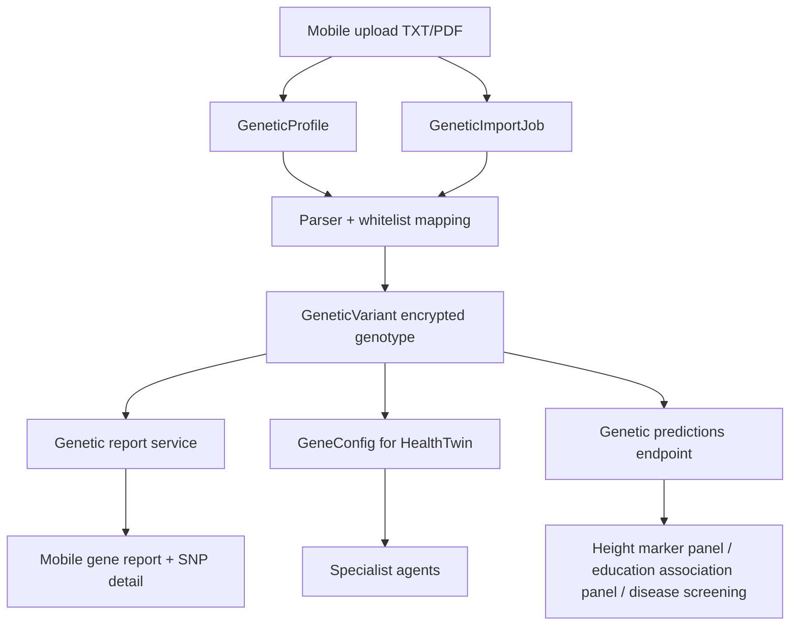

# Genetic Module Architecture

Updated: 2026-05-16

## Scope

The genetics module is a screening and personalization layer for the Personal Health Trajectory Agent. It stores consumer genetic findings, tracks import provenance, explains known SNPs, and exposes conservative prediction surfaces. It does not diagnose disease, prescribe medication, or predict social outcomes.

## Data Flow

## Core Files

- `backend/app/api/genetic_data.py`: upload, profile, report, SNP detail, and prediction endpoints.
- `backend/app/models/genetic_data.py`: `GeneticProfile`, `GeneticVariant`, `GeneticImportJob`.
- `backend/app/services/genetic_registry.py`: versioned registry facade and claim boundaries.
- `backend/app/services/genetic_report.py`: active profile selection, strict SNP matching, mobile report, SNP detail prompt.
- `backend/app/services/genetic_predictions.py`: conservative prediction surface.
- `backend/app/twin/gene_config.py`: structured gene-derived parameters for agents.

## Import Contract

Every import creates a `GeneticImportJob` with parser version, source type, provider, raw hash, counts, coverage summary, and terminal status. TXT imports complete synchronously. PDF imports use FastAPI `BackgroundTasks` and update the job as `queued -> processing -> done/failed`.

Coverage is explicit:

- `present`: known SNPs successfully mapped.
- `missing_by_rsids`: per-rsid missing reason.
- `unsupported_or_requires_confirmation`: structural/HLA/proxy markers that need clinical confirmation or provider-specific handling.
- `not_present_in_raw_file`: known rsid not found in the raw file.
- `not_mapped`: raw rsid present but genotype did not map.

## Matching Rules

Reports and SNP detail share the same strict matcher:

1. Prefer exact `rsid`.
2. Fall back only to exact `(gene_name, variant_name)` for legacy rows.
3. Never match by gene alone.

This prevents the previous class of bugs where one MTHFR/APOE/CYP variant caused another SNP in the same gene to appear as a hit.

## Claim Boundaries

Drug sensitivity:

- Do not suggest stopping, changing, or adjusting medication.
- Output only a clinician/pharmacist confirmation action.

Disease risk:

- Screening-level association only.
- Not diagnosis or probability of disease.
- Must be combined with labs, symptoms, family history, and clinician judgment.

Height:

- Endpoint returns `exploratory_marker_score` only when the user has one or more supported height GWAS markers (`HMGA2`, `GDF5`, `ZBTB38`) in the active profile.
- The panel reports marker count and height-increasing allele count, but does not convert this into centimeters.
- If no supported markers are present, it still returns `insufficient_model` until a validated PRS weight set and population calibration are available.

Education:

- Endpoint returns `exploratory_association` only when the user has one or more supported educational-attainment GWAS markers (`rs9320913`, `rs11584700`, `rs4851266`) in the active profile.
- The system does not predict whether a person can attend university and does not use genetics for education/social outcome decisions.
- The response carries `does_not_predict_college=true` and should only be displayed as a personal curiosity/knowledge panel.

## Mobile Function Map

- Gene report screen: `/api/v1/genetic/report/me`
- SNP detail screen: `/api/v1/genetic/snp/{rsid}`
- Import TXT: `/api/v1/genetic/profiles/upload-txt`
- Import PDF: `/api/v1/genetic/profiles/upload-pdf`
- Import status and coverage: `/api/v1/genetic/profiles/{profile_id}/status`
- Conservative prediction surface: `/api/v1/genetic/predictions/me`

## Database Migration

Production PostgreSQL managed migration:

- `backend/migrations/managed/20260516_010000_create_genetic_import_jobs.postgresql.sql`

SQLite is only used by tests through SQLAlchemy `create_all`.
