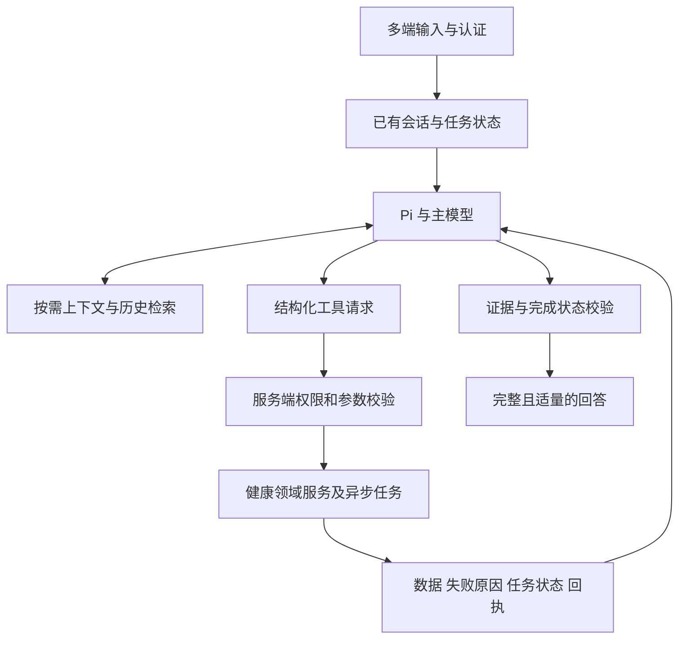

# Reva 与 Hermes Agent、OpenClaw 的架构对照

本次读取时间：2026-09-13（北京时间）。这是源码审阅和改造建议，没有部署其他 Agent，也没有进行三者的同任务性能或质量对照测试。

## 结论

Reva 需要修改 Agent 外围的职责划分与任务衔接。当前证据不足以支持立即整体迁移到 Hermes 或 OpenClaw。先保留 Pi，把自然语言理解从硬权限规则中解耦，并统一任务状态、上下文、工具反馈和结果验证，收益更容易验证，风险也更可控。

这里的 Hermes 指 NousResearch/hermes-agent。比较的是本次读取的 main 源码快照，不等于这些变化均已进入稳定发布版：

- Hermes：[`205645ee424163c7b6cfc032c331c3557797497b`](https://github.com/NousResearch/hermes-agent/tree/205645ee424163c7b6cfc032c331c3557797497b)。
- OpenClaw：[`f0817f23e939447755c614e29866b0467ee0d7c3`](https://github.com/openclaw/openclaw/tree/f0817f23e939447755c614e29866b0467ee0d7c3)。
- Reva：本地审阅 `2f6cf0192`，线上问题证据沿用同日复盘中已经核对的 `deab5edcd`。本轮没有重新抽取用户健康数据。

一个版本事实需要纠正：本次读取的 OpenClaw 已拥有自己的 `packages/agent-core`，文档将旧 runtime 名称 `pi` 映射到 `openclaw`；保留的 `pi-tui` 是终端组件。这说明今天不能把 OpenClaw 简化为“Pi 外面加渠道”，也不能据此推导 Reva 应立刻跟随替换内核。[OpenClaw runtime 架构](https://github.com/openclaw/openclaw/blob/f0817f23e939447755c614e29866b0467ee0d7c3/docs/agent-runtime-architecture.md)

## 值得借鉴的差异

| 维度 | 官方设计或源码事实 | Reva 当前差距 | 建议 |
|---|---|---|---|
| 模型与执行循环 | Hermes 主循环组织请求准备、模型调用、工具轮次、恢复和收尾；OpenClaw 循环处理工具结果以及运行中输入 | Pi 已接入，但 Reva 在循环外用多个语义判断限制工具和解释完成状态 | 保留通用循环，统一任务目标；规则重点校验结构化参数、权限和结果 |
| 会话控制 | OpenClaw 按 session 排队，并校验当前 transcript writer，处理 steering/followup | Reva 已有 AgentRun、输入序号、租约和恢复状态；但“上一轮没做完什么”没有充分连接到对话语义 | 扩展已有运行体系，关联待完成目标、澄清、异步任务和新输入；不再建一套并行调度器 |
| 记忆 | Hermes 区分精简常驻记忆与按需 session_search；OpenClaw 区分 memory_search 与 memory_get | Reva 已有事实版本、对话记忆等服务，但历史投影及健康清单难以表达来源、时间和冲突 | 统一记忆读取接口；健康 DB 为事实真源，历史检索返回原消息位置与时间，摘要只是索引 |
| Skill | Hermes 支持按需加载 Skill，也允许 Agent 管理 Skill | Reva 已有 Skill registry 和精确触发的 procedure recipe，不能说从零缺失 | 把可复用分析方法与有副作用的配方区分；经验先成为候选，再经回放验证与版本发布 |
| 提示词 | Hermes 明确管理缓存提示词的 stable/context/volatile 层及更新边界 | Reva 有 lite/full 等上下文路径，但最终职责和更新语义仍分散 | 稳定规则留前缀；任务相关事实按需读；本轮用户更正必须及时可见 |

循环与会话来源：[Hermes conversation_loop.py](https://github.com/NousResearch/hermes-agent/blob/205645ee424163c7b6cfc032c331c3557797497b/agent/conversation_loop.py#L1514)、[OpenClaw agent-loop.ts](https://github.com/openclaw/openclaw/blob/f0817f23e939447755c614e29866b0467ee0d7c3/packages/agent-core/src/agent-loop.ts#L309)、[OpenClaw 会话执行说明](https://docs.openclaw.ai/concepts/agent-loop)。

记忆与上下文来源：[Hermes memory](https://hermes-agent.nousresearch.com/docs/user-guide/features/memory/)、[Hermes session_search 源码](https://github.com/NousResearch/hermes-agent/blob/205645ee424163c7b6cfc032c331c3557797497b/tools/session_search_tool.py)、[OpenClaw memory](https://docs.openclaw.ai/concepts/memory)、[Hermes prompt assembly](https://hermes-agent.nousresearch.com/docs/developer-guide/prompt-assembly)。Skill 来源：[Hermes Skills](https://hermes-agent.nousresearch.com/docs/user-guide/features/skills/)。

这些设计不证明 Hermes 或 OpenClaw 在 Reva 的健康任务上一定更智能。两者都有校验、预算、终止和安全边界；不能将它们描述成无约束的模型循环。值得学习的是职责和反馈通道，而不是减少安全控制的数量。

## Reva 应优先修改的地方

### P0：让模型理解任务，服务端守住权限

同日线上复盘及纯函数探针已经证明：相同的 Garmin 同步参数，仅因用户把简句扩写为口语，权限结果就从 allow 变成 block；睡眠查询追加同步状态问题后，日期解析也失败。

对应位置是 `backend/app/services/agent_kernel/capability_policy.py:2562` 的整句匹配和 `:2707` 起的查询范围判定。不能把这类语义未识别与跨账户访问放在同一个拒绝机制里。

模型可以提出多个子目标及结构化读取计划，服务端从认证上下文绑定本人身份、业务时区和可访问数据域，校验日期边界、参数类型、结果规模、写入确认与幂等。明确的本人只读请求应能组合；模型不能凭自己声明“已获授权”扩大读取对象或取得写入权限。

这里不建议为每个简单问题增加一个强制的独立 Planner 模型调用。简单任务沿用当前主模型直接调用工具；复杂任务或澄清续接才保存显式计划。否则会把现有的路由复杂度换成另一套固定编排，并增加等待。

### P0：把错误作为可操作反馈，而非通用终止句

`backend/app/services/agent_policy_retry.py:5` 把语义未识别、日历范围未识别放入 terminal notices；`agent_executor.py:17142` 让这类通知终止 Pi。

应统一工具结果契约，明确成功数据、缺失字段、失败类别、可恢复性和已经发生的副作用：参数可修复时给一次有信息增量的重试；相同失败参数去重；权限拒绝和用户取消不能重试绕过。普通的“昨天”不能识别时，应归一化时间或问具体歧义，而不是要求用户重写整段需求。

借鉴 Hermes 的分阶段恢复和 OpenClaw 的工具前后钩子，但实际恢复规则仍需由 Reva 的任务与安全语义决定。[Hermes loop internals](https://hermes-agent.nousresearch.com/docs/developer-guide/agent-loop)、[OpenClaw 工具结果处理](https://github.com/openclaw/openclaw/blob/f0817f23e939447755c614e29866b0467ee0d7c3/packages/agent-core/src/agent-loop.ts#L1341)

### P0：区分任务状态与运行状态

`backend/app/services/agent_runtime.py` 已有持久化 run 状态、输入序号和工具操作账本；`agent_runtime_lease.py` 已有租约维护，不需要为了仿照 OpenClaw 再造基础设施。

需要补齐的是：当前用户想完成什么、哪些子任务已完成、正在等哪个同步任务、哪项澄清待回答、什么新输入取代了旧假设。把这些状态关联到现有会话和运行记录，保持运行控制账本不保存健康原文。

例如“同步后分析昨晚睡眠”应经历请求同步、取得 job_id、确认任务状态、读取目标日期、回答几个阶段。进程结束、同步入队、模型文本生成结束都不等于这个用户任务完成。

“起草今天方案”与“保存为计划”也应在同一任务契约中分清。现有 `utterance_intent_lexicon.py:291` 与 `agent_executor.py:10279` 在这点上的解释不一致，优先修复共享语义，不在最终文案再加特例。

### P1：统一已有记忆能力，按任务取证

Reva 的 `memory_service.py` 已有事实版本、来源加强与矛盾检测；`conversation_memory_service.py` 也有对话提取和旧记忆替代。优先统一调用与可信度语义，而不是另装一个向量库就宣布具备长期记忆。

建议区分四类内容：稳定偏好、当前任务状态、可定位的历史对话、带时间与来源的健康事实。前两类可以精简进入上下文；历史按需查；健康事实由有权限的领域读取接口提供。生成摘要和用户转述不能升级为独立核验的医嘱。

Hermes 的会话开始时冻结记忆快照有缓存收益，但不能原样套用到动态健康事实：本轮用户纠正必须立刻影响回答，旧清单不能因为缓存而被继续当作已确认当前状态。OpenClaw 也明确提醒，记忆可以记录行动条件，但不能替代权限执行。[Hermes memory](https://hermes-agent.nousresearch.com/docs/user-guide/features/memory/)、[OpenClaw action-sensitive memories](https://docs.openclaw.ai/concepts/memory#action-sensitive-memories)

### P1：把经验学习放进可验证的发布过程

Hermes 的按需 Skill 和经验复用值得借鉴，但 Reva 不应让运行时 Agent 自行改写医学规则或生产授权策略。

复用现有 `skill_registry.py`、`procedure_recipe_service.py`：从成功轨迹形成候选的只读分析方法，例如先核验数据日期再比较睡眠；经过留出样本和安全负例验证后发布版本。涉及有副作用的配方继续保留原有确认档位，不继承旧的一次性确认。每次应用记录方法版本、证据与结果，失败则撤回该版本。

自学习不是把上一次回答的医学结论长期保存，也不是把一次用户确认升级成永久执行权限。

### P1：统一最终结果验证与展示

本次外部对照不意味着可删掉 Reva 的领域验证。相反，要让它成为清楚的出口：已验证事实、建议证据、写入回执和最终任务状态一致。

同日复盘发现 `guidance_validator.py:381` 的逐句占位替换产生残缺长文。应保留拦截，再用确定性模板或受约束重写得到完整短答并再次校验；纯记录任务由回执生成简短确认。不要让每条成功记录继续展开没有请求的健康建议。

## 建议的目标结构

下图是建议结构，不是当前系统地图，也不意味着新增同名微服务：

先在现有服务内部明确这些边界。数据库、领域工具、身份隔离、写入审计与客户端协议尽量复用；不为了图上的框拆出新的网络服务。`agent_executor.py` 的职责再逐步收敛为协调，而不是继续容纳相互不一致的语义解释器。

## 哪些东西不应直接搬过来

- 不用通用 terminal 或模型自行生成 SQL 访问生产健康库；有类型、有授权和可审计的领域工具继续保留。
- 不把 Skill、记忆或自然语言“自我反思”当作医学证据或写入授权。
- 不因两者支持多 Agent 就先增加专家并行。当前主任务都可能被句式规则拒绝，增加代理无法跨过这一瓶颈，还会增加一致性与成本负担。
- 不直接拿个人 Agent 的部署边界替代多用户健康服务。OpenClaw 官方定义的是单一信任边界内的个人或互信团队；它明确不是互不信任用户共用 Agent/Gateway 时的多租户安全边界。[OpenClaw Security](https://docs.openclaw.ai/gateway/security)

## 迁移与验收选择

首选“保留 Pi，改外围任务控制”。完整替换 Hermes/OpenClaw 目前会同时牵动身份、记忆、工具、会话和客户端集成，尚无证据表明收益覆盖这些成本。

先做影子理解与隔离回放，再灰度本人只读任务，随后才处理异步衔接和有副作用的任务。用同一批多轮任务、相同模型、数据快照和安全边界比较改前改后，验证目标完成、澄清次数、耗时、成本、错误事实与越权负例。只有当剩余失败能稳定定位到 Pi 的传输或循环能力缺口，再评估替换运行时。

当前建议是架构判断，不是已证明 Hermes/OpenClaw 的总体任务质量优于 Reva。此次源码对照的主要用途，是把下一轮可验证的改造范围缩小。
