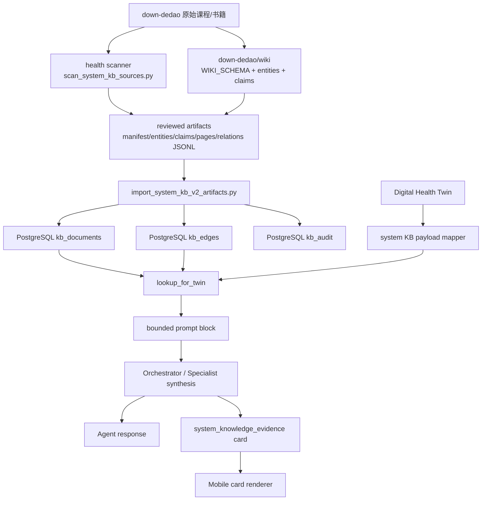

# Dedao 系统知识库到 Health 系统同步说明

日期：2026-05-16  
状态：已上线 Phase 0 + Phase 1a/1b serving slice；Phase 1c Dedao ingest pipeline 已接入；2026-05-18 完成 Phase 2 reviewed corpus expansion、隐私扫描、FTS/vector 兼容检索通道、首批外部证据元数据和 entity-to-entity 图谱关联

## 2026-05-18 Current State

- Reviewed artifacts: 508 docs / 2715 edges (`52 pages / 99 entities / 357 claims`); backend deploy imports them into serving DB.
- Ingest authoring CLI: `backend/scripts/ingest_course.py`.
- Review promotion: `promote_artifact_review_status`.
- Ingest review queue: dry-run PR-style diffs prepend new draft claim count, missing external-evidence count, candidate duplicate count, and claim IDs that need reviewer attention.
- Admin lint: contradiction + invalid review status included.
- Admin coverage: `/api/v1/admin/knowledge/coverage_report`.
- Crystallize: draft-only service exists and is called by weekly `system-kb-lifecycle` Celery task.
- Privacy isolation: scanner excludes private-looking source paths; `find_private_source_violations(...)` reports `personal/private/用户/user-*` paths without reading contents.
- Search serving: `/knowledge/search` returns local BM25 lexical + PostgreSQL `tsvector` FTS + semantic alias + one-hop graph RRF channels. SQLite keeps a precomputed-text fallback for focused tests; production admin reindex updates `kb_documents.tsv` with `to_tsvector('simple', ...)`.
- External evidence: selected MTHFR/APOE/statin/diabetes claims now carry reviewed PubMed/guideline references in `sources` and `metadata.external_sources`.
- Corpus expansion: deterministic Dedao compiler scanned 46 health-relevant source directories and promoted 314 generated claims / 83 entities / 46 pages / 2566 relations to reviewed status across reviewed passes, while preserving older reviewed artifacts.
- Graph association: claim context now emits entity-to-entity `contextualizes` edges, for example `hyperuricemia-risk -> chronic-kidney-risk` and `hyperuricemia-risk -> hydration`, so lookup can traverse from a biomarker or condition to related interventions and boundaries.
- Admin operations: `/api/v1/admin/knowledge/operations_dashboard` returns coverage, external-evidence metrics, lint summary, latest lifecycle report, and action items.
- External evidence governance: coverage reports include target external-source rate and `meets_target`, so PubMed/guideline enrichment is tracked as an operational gate rather than a narrative note.
- Planner enforcement: Orchestrator now filters unsupported actionable specialist findings before final synthesis when the same evidence domain has a KB-supported finding; safety-critical alerts and data gaps bypass this filter.
- Weekly Advisor evidence enforcement: weekly fallback action cards now attach system KB evidence and run the same planner evidence policy before persisting specialist-derived suggestions.
- Notification evidence coverage includes trend summaries, morning briefings, weekly-review invites, action-card followups, agent-loop advice, and outcome-grader pushes.

## 结论

基于 `/Users/liqiuhua/work/personal/down-dedao` 的系统级知识库已经搭起来了，但当前不是“把所有得到课程全文直接塞进线上 RAG”。当前上线的是更克制的 LLM Wiki V2 serving slice + deterministic ingest pipeline：

- `down-dedao` 是离线资料与 wiki 编译工作区。
- `health-llm-driven` 是线上 serving plane。
- 线上只同步经过整理的实体、短 claim、课程页元信息和图谱边。
- 不同步完整付费课程正文，不给用户展示大段课程内容。
- Agent 使用结构化 `applies_when` 命中知识，而不是只靠 embedding 模糊召回。
- Dedao 课程扩展先通过 dry-run PR-style diff 和 reviewer queue 摘要，再写入 reviewed artifacts；draft 结果不会覆盖已经 reviewed 的 claim。
- 若由 `dedao-kbase`/`ak-kbase` 侧先编译出统一 export，使用 [`dedao-kbase-reva-sync.md`](dedao-kbase-reva-sync.md) 的 `system_kb_export.json` 契约和 `ingest_dedao_kbase_export.py`，默认进入 draft gate，禁止直接作为运行时搜索源。

当前线上已导入：

- Phase 0：12 个文档、5 条图谱边，覆盖 `MTHFR/APOE/FTO/ACTN3/ALDH2` 等基因样板。
- Phase 1a：49 个文档、25 条图谱边，覆盖代谢健康、营养、血压、血脂、血糖、尿酸、睡眠恢复、运动和用药安全。
- Phase 1b：扩展到 64 个文档、47 条图谱边，新增 14 个衰老标志实体、1 条“衰老标志仅作轨迹分类框架”边界 claim，并上线 claim/search/admin lint/reindex/decay 能力。
- Phase 1c/2：通过 `ingest_course.py` 编译 46 个健康相关 Dedao/书籍来源目录，当前 artifacts 为 508 个文档、2715 条图谱边；包含 357 条系统 claim、99 个 entity 和 52 个 source page，覆盖冯雪代谢课程、仇子龙基因、仝卿营养、王家伟用药、薄世宁医学通识/前沿、睡眠、糖尿病、心脏、骨科、微生物组、精力管理、正念和部分生命科学课程，并为高风险 claim 增加首批外部证据引用。

## 源端：down-dedao

源目录：

```text
/Users/liqiuhua/work/personal/down-dedao
```

它承担 authoring/compiler plane 的角色：

- 保存原始得到课程、书籍和 wiki。
- 维护 `wiki/WIKI_SCHEMA.md`、`wiki/entities/`、`wiki/claims/`。
- 大规模 ingest 先由 `health-llm-driven` 的 deterministic pipeline 生成 PR-style diff，再人工 review 后写入 artifacts。
- 当前 health 系统不会直接读取 raw 课程正文作为线上回答依据。
- 私人资料不会进入系统级扫描；`personal/private/私人/个人/用户/user-*` 路径会被排除，且可通过 `find_private_source_violations(...)` 生成隔离报告。

优先健康课程范围由 `health-llm-driven` 中的扫描器识别：

```bash
cd /Users/liqiuhua/work/personal/health-llm-driven
DATABASE_URL=sqlite:///./scan_dummy.db \
SECRET_KEY=test-secret-key-32-chars-minimum!! \
GARMIN_ENCRYPTION_KEY=mI4nYXirjGlbHD7sFogYlqPQJzirU04mUsS5LyDS0SU= \
backend/venv/bin/python backend/scripts/scan_system_kb_sources.py --limit 20
```

核心扫描代码：

- `backend/app/services/system_knowledge_pipeline.py`
- `backend/scripts/scan_system_kb_sources.py`
- `backend/app/services/system_knowledge_ingest.py`
- `backend/scripts/ingest_dedao_system_kb.py`

当前优先课程包括：

- 冯雪·科学减肥16讲
- 冯雪·高血压医学课
- 冯雪·高血糖医学课
- 冯雪·高血脂医学课
- 冯雪·高尿酸医学课
- 给忙碌者的糖尿病医学课
- 给忙碌者的营养健康公开课
- 仝卿·营养科学20讲
- 仇子龙·基因科学20讲
- 王家伟·日常用药健康课
- 怎样获得高质量睡眠
- 薄世宁·医学通识50讲

## 中间产物：Reviewed JSONL Artifacts

当前同步到 health 系统的不是 raw 文件，而是 reviewed artifacts：

```text
backend/data/system_kb_v2_seed/
├── manifest.json
├── entities.jsonl
├── claims.jsonl
├── pages.jsonl
└── relations.jsonl
```

各文件含义：

- `manifest.json`：版本、来源、版权边界、统计数量和优先课程清单。
- `entities.jsonl`：实体页，例如代谢健康、HbA1c、LDL-C、体重、腰围、蛋白质目标、睡眠规律。
- `claims.jsonl`：可被 Agent 使用的原子事实/行动规则，每条必须有边界、证据等级、置信度和 `applies_when`；高风险条目可带 `metadata.external_sources`。
- `pages.jsonl`：课程页元信息，不是课程全文。
- `relations.jsonl`：知识图谱边，例如 `entity -> claim`、`page -> claim`、`requires_boundary`、`entity -> entity contextualizes`。

当前 artifact 计数：

- `pages`: 52
- `entities`: 99
- `claims`: 357
- `relations`: 2715

其中最新 Dedao ingest 增量：

- `pages_added`: 0
- `entities_added`: 0
- `claims_added`: 11
- `relations_added`: 204
- `claims_superseded`: 0
- 新增关系中包含 claim-to-entity `mentions`、claim-to-intervention `recommends_lookup`、entity-to-claim `has_claim`、page-to-claim `supports`，以及 113 条 entity-to-entity `contextualizes` 边。

新增 `aging_hallmark` 实体层覆盖：基因组不稳定性、端粒损耗、表观遗传改变、蛋白质稳态丧失、巨自噬失活、营养感知失调、线粒体功能障碍、细胞衰老、干细胞耗竭、细胞间通讯改变、慢性炎症、菌群失调、细胞外基质变化、心理社会压力与孤立。它们只作为长期健康轨迹和机制地图使用，不直接映射为补剂处方。

Claim 样例：

```json
{
  "doc_id": "claim:c_weight_waist_tracking",
  "doc_type": "claim",
  "entity_type": "intervention",
  "entity_id": "weight-waist-tracking",
  "title": "晨起体重和腰围用于代谢轨迹反馈",
  "summary": "减重或代谢风险管理中，应在固定时间、固定条件下记录体重和腰围，用 7 天以上趋势判断变化，避免被单日波动误导。",
  "confidence": 0.78,
  "evidence_level": "B",
  "applies_when": [
    "twin.goals.weight_loss.active == true",
    "twin.goals.metabolic_health.active == true"
  ],
  "recommends_lookup": [
    "entity:biomarker:weight",
    "entity:biomarker:waist"
  ],
  "sources": [
    "dedao:fengxue-weight-loss"
  ],
  "metadata": {
    "domain": "metabolic_health",
    "claim_boundary": "General health management; not diagnosis or treatment."
  }
}
```

## Health 系统 serving plane

线上 PostgreSQL 使用三张表承接系统知识库：

```text
kb_documents
kb_edges
kb_audit
```

定义位置：

- `backend/app/models/system_knowledge.py`
- `backend/migrations/managed/20260516_200000_create_system_knowledge_tables.postgresql.sql`
- `backend/migrations/managed/20260516_200000_create_system_knowledge_tables.sqlite.sql`

表职责：

- `kb_documents`：统一存 entity、claim、article/page。
- `kb_edges`：存 typed relationship，例如 `has_claim`、`supports`、`requires_boundary`。
- `kb_audit`：记录查询、lookup、导入等操作，保留审计链路。

同步入口：

```bash
cd /Users/liqiuhua/work/personal/health-llm-driven/backend
python scripts/import_system_kb_v2_artifacts.py
```

导入器代码：

- `backend/app/services/system_knowledge_importer.py`
- `backend/scripts/import_system_kb_v2_artifacts.py`

导入是幂等的：

- 相同 `doc_id` 会 update，不重复插入。
- 相同 `src_doc_id + dst_doc_id + relation` 会 update，不重复插入边。
- 每次导入写入一条 `kb_audit(op='import_system_kb_artifacts')`。

## 部署时如何同步

部署脚本已经接入同步流程：

```text
./deploy.sh -b
```

后端部署顺序：

```text
1. 推送代码
2. 备份 PostgreSQL
3. 服务器拉取 main
4. 同步 .env 到 backend/.env
5. 安装依赖
6. python scripts/apply_managed_migrations.py
7. python scripts/seed_system_kb_phase0.py
8. python scripts/import_system_kb_v2_artifacts.py
9. 重启 health-backend / celery
10. 运行部署后健康检查
```

也就是说，后续只要 reviewed artifacts 进入 repo，再走 `./deploy.sh -b`，线上 PostgreSQL 会自动同步最新系统知识库。

## Agent 如何使用

### API

系统知识库 API：

- `GET /api/v1/knowledge/entity/{entity_type}/{entity_id}`
- `GET /api/v1/knowledge/claim/{claim_id}`
- `POST /api/v1/knowledge/claim/{claim_id}/feedback`
- `GET /api/v1/knowledge/search?q=...&limit=...`：DB-backed BM25 lexical + PostgreSQL `tsvector` FTS stream + semantic alias stream + one-hop graph expansion + RRF，结果带 `retrieval.channels` 和 `retrieval_plan.*_backend`
- `POST /api/v1/knowledge/lookup_for_twin`：先用 Twin 结构化字段命中 entity，再沿 `contextualizes` / `has_claim` 图谱边补充上下文 entity 和 claim，例如尿酸指标可带出高尿酸风险、肾功能和饮水/复查相关 claim
- `GET /api/v1/admin/knowledge/lint_report`
- `POST /api/v1/admin/knowledge/reindex`

代码：

- `backend/app/api/system_knowledge.py`
- `backend/app/services/system_knowledge_service.py`

运维脚本：

```bash
cd /Users/liqiuhua/work/personal/health-llm-driven/backend
python scripts/lint_system_kb.py
python scripts/reindex_system_kb.py
python scripts/decay_system_kb_confidence.py
```

说明：

- `lint_system_kb.py` 输出 orphan entity/claim、无效 `applies_when`、过期 claim。
- `reindex_system_kb.py` 刷新 `kb_documents.tsv` 和 `content_hash`；PostgreSQL 线上字段是 `TSVECTOR`，使用 `to_tsvector('simple', ...)` 写入，SQLite 测试环境保留文本 fallback。
- `decay_system_kb_confidence.py` 对长期未确认的 claim 做 confidence decay，并写入 `kb_audit`。

### Twin 命中逻辑

Agent 不直接把用户问题拿去搜课程全文，而是把 Health Twin 映射成结构化 payload：

```json
{
  "labs": {
    "hba1c_percent": 5.9,
    "ldl_c_mmol_l": 3.6,
    "triglycerides_mmol_l": 1.9,
    "systolic_bp": 132,
    "uric_acid_umol_l": 430
  },
  "wearable": {
    "sleep_duration_hours": 6.2,
    "hrv_latest": 45
  },
  "goals": {
    "weight_loss": { "active": true },
    "metabolic_health": { "active": true },
    "sleep": { "active": false },
    "longevity": { "active": false }
  }
}
```

然后用 claim 的 `applies_when` 做确定性命中，例如：

```text
twin.goals.weight_loss.active == true
twin.labs.hba1c_percent >= 5.7
twin.labs.triglycerides_mmol_l >= 1.7
twin.wearable.sleep_duration_hours < 6.5
```

Orchestrator 合成回答时会注入一个受控长度的知识库段落：

```text
【系统知识库命中】
## 系统知识库相关条目
- 晨起体重和腰围用于代谢轨迹反馈 [B conf=0.78] (claim:c_weight_waist_tracking): ...
- HbA1c 适合作为 8-12 周复查闭环 [B conf=0.76] (claim:c_hba1c_requires_8_12_week_feedback): ...
边界: 仅用于健康管理和风险沟通，不替代医生诊断、治疗或用药决策。
```

相关代码：

- `backend/app/orchestrator/orchestrator.py`
- `format_system_knowledge_for_prompt(...)`
- `build_evidence_card_for_message(...)`
- `build_evidence_card_for_twin(...)`
- `attach_system_knowledge_evidence(...)`
- `_system_kb_twin_payload(...)`
- `lookup_for_twin(...)`

Specialist 结果现在支持 `evidence_refs`。Orchestrator 在 specialist 运行后，会用结构化 Twin payload 命中系统 KB claim，并把 claim_id 附着到：

- `SpecialistFinding.evidence_refs`
- `SpecialistFinding.raw.system_kb_evidence_refs`
- `finding.findings[*].evidence_refs`

这为 mobile 的证据 chip、审计和后续 unsupported 建议统计提供统一数据源。Mobile 证据详情里的“这条证据不对”会调用 `/knowledge/claim/{claim_id}/feedback`，在 `kb_audit` 写入 `feedback_disagree`，作为后续 contradiction lint 和人工 review 的输入。

### Mobile 展示

Mobile 当前已支持 `system_knowledge_evidence` 卡片和普通卡片的证据展开：

- `mobile/components/chat/cards/SystemKnowledgeEvidenceCard.tsx`
- `mobile/components/chat/cards/registry.tsx`
- `mobile/components/chat/cards/EvidenceRefsRow.tsx`
- `mobile/components/knowledge/ClaimSheet.tsx`
- `mobile/components/knowledge/EntityCard.tsx`
- `mobile/app/knowledge/entity.tsx`

Phase 0 已支持用户明确问基因问题时返回证据卡，例如：

```text
我 MTHFR-TT 该注意什么？
```

后端会生成 `system_knowledge_evidence` card，移动端展示证据等级、置信度、来源和医学边界。
如果用户没有在问题里明确写基因/位点，但 Health Twin 里已有匹配的基因或化验数据，例如“我最近应该怎么补叶酸？”，`/agent/stream` 会用 Twin payload 命中系统 KB：同一批 claim 既进入 LLM prompt，也进入 SSE `done.data.cards` 和 message meta，移动端能显示证据卡。Prompt 还要求 LLM 在输出具体饮食、补剂或运动建议时显式标注 claim_id；没有足够 `evidence_refs` 时必须标明“模型推断”。

普通饮食、补剂、运动、恢复卡片中的 `evidence_refs` 已渲染成可点击 evidence chip。点击后打开统一 `ClaimSheet`，读取 `/knowledge/claim/{claim_id}`，展示 claim、来源分组、来源类型（如得到课程 / PubMed）、证据等级说明、医学边界和相关 entity，并支持“这条证据不对”反馈写入 `/knowledge/claim/{claim_id}/feedback`。相关 entity 可继续进入 `/knowledge/entity?type={entity_type}&id={entity_id}` 深链页，展示 entity 正文、来源和 linked claims。

基因报告页也支持 per-gene `evidence_refs`，命中基因卡会显示“系统证据 N 条”，复用同一 `ClaimSheet`。

## 系统架构图



## 数据与版权边界

必须遵守：

- 不把完整付费课程正文同步到线上 serving DB。
- 不在移动端展示长篇课程摘录。
- `sources` 只暴露课程/作者/lesson/source key 等引用级信息。
- claim 必须是转化后的短事实或行动边界。
- 每条健康建议必须带“不替代医生诊断、治疗或用药决策”的边界。
- 用户对话不直接写入 system KB，只能进入 user-private memory；多用户聚合规则以后必须 review 后再进入 system KB。

## 当前缺口

当前已经完成“系统知识库能同步、能被 Twin 命中、能进入 Agent prompt、能展示证据卡”的纵切，也已经补上 Dedao deterministic ingest pipeline、Phase 2 reviewed corpus expansion、admin operations dashboard 和外部证据覆盖指标。还没有完成全部 V2 能力：

- Search serving 已有 DB-backed BM25 + PostgreSQL `tsvector` FTS + semantic alias + graph RRF 路径；还没有真正向量检索或外部检索引擎。
- Specialist 输出已标注 `support_status / unsupported / unsupported_reason` 并进入 coverage dashboard；Planner 层已对同证据域的无证据 actionable 建议做确定性过滤，Weekly Advisor 兜底生成 action card 时也复用同一策略。直接 PushScheduler 的可穿戴健康预警已标记 `support_status=safety_alert`、`unsupported=false`、`planner_evidence_policy.kept_reason=safety_or_data_gap` 和 `claim_boundary`。Celery notification 的趋势摘要、周聊邀请、行动卡随访、agent_loop 主动推送和 outcome grader 命中推送也已统一写入 notification evidence metadata，并已并入 admin coverage dashboard 的 `notification_evidence` 统计和 operations action item。`agent_loop` 主动建议现在优先调用用户级 evidence builder：如果用户 Twin 命中系统 KB claim，会自动补 `evidence_refs` 并标为 `supported`；没有命中时才保留 `model_inference`。后续重点是把更多 generated advice 调用点切到同一用户级 builder，并扩大 claim 覆盖。
- Mobile 已有普通饮食/补剂/训练卡和基因报告卡的 evidence chip、统一 ClaimSheet/EntityCard、来源分组、来源可信度解释、entity 深链页和 claim feedback 入口。
- 当前 Dedao ingest 是 deterministic topic-template claim mining，不是无约束 LLM 全文抽取；这样牺牲部分覆盖率，换取版权边界、医学边界和 review 可控性。
- 给忙碌者的营养健康公开课在本轮扫描中没有进入最终 source set，原因是本地目录未暴露可识别的受支持文件；后续补齐源文件后可用同一 pipeline 追加。

## 后续扩展流程

扩大课程或书籍范围时按这个流程：

```text
1. scan_system_kb_sources.py 扫描 down-dedao
2. 选择健康相关 priority 课程/书籍
3. 运行 `ingest_course.py` dry-run 生成 PR-style diff
4. 人工 review diff，确认无版权/医学边界问题
5. 使用 `--write` 写入 reviewed JSONL artifacts
6. artifacts 进入 health-llm-driven repo
7. 本地运行 import smoke test
8. commit + push
9. ./deploy.sh -b 同步到线上 PostgreSQL
10. 验证 Agent prompt / API / Mobile evidence card
```

Dry-run 示例：

```bash
DATABASE_URL=sqlite:///./backend/health.db \
PYTHONPATH=backend \
backend/venv/bin/python backend/scripts/ingest_course.py \
  --source-root /Users/liqiuhua/work/personal/down-dedao \
  --artifact-dir backend/data/system_kb_v2_seed \
  --max-lessons-per-course 60 \
  --json-summary
```

本地 smoke test：

```bash
rm -f /tmp/health_kb_v2_verify.db
DATABASE_URL=sqlite:////tmp/health_kb_v2_verify.db \
SECRET_KEY=test-secret-key-32-chars-minimum!! \
GARMIN_ENCRYPTION_KEY=mI4nYXirjGlbHD7sFogYlqPQJzirU04mUsS5LyDS0SU= \
backend/venv/bin/python backend/scripts/apply_managed_migrations.py

DATABASE_URL=sqlite:////tmp/health_kb_v2_verify.db \
SECRET_KEY=test-secret-key-32-chars-minimum!! \
GARMIN_ENCRYPTION_KEY=mI4nYXirjGlbHD7sFogYlqPQJzirU04mUsS5LyDS0SU= \
backend/venv/bin/python backend/scripts/seed_system_kb_phase0.py

DATABASE_URL=sqlite:////tmp/health_kb_v2_verify.db \
SECRET_KEY=test-secret-key-32-chars-minimum!! \
GARMIN_ENCRYPTION_KEY=mI4nYXirjGlbHD7sFogYlqPQJzirU04mUsS5LyDS0SU= \
backend/venv/bin/python backend/scripts/import_system_kb_v2_artifacts.py
```

期望输出：

```text
seeded 12 kb_documents and 5 kb_edges
imported system KB V2 artifacts: 508 documents, 2715 edges
```
