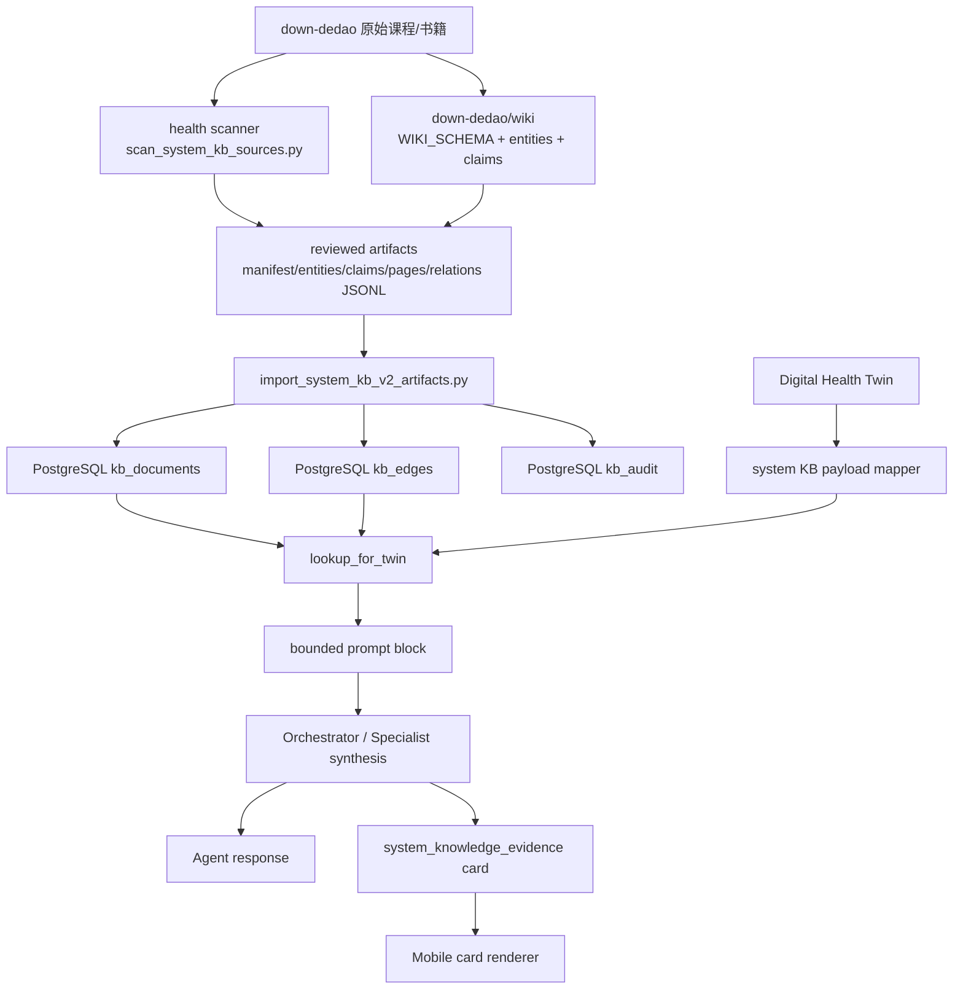

# Dedao 系统知识库到 Health 系统同步说明

日期：2026-05-16  
状态：已上线 Phase 0 + Phase 1a reviewed artifact 纵切

## 结论

基于 `/Users/liqiuhua/work/personal/down-dedao` 的系统级知识库已经搭起来了，但当前不是“把所有得到课程全文直接塞进线上 RAG”。当前上线的是更克制的 LLM Wiki V2 serving slice：

- `down-dedao` 是离线资料与 wiki 编译工作区。
- `health-llm-driven` 是线上 serving plane。
- 线上只同步经过整理的实体、短 claim、课程页元信息和图谱边。
- 不同步完整付费课程正文，不给用户展示大段课程内容。
- Agent 使用结构化 `applies_when` 命中知识，而不是只靠 embedding 模糊召回。

当前线上已导入：

- Phase 0：12 个文档、5 条图谱边，覆盖 `MTHFR/APOE/FTO/ACTN3/ALDH2` 等基因样板。
- Phase 1a：49 个文档、25 条图谱边，覆盖代谢健康、营养、血压、血脂、血糖、尿酸、睡眠恢复、运动和用药安全。

## 源端：down-dedao

源目录：

```text
/Users/liqiuhua/work/personal/down-dedao
```

它承担 authoring/compiler plane 的角色：

- 保存原始得到课程、书籍和 wiki。
- 维护 `wiki/WIKI_SCHEMA.md`、`wiki/entities/`、`wiki/claims/`。
- 后续大规模 ingest 应在这里先生成 PR-style diff，再人工 review。
- 当前 health 系统不会直接读取 raw 课程正文作为线上回答依据。

优先健康课程范围由 `health-llm-driven` 中的扫描器识别：

```bash
cd /Users/liqiuhua/work/personal/health-llm-driven
DATABASE_URL=sqlite:///./scan_dummy.db \
SECRET_KEY=test-secret-key-32-chars-minimum!! \
GARMIN_ENCRYPTION_KEY=mI4nYXirjGlbHD7sFogYlqPQJzirU04mUsS5LyDS0SU= \
backend/venv/bin/python backend/scripts/scan_system_kb_sources.py --limit 20
```

核心扫描代码：

- `backend/app/services/system_knowledge_pipeline.py`
- `backend/scripts/scan_system_kb_sources.py`

当前优先课程包括：

- 冯雪·科学减肥16讲
- 冯雪·高血压医学课
- 冯雪·高血糖医学课
- 冯雪·高血脂医学课
- 冯雪·高尿酸医学课
- 给忙碌者的糖尿病医学课
- 给忙碌者的营养健康公开课
- 仝卿·营养科学20讲
- 仇子龙·基因科学20讲
- 王家伟·日常用药健康课
- 怎样获得高质量睡眠
- 薄世宁·医学通识50讲

## 中间产物：Reviewed JSONL Artifacts

当前同步到 health 系统的不是 raw 文件，而是 reviewed artifacts：

```text
backend/data/system_kb_v2_seed/
├── manifest.json
├── entities.jsonl
├── claims.jsonl
├── pages.jsonl
└── relations.jsonl
```

各文件含义：

- `manifest.json`：版本、来源、版权边界、统计数量和优先课程清单。
- `entities.jsonl`：实体页，例如代谢健康、HbA1c、LDL-C、体重、腰围、蛋白质目标、睡眠规律。
- `claims.jsonl`：可被 Agent 使用的原子事实/行动规则，每条必须有边界、证据等级、置信度和 `applies_when`。
- `pages.jsonl`：课程页元信息，不是课程全文。
- `relations.jsonl`：知识图谱边，例如 `entity -> claim`、`page -> claim`、`requires_boundary`。

Claim 样例：

```json
{
  "doc_id": "claim:c_weight_waist_tracking",
  "doc_type": "claim",
  "entity_type": "intervention",
  "entity_id": "weight-waist-tracking",
  "title": "晨起体重和腰围用于代谢轨迹反馈",
  "summary": "减重或代谢风险管理中，应在固定时间、固定条件下记录体重和腰围，用 7 天以上趋势判断变化，避免被单日波动误导。",
  "confidence": 0.78,
  "evidence_level": "B",
  "applies_when": [
    "twin.goals.weight_loss.active == true",
    "twin.goals.metabolic_health.active == true"
  ],
  "recommends_lookup": [
    "entity:biomarker:weight",
    "entity:biomarker:waist"
  ],
  "sources": [
    "dedao:fengxue-weight-loss"
  ],
  "metadata": {
    "domain": "metabolic_health",
    "claim_boundary": "General health management; not diagnosis or treatment."
  }
}
```

## Health 系统 serving plane

线上 PostgreSQL 使用三张表承接系统知识库：

```text
kb_documents
kb_edges
kb_audit
```

定义位置：

- `backend/app/models/system_knowledge.py`
- `backend/migrations/managed/20260516_200000_create_system_knowledge_tables.postgresql.sql`
- `backend/migrations/managed/20260516_200000_create_system_knowledge_tables.sqlite.sql`

表职责：

- `kb_documents`：统一存 entity、claim、article/page。
- `kb_edges`：存 typed relationship，例如 `has_claim`、`supports`、`requires_boundary`。
- `kb_audit`：记录查询、lookup、导入等操作，保留审计链路。

同步入口：

```bash
cd /Users/liqiuhua/work/personal/health-llm-driven/backend
python scripts/import_system_kb_v2_artifacts.py
```

导入器代码：

- `backend/app/services/system_knowledge_importer.py`
- `backend/scripts/import_system_kb_v2_artifacts.py`

导入是幂等的：

- 相同 `doc_id` 会 update，不重复插入。
- 相同 `src_doc_id + dst_doc_id + relation` 会 update，不重复插入边。
- 每次导入写入一条 `kb_audit(op='import_system_kb_artifacts')`。

## 部署时如何同步

部署脚本已经接入同步流程：

```text
./deploy.sh -b
```

后端部署顺序：

```text
1. 推送代码
2. 备份 PostgreSQL
3. 服务器拉取 main
4. 同步 .env-online 到 backend/.env
5. 安装依赖
6. python scripts/apply_managed_migrations.py
7. python scripts/seed_system_kb_phase0.py
8. python scripts/import_system_kb_v2_artifacts.py
9. 重启 health-backend / celery
10. 运行部署后健康检查
```

也就是说，后续只要 reviewed artifacts 进入 repo，再走 `./deploy.sh -b`，线上 PostgreSQL 会自动同步最新系统知识库。

## Agent 如何使用

### API

系统知识库 API：

- `GET /api/v1/knowledge/entity/{entity_type}/{entity_id}`
- `POST /api/v1/knowledge/lookup_for_twin`

代码：

- `backend/app/api/system_knowledge.py`
- `backend/app/services/system_knowledge_service.py`

### Twin 命中逻辑

Agent 不直接把用户问题拿去搜课程全文，而是把 Health Twin 映射成结构化 payload：

```json
{
  "labs": {
    "hba1c_percent": 5.9,
    "ldl_c_mmol_l": 3.6,
    "triglycerides_mmol_l": 1.9,
    "systolic_bp": 132,
    "uric_acid_umol_l": 430
  },
  "wearable": {
    "sleep_duration_hours": 6.2,
    "hrv_latest": 45
  },
  "goals": {
    "weight_loss": { "active": true },
    "metabolic_health": { "active": true },
    "sleep": { "active": false }
  }
}
```

然后用 claim 的 `applies_when` 做确定性命中，例如：

```text
twin.goals.weight_loss.active == true
twin.labs.hba1c_percent >= 5.7
twin.labs.triglycerides_mmol_l >= 1.7
twin.wearable.sleep_duration_hours < 6.5
```

Orchestrator 合成回答时会注入一个受控长度的知识库段落：

```text
【系统知识库命中】
## 系统知识库相关条目
- 晨起体重和腰围用于代谢轨迹反馈 [B conf=0.78] (claim:c_weight_waist_tracking): ...
- HbA1c 适合作为 8-12 周复查闭环 [B conf=0.76] (claim:c_hba1c_requires_8_12_week_feedback): ...
边界: 仅用于健康管理和风险沟通，不替代医生诊断、治疗或用药决策。
```

相关代码：

- `backend/app/orchestrator/orchestrator.py`
- `format_system_knowledge_for_prompt(...)`
- `_system_kb_twin_payload(...)`
- `lookup_for_twin(...)`

### Mobile 展示

Mobile 当前已支持 `system_knowledge_evidence` 卡片：

- `mobile/components/chat/cards/SystemKnowledgeEvidenceCard.tsx`
- `mobile/components/chat/cards/registry.tsx`

Phase 0 已支持用户明确问基因问题时返回证据卡，例如：

```text
我 MTHFR-TT 该注意什么？
```

后端会生成 `system_knowledge_evidence` card，移动端展示证据等级、置信度、来源和医学边界。

## 系统架构图



## 数据与版权边界

必须遵守：

- 不把完整付费课程正文同步到线上 serving DB。
- 不在移动端展示长篇课程摘录。
- `sources` 只暴露课程/作者/lesson/source key 等引用级信息。
- claim 必须是转化后的短事实或行动边界。
- 每条健康建议必须带“不替代医生诊断、治疗或用药决策”的边界。
- 用户对话不直接写入 system KB，只能进入 user-private memory；多用户聚合规则以后必须 review 后再进入 system KB。

## 当前缺口

当前已经完成“系统知识库能同步、能被 Twin 命中、能进入 Agent prompt、能展示证据卡”的纵切，但还没有完成全部 V2 能力：

- 还没有自动 LLM ingest 课程全文生成 PR diff。
- 还没有 Chroma/BM25/graph hybrid search 的完整 serving 路径。
- Specialist 输出还没有全面强制 `evidence_refs`。
- Mobile 证据卡主要覆盖显式基因问题；普通饮食/补剂/训练建议的证据 chip 还需要 Phase 2 深接入。
- 当前 Dedao 扩展 corpus 是 reviewed seed，不是全量课程自动构建。

## 后续扩展流程

扩大课程或书籍范围时按这个流程：

```text
1. scan_system_kb_sources.py 扫描 down-dedao
2. 选择健康相关 priority 课程/书籍
3. 在 down-dedao/wiki 中整理 entity / claim
4. 生成 reviewed JSONL artifacts
5. 人工 review，确认无版权/医学边界问题
6. artifacts 进入 health-llm-driven repo
7. 本地运行 import smoke test
8. commit + push
9. ./deploy.sh -b 同步到线上 PostgreSQL
10. 验证 Agent prompt / API / Mobile evidence card
```

本地 smoke test：

```bash
rm -f /tmp/health_kb_v2_verify.db
DATABASE_URL=sqlite:////tmp/health_kb_v2_verify.db \
SECRET_KEY=test-secret-key-32-chars-minimum!! \
GARMIN_ENCRYPTION_KEY=mI4nYXirjGlbHD7sFogYlqPQJzirU04mUsS5LyDS0SU= \
backend/venv/bin/python backend/scripts/apply_managed_migrations.py

DATABASE_URL=sqlite:////tmp/health_kb_v2_verify.db \
SECRET_KEY=test-secret-key-32-chars-minimum!! \
GARMIN_ENCRYPTION_KEY=mI4nYXirjGlbHD7sFogYlqPQJzirU04mUsS5LyDS0SU= \
backend/venv/bin/python backend/scripts/seed_system_kb_phase0.py

DATABASE_URL=sqlite:////tmp/health_kb_v2_verify.db \
SECRET_KEY=test-secret-key-32-chars-minimum!! \
GARMIN_ENCRYPTION_KEY=mI4nYXirjGlbHD7sFogYlqPQJzirU04mUsS5LyDS0SU= \
backend/venv/bin/python backend/scripts/import_system_kb_v2_artifacts.py
```

期望输出：

```text
seeded 12 kb_documents and 5 kb_edges
imported system KB V2 artifacts: 49 documents, 25 edges
```
