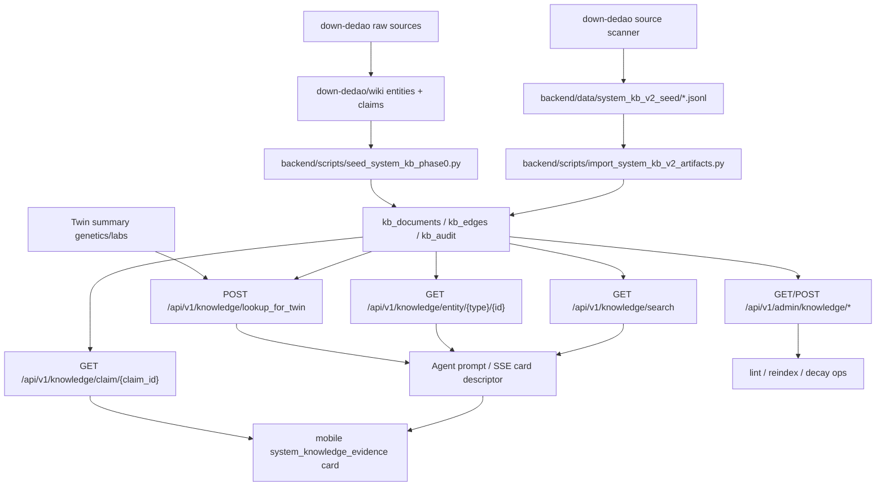

# System Knowledge KB Phase 0

Date: 2026-05-16

This document records the implemented vertical slice for the LLM Wiki v2 system knowledge base.

## 2026-05-18 Current State

- Reviewed artifacts: 508 docs / 2715 edges (`52 pages / 99 entities / 357 claims`); backend deploy imports them into serving DB.
- Ingest authoring CLI: `backend/scripts/ingest_course.py`.
- Review promotion: `promote_artifact_review_status`.
- Admin lint: contradiction + invalid review status included.
- Admin coverage: `/api/v1/admin/knowledge/coverage_report`.
- Crystallize: draft-only service exists and is called by weekly `system-kb-lifecycle` Celery task.
- Privacy isolation: scanner excludes private-looking paths; `find_private_source_violations(...)` reports private material without reading content.
- Search serving: `/knowledge/search` now fuses lexical, FTS-compatible, semantic alias, and graph streams via deterministic RRF.
- External evidence: selected MTHFR/APOE/statin/diabetes claims include reviewed PubMed/guideline source metadata.
- Phase 2 corpus expansion: compiler scanned 46 health-relevant source directories; 314 generated claims, 83 entities, 46 pages, and 2566 relations were promoted to reviewed status across reviewed passes while preserving previous reviewed artifacts.
- Dedao graph association: the compiler now adds entity-to-entity `contextualizes` edges from claim context, so graph traversal can connect biomarkers, conditions, and interventions even when the query does not name the exact claim.
- Admin operations dashboard: `/api/v1/admin/knowledge/operations_dashboard` aggregates coverage, external-evidence metrics, lint, latest lifecycle report, and action items.
- Planner evidence policy: Orchestrator blocks unsupported actionable findings from final synthesis when a same-domain KB-supported finding exists; safety alerts and data gaps are kept.
- Weekly Advisor evidence policy: fallback weekly action cards attach system KB evidence and reuse Planner evidence filtering before persistence.
- PushScheduler health-alert policy: direct wearable threshold alerts now carry `support_status=safety_alert`, rule identity, evidence domain, `unsupported=false`, and a medical-boundary payload. These alerts are deterministic safety prompts, not unsupported lifestyle recommendations.
- Generated notification policy: Celery trend summaries, weekly-review invites, action-card followups, agent-loop pushes, and outcome-grader pushes now carry KB V2 notification evidence metadata. Data-summary pushes are marked `support_status=data_summary`; generated advice without claim refs is explicitly auditable as `support_status=model_inference` and `unsupported=true`.
- Admin notification evidence coverage: `/api/v1/admin/knowledge/coverage_report` now includes `notification_evidence` for push logs that carry `support_status`; `/operations_dashboard` emits `notification_evidence_unsupported_high` when unsupported generated pushes need claim-backed cleanup.

## Scope

Phase 0 makes reviewed system knowledge addressable by structured entity and claim IDs. The follow-on Phase 1a extension adds a reviewed JSONL artifact import path and expands the seed corpus across metabolic health, nutrition, sleep/recovery, movement, blood pressure, lipids, blood sugar, uric acid, and medication safety. Phase 1b adds DB-backed search, claim detail, admin lint/reindex, confidence decay, specialist `evidence_refs`, and an `aging_hallmark` taxonomy layer. Phase 1c adds the deterministic Dedao ingest pipeline, PR-style diff review flow, conflict/supersession guardrails, and the first scaled Dedao corpus expansion. User conversations remain outside the system KB.

## Data Flow



## Backend Components

- `app.models.system_knowledge.KBDocument`: entity, claim, and article metadata.
- `app.models.system_knowledge.KBEdge`: typed graph edges between documents.
- `app.models.system_knowledge.KBAudit`: query and lookup audit trail.
- `app.services.system_knowledge_service`: deterministic entity bundle, claim detail, DB-backed search, Twin lookup, message/Twin evidence-card construction, confidence decay, lint, reindex, and specialist evidence attachment.
- `app.services.agent_executor`: `/agent/stream` injects the same `system_knowledge_evidence` payload into the LLM prompt and SSE `done.data.cards`; Twin-only matches are now visible to mobile, not hidden inside prompt text.
- `app.api.system_knowledge`: authenticated `/knowledge/entity/...`, `/knowledge/claim/...`, `/knowledge/claim/{claim_id}/feedback`, `/knowledge/search`, `/knowledge/lookup_for_twin`, plus admin `/admin/knowledge/lint_report` and `/admin/knowledge/reindex`.
- `migrations/managed/20260516_200000_create_system_knowledge_tables.*.sql`: PostgreSQL production and SQLite test migrations.
- `app.services.system_knowledge_pipeline`: deterministic source scanner and health-domain classifier for `/Users/liqiuhua/work/personal/down-dedao`.
- `app.services.system_knowledge_ingest`: deterministic Dedao course ingest, transformed claim mining, duplicate/conflict handling, supersession guardrails, entity/claim/page/relation artifact generation, and PR-style diff rendering.
- `app.services.system_knowledge_importer`: imports reviewed `manifest.json` plus `entities.jsonl`, `claims.jsonl`, `pages.jsonl`, and `relations.jsonl`.
- `app.services.notification.push_scheduler`: direct wearable health alerts include KB V2 evidence-contract metadata (`support_status`, `unsupported`, `planner_evidence_policy`, `rule_id`, and `claim_boundary`) before they enter notification logs or push channels.
- `app.services.notification.evidence_policy`: shared metadata builder for generated notification surfaces (`ai_advice`, `trend_report`, `prediction_verified`) so push logs can be counted in KB coverage and unsupported-advice audits. The user-level builder can auto-fill claim-backed `evidence_refs` from Health Twin matches before marking generated advice as `model_inference`.
- `app.services.agent_loop`: proactive `ai_advice` notifications use the user-level evidence builder, so Twin-backed KB claims are carried into push metadata instead of being hidden or counted as unsupported.
- `app.services.system_knowledge_service._aggregate_notification_evidence_coverage`: counts push-log evidence refs, unsupported rate, support-status mix, and per-notification-type coverage for admin governance.
- `scripts/ingest_dedao_system_kb.py`: dry-run or `--write` CLI for expanding reviewed artifacts from selected Dedao courses.
- `scripts/import_system_kb_v2_artifacts.py`: deployment-safe import entrypoint for reviewed artifacts.
- `scripts/scan_system_kb_sources.py`: local inspection tool for expanding course/book coverage without publishing raw paid content.
- `scripts/lint_system_kb.py`: CLI lint report for orphan/stale/invalid KB content.
- `scripts/reindex_system_kb.py`: refreshes `tsv` search text and `content_hash`.
- `scripts/decay_system_kb_confidence.py`: applies lifecycle confidence decay to stale claims.
- `app.tasks.system_knowledge_lifecycle`: weekly Celery task that runs lint, confidence decay, and draft-only crystallize candidate generation.

## Mobile Function Map


Card type: `system_knowledge_evidence`

Minimal payload:

```json
{
  "type": "system_knowledge_evidence",
  "data": {
    "entity": { "title": "MTHFR", "entity_id": "MTHFR" },
    "claims": [
      {
        "title": "MTHFR C677T 与叶酸转化边界",
        "evidence_level": "B",
        "confidence": 0.82,
        "sources": ["dedao:qiuzilong-genetics-07", "pubmed:19033271"]
      }
    ],
    "claim_boundary": "仅用于健康管理和风险沟通，不替代医生诊断、治疗或用药决策。"
  }
}
```

## Phase 0 Seed Coverage

- Genes: `MTHFR`, `APOE`, `FTO`, `ACTN3`, `ALDH2`
- Biomarker: `Hcy`
- Supplement: `5-MTHF`
- Claims: five reviewed seed claims, one per gene.

## Phase 1a Expanded Coverage

The reviewed artifact seed adds:

- Priority course pages: 冯雪四高课程、科学减肥、仝卿营养、忙碌者营养/糖尿病、仇子龙基因、王家伟用药、睡眠课程、薄世宁医学通识。
- Entities: metabolic-health, hypertension-risk, dyslipidemia-risk, glycemic-risk, hyperuricemia-risk, sleep-recovery, weight/waist/HbA1c/LDL-C/TG/BP/uric-acid/eGFR and core interventions.
- Claims: 15 bounded action claims covering weight+waist tracking, protein, fiber, salt, home BP, LDL/ApoB, TG, HbA1c feedback loop, uric acid context, Zone 2 with recovery constraint, strength training, sleep window, medication-vs-supplement separation, interaction review, and medical boundary.

These artifacts are intentionally transformed summaries and short claims. They do not expose full paid lesson text and are imported only after review.

## Phase 1b Backend Closure

Phase 1b intermediate reviewed artifact counts:

- Pages: 16
- Entities: 45
- Claims: 148
- Relations: 562

New behavior:

- `GET /api/v1/knowledge/claim/{claim_id}` returns claim detail, graph neighbors, edges, and medical boundary.
- `POST /api/v1/knowledge/claim/{claim_id}/feedback` records `feedback_disagree` in `kb_audit` so mobile evidence feedback becomes a lifecycle signal.
- `GET /api/v1/knowledge/search` performs deterministic DB-only lexical scoring, precomputed `tsv` FTS-compatible scoring, semantic alias scoring, and one-hop graph context through RRF. It is compatible with SQLite tests and production PostgreSQL; a real embedding backend can replace the alias stream without changing response shape.
- `POST /api/v1/knowledge/lookup_for_twin` now returns both direct `applies_when` matches and graph-context claims reached from structured Twin entities via `contextualizes` and `has_claim` edges. This lets a lab fact such as uric acid pull related condition/intervention claims into Agent prompts even when the claim has no direct threshold condition.
- `GET /api/v1/admin/knowledge/lint_report` reports orphan entities, orphan claims, invalid `applies_when`, and stale claims.
- `POST /api/v1/admin/knowledge/reindex` refreshes `kb_documents.tsv` and SHA-256 `content_hash`.
- `apply_confidence_decay(...)` and `scripts/decay_system_kb_confidence.py` implement the first lifecycle hook for stale claim confidence decay.
- Orchestrator attaches matched system KB claim IDs to specialist output as `evidence_refs`, so mobile can render evidence chips on non-gene cards in a later UI pass.
- KnowledgeLibrarian now prefers system KB V2 when a DB session is present, returning `system_knowledge_reference` findings and claim-level `evidence_refs`; the old Chroma wiki search remains fallback.

New taxonomy:

- `aging_hallmark:*` covers 14 aging hallmarks and extensions. The explicit product rule is: hallmark entities are a trajectory map and mechanism vocabulary, not a direct supplement recommendation table.

## Phase 1c Dedao Ingest Pipeline

New ingest behavior:

- `backend/scripts/ingest_dedao_system_kb.py` runs in dry-run mode by default and prints a PR-style diff without mutating `backend/data/system_kb_v2_seed`.
- `--write` merges generated pages, entities, claims, and graph edges into reviewed artifacts after human review.
- Claims are transformed short health-management facts with `applies_when`, `recommends_lookup`, evidence level, confidence, lifecycle fields, and a medical boundary.
- Raw paid-course bodies are not written to artifacts or serving DB.
- Existing reviewed claims are not superseded by draft ingest output; possible overlaps are marked as `candidate_duplicates`.
- Legacy or draft claims may be superseded with an explicit archived copy and metadata trail.

Current reviewed artifact run:

- Source root: `/Users/liqiuhua/work/personal/down-dedao`
- Courses selected: all scanner-detected health-relevant directories under `down-dedao`, capped at 60 lessons per course for this deterministic pass.
- Sources scanned: 46
- Claims: 357
- Entities: 99
- Pages: 52
- Relations: 2715
- Claims superseded: 0
- Latest incremental Dedao write: 11 claims added, 204 relations added, including 113 `contextualizes` entity-to-entity graph edges.
- Selected high-risk claims now include external PubMed/guideline metadata while keeping paid-course text out of artifacts.

## Next Interfaces

The Phase 2 corpus breadth target is met, the backend admin operations dashboard is available, and Planner-level evidence filtering is active for Orchestrator synthesis and Weekly Advisor fallback action cards. Next work should focus on applying the same evidence policy to direct push scheduler notification surfaces, governed LLM extraction for higher recall, broader external evidence coverage, and replacing the semantic alias stream with a proper embedding/vector backend when operationally justified.
