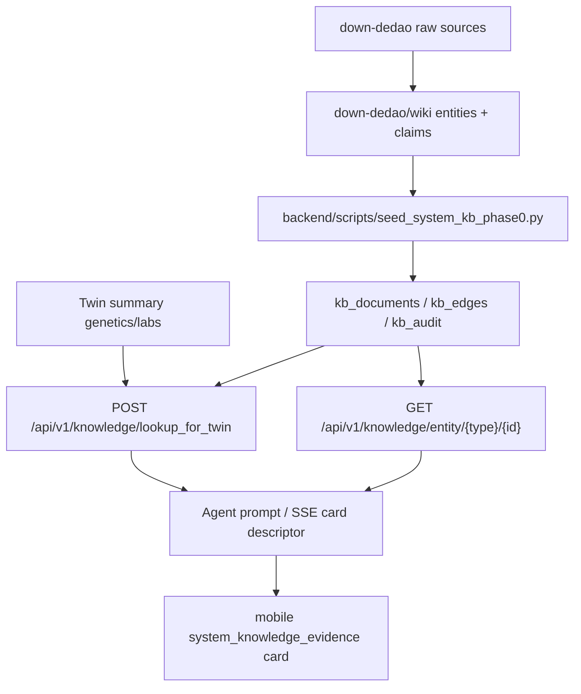

# System Knowledge KB Phase 0

Date: 2026-05-16

This document records the implemented vertical slice for the LLM Wiki v2 system knowledge base.

## Scope

Phase 0 makes reviewed system knowledge addressable by structured entity and claim IDs. It does not yet run the full course ingest pipeline or vector search. User conversations remain outside the system KB.

## Data Flow



## Backend Components

- `app.models.system_knowledge.KBDocument`: entity, claim, and article metadata.
- `app.models.system_knowledge.KBEdge`: typed graph edges between documents.
- `app.models.system_knowledge.KBAudit`: query and lookup audit trail.
- `app.services.system_knowledge_service`: deterministic entity bundle and Twin lookup.
- `app.api.system_knowledge`: authenticated `/knowledge/entity/...` and `/knowledge/lookup_for_twin` endpoints.
- `migrations/managed/20260516_200000_create_system_knowledge_tables.*.sql`: PostgreSQL production and SQLite test migrations.

## Mobile Function Map


Card type: `system_knowledge_evidence`

Minimal payload:

```json
{
  "type": "system_knowledge_evidence",
  "data": {
    "entity": { "title": "MTHFR", "entity_id": "MTHFR" },
    "claims": [
      {
        "title": "MTHFR C677T 与叶酸转化边界",
        "evidence_level": "B",
        "confidence": 0.82,
        "sources": ["dedao:qiuzilong-genetics-07", "pubmed:19033271"]
      }
    ],
    "claim_boundary": "仅用于健康管理和风险沟通，不替代医生诊断、治疗或用药决策。"
  }
}
```

## Phase 0 Seed Coverage

- Genes: `MTHFR`, `APOE`, `FTO`, `ACTN3`, `ALDH2`
- Biomarker: `Hcy`
- Supplement: `5-MTHF`
- Claims: five reviewed seed claims, one per gene.

## Next Interfaces

Phase 1 should replace the manual seed with PR-diff course ingest, then populate the same tables. Phase 2 should make planners and specialist agents emit `evidence_refs` and card descriptors from these `claim:*` IDs.
