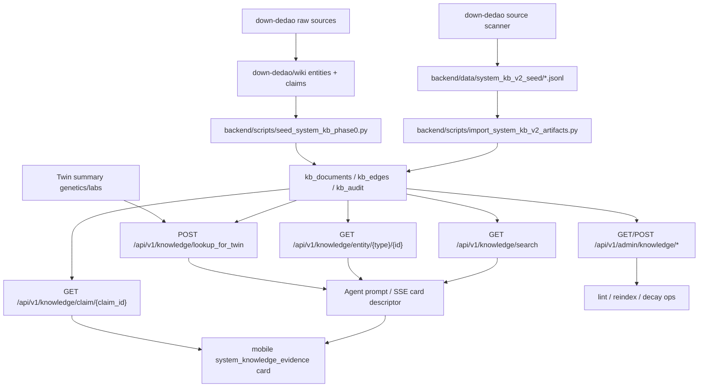

# System Knowledge KB Phase 0

Date: 2026-05-16

This document records the implemented vertical slice for the LLM Wiki v2 system knowledge base.

## Scope

Phase 0 makes reviewed system knowledge addressable by structured entity and claim IDs. The follow-on Phase 1a extension adds a reviewed JSONL artifact import path and expands the seed corpus across metabolic health, nutrition, sleep/recovery, movement, blood pressure, lipids, blood sugar, uric acid, and medication safety. Phase 1b adds DB-backed search, claim detail, admin lint/reindex, confidence decay, specialist `evidence_refs`, and an `aging_hallmark` taxonomy layer. User conversations remain outside the system KB.

## Data Flow



## Backend Components

- `app.models.system_knowledge.KBDocument`: entity, claim, and article metadata.
- `app.models.system_knowledge.KBEdge`: typed graph edges between documents.
- `app.models.system_knowledge.KBAudit`: query and lookup audit trail.
- `app.services.system_knowledge_service`: deterministic entity bundle, claim detail, DB-backed search, Twin lookup, confidence decay, lint, reindex, and specialist evidence attachment.
- `app.api.system_knowledge`: authenticated `/knowledge/entity/...`, `/knowledge/claim/...`, `/knowledge/search`, `/knowledge/lookup_for_twin`, plus admin `/admin/knowledge/lint_report` and `/admin/knowledge/reindex`.
- `migrations/managed/20260516_200000_create_system_knowledge_tables.*.sql`: PostgreSQL production and SQLite test migrations.
- `app.services.system_knowledge_pipeline`: deterministic source scanner and health-domain classifier for `/Users/liqiuhua/work/personal/down-dedao`.
- `app.services.system_knowledge_importer`: imports reviewed `manifest.json` plus `entities.jsonl`, `claims.jsonl`, `pages.jsonl`, and `relations.jsonl`.
- `scripts/import_system_kb_v2_artifacts.py`: deployment-safe import entrypoint for reviewed artifacts.
- `scripts/scan_system_kb_sources.py`: local inspection tool for expanding course/book coverage without publishing raw paid content.
- `scripts/lint_system_kb.py`: CLI lint report for orphan/stale/invalid KB content.
- `scripts/reindex_system_kb.py`: refreshes `tsv` search text and `content_hash`.
- `scripts/decay_system_kb_confidence.py`: applies lifecycle confidence decay to stale claims.

## Mobile Function Map


Card type: `system_knowledge_evidence`

Minimal payload:

```json
{
  "type": "system_knowledge_evidence",
  "data": {
    "entity": { "title": "MTHFR", "entity_id": "MTHFR" },
    "claims": [
      {
        "title": "MTHFR C677T 与叶酸转化边界",
        "evidence_level": "B",
        "confidence": 0.82,
        "sources": ["dedao:qiuzilong-genetics-07", "pubmed:19033271"]
      }
    ],
    "claim_boundary": "仅用于健康管理和风险沟通，不替代医生诊断、治疗或用药决策。"
  }
}
```

## Phase 0 Seed Coverage

- Genes: `MTHFR`, `APOE`, `FTO`, `ACTN3`, `ALDH2`
- Biomarker: `Hcy`
- Supplement: `5-MTHF`
- Claims: five reviewed seed claims, one per gene.

## Phase 1a Expanded Coverage

The reviewed artifact seed adds:

- Priority course pages: 冯雪四高课程、科学减肥、仝卿营养、忙碌者营养/糖尿病、仇子龙基因、王家伟用药、睡眠课程、薄世宁医学通识。
- Entities: metabolic-health, hypertension-risk, dyslipidemia-risk, glycemic-risk, hyperuricemia-risk, sleep-recovery, weight/waist/HbA1c/LDL-C/TG/BP/uric-acid/eGFR and core interventions.
- Claims: 15 bounded action claims covering weight+waist tracking, protein, fiber, salt, home BP, LDL/ApoB, TG, HbA1c feedback loop, uric acid context, Zone 2 with recovery constraint, strength training, sleep window, medication-vs-supplement separation, interaction review, and medical boundary.

These artifacts are intentionally transformed summaries and short claims. They do not expose full paid lesson text and are imported only after review.

## Phase 1b Backend Closure

Current reviewed artifact counts:

- Pages: 12
- Entities: 36
- Claims: 16
- Relations: 47

New behavior:

- `GET /api/v1/knowledge/claim/{claim_id}` returns claim detail, graph neighbors, edges, and medical boundary.
- `GET /api/v1/knowledge/search` performs deterministic DB-only lexical scoring plus graph context. It is compatible with SQLite tests and production PostgreSQL; later FTS/vector/RRF can replace the scorer without changing response shape.
- `GET /api/v1/admin/knowledge/lint_report` reports orphan entities, orphan claims, invalid `applies_when`, and stale claims.
- `POST /api/v1/admin/knowledge/reindex` refreshes `kb_documents.tsv` and SHA-256 `content_hash`.
- `apply_confidence_decay(...)` and `scripts/decay_system_kb_confidence.py` implement the first lifecycle hook for stale claim confidence decay.
- Orchestrator attaches matched system KB claim IDs to specialist output as `evidence_refs`, so mobile can render evidence chips on non-gene cards in a later UI pass.

New taxonomy:

- `aging_hallmark:*` covers 14 aging hallmarks and extensions. The explicit product rule is: hallmark entities are a trajectory map and mechanism vocabulary, not a direct supplement recommendation table.

## Next Interfaces

Next work should keep widening the reviewed artifact corpus and add PR-diff ingest for new courses/books. The main remaining product work is mobile rendering for `evidence_refs`, deeper PostgreSQL FTS/vector hybrid search, and reviewer workflows for claim approval/supersession.
