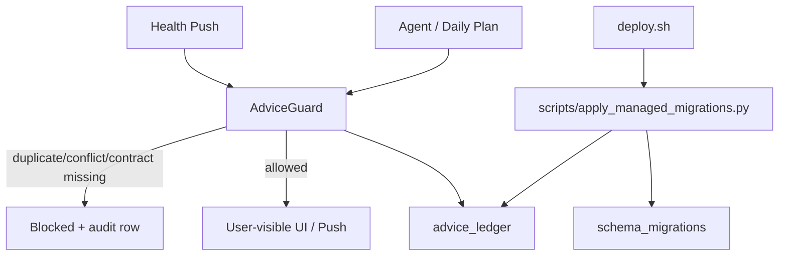

# Advice Ledger + Managed Migrations Implementation

日期: 2026-05-16

## 目标

解决两类线上风险:

- 同一用户收到重复或语义冲突的健康建议, 例如 Agent 建议恢复/休跑, push 又提示运动不足并要求提高强度。
- 新表结构依赖应用启动时临时 `ALTER TABLE`, 部署脚本没有显式迁移步骤。

## 架构



## 行为契约

所有用户可见的行动建议必须至少具备:

- `domain`
- `title`
- `body`
- `evidence_tier`
- `confidence`
- `claim_boundary`

`AdviceGuard` 当前先覆盖最高风险的 movement 冲突:

- `reduce_intensity/rest/pause_running`
- `increase_activity/150min_weekly/run_more`

同一用户当天如果已有“降低跑步强度/休跑/恢复优先”, 后续“长期运动不足/提高运动强度”类 push 会被拦截。Daily Plan 生成时也会过滤冲突 action。

## 迁移边界

历史 `backend/migrations/` 里混有 PostgreSQL、SQLite 和一次性脚本, 不适合在生产首次重放。因此新迁移进入:

```text
backend/migrations/managed/
```

部署时执行:

```bash
python scripts/apply_managed_migrations.py
```

runner 会:

1. 创建 `schema_migrations`;
2. 按当前数据库 dialect 选择 `.postgresql.sql` 或 `.sqlite.sql`;
3. 校验 checksum, 防止修改已执行迁移;
4. 只应用尚未记录的新迁移。

## 测试

- `backend/tests/test_managed_migrations.py`
- `backend/tests/test_advice_guard.py`

