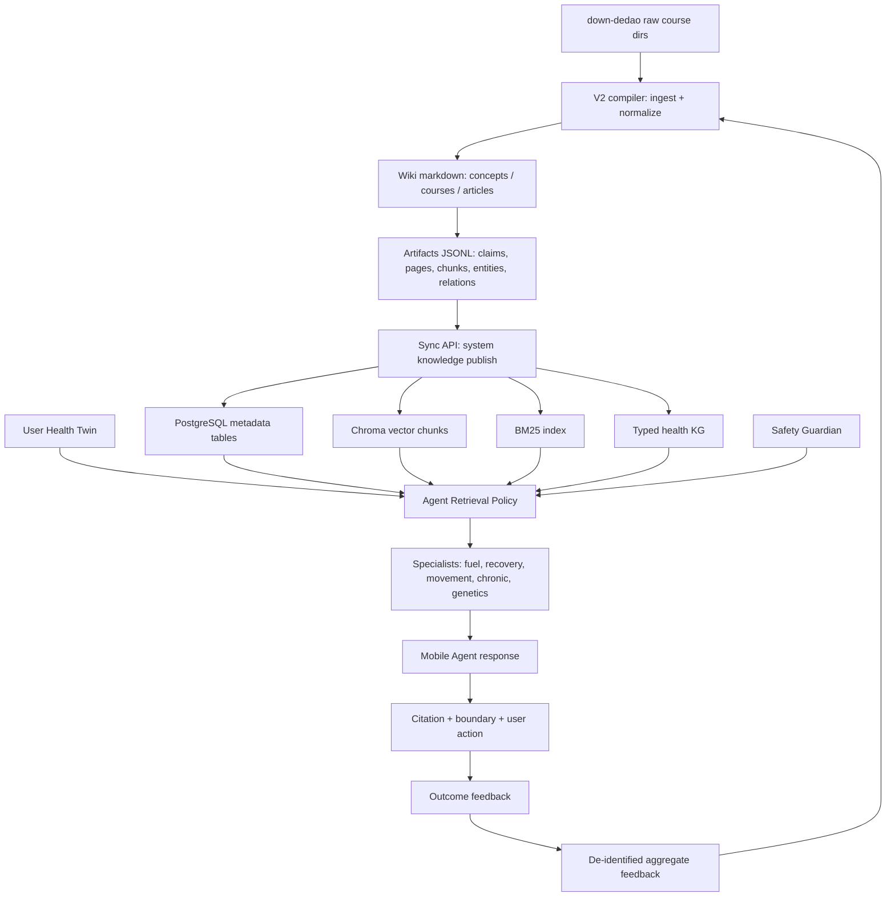

# LLM Wiki V2 System Knowledge Base Implementation Plan

> **For Claude:** REQUIRED SUB-SKILL: Use superpowers:executing-plans to implement this plan task-by-task.

**Goal:** Build a system-level LLM Wiki V2 knowledge base from `/Users/liqiuhua/work/personal/down-dedao`, then publish governed health knowledge into `health-llm-driven` so every Mobile First Agent Native user can receive evidence-enhanced guidance grounded in genetics and personal health data.

**Architecture:** Keep `/Users/liqiuhua/work/personal/down-dedao` as the offline wiki compiler and source curation workspace. Extend `health-llm-driven` into the serving plane: system corpus, typed health knowledge graph, lifecycle metadata, hybrid retrieval, safety policy, and Mobile Agent citation surfaces.

**Tech Stack:** Python 3.12, FastAPI, SQLAlchemy, PostgreSQL in production, ChromaDB vector store, BM25/hybrid search, Celery, Expo React Native, Markdown/YAML wiki artifacts.

---

## 1. Product Framing

This is not a generic RAG upload feature. It is the system knowledge layer for a Personal Health Trajectory Agent.

The Agent should answer using three bounded knowledge sources:

1. **System Wiki:** curated health knowledge compiled from legally obtained course notes and source materials under `/Users/liqiuhua/work/personal/down-dedao`.
2. **User Twin:** private user data including genotype, labs, wearable data, diet, movement, sleep, medications, symptoms, and goals.
3. **Safety Rules:** deterministic clinical boundaries, red flags, drug/supplement interactions, and "not diagnosis / not treatment" constraints.

System Wiki must be shared by all users. User Twin must remain private per user. Anonymous aggregate feedback may strengthen system knowledge only after de-identification and review.

## 2. Current State

`/Users/liqiuhua/work/personal/down-dedao` already has the right shape for V2:

- ~14,478 files and ~625 directories.
- Health-relevant course directories:
  - `冯雪·家庭健康管理100讲`
  - `冯雪·科学减肥16讲`
  - `冯雪·高血压医学课`
  - `冯雪·高血糖医学课`
  - `冯雪·高血脂医学课`
  - `冯雪·高尿酸医学课`
  - `仝卿·营养科学20讲`
  - `仇子龙·基因科学20讲`
  - `薄世宁·医学通识50讲`
  - `王家伟·日常用药健康课`
  - `前沿课·人体微生物组9讲`
- Existing V2-like workspace:
  - `wiki/`
  - `wiki/concepts/`
  - `wiki/courses/`
  - `wiki/articles/`
  - `pipeline/compiler.py`
  - `pipeline/sync.py`
  - `pipeline/export_graph.py`
  - `pipeline/lint.py`
  - `artifacts/*.json`

`health-llm-driven` already has:

- `backend/app/services/knowledge/vectorstore.py`
- `backend/app/services/knowledge/rag_pipeline.py`
- `backend/app/api/knowledge.py`
- `backend/app/services/knowledge_evidence.py`
- Diet and supplement advice using first-pass `knowledge_evidence`.
- Agent architecture with Digital Health Twin, specialists, Safety Guardian, and advice ledger.

Implementation status as of 2026-05-16:

- Completed serving slice: `kb_documents`, `kb_edges`, `kb_audit`, entity/claim/search/lookup/admin APIs, deployment import, and mobile evidence-card plumbing.
- Completed first deterministic ingest slice: `system_knowledge_ingest.py` + `ingest_dedao_system_kb.py` produce dry-run PR-style diffs, transformed claims, graph edges, duplicate detection, and supersession guardrails.
- Completed first scaled Dedao corpus expansion: 13 course sources compiled into reviewed artifacts, expanding the serving corpus to 206 documents and 550 graph edges.
- Remaining V2 work: governed LLM extraction for deeper per-lesson claims, PostgreSQL FTS/vector/RRF hybrid search, reviewer UI/workflow, and broader evidence promotion with PubMed/guidelines.

## 3. Target Architecture



### Boundary Between Workspaces

`down-dedao` is the authoring/compiler plane:

- Reads raw files.
- Maintains wiki pages.
- Extracts entities and typed relations.
- Produces structured artifacts.
- Runs lint and quality checks.

`health-llm-driven` is the serving plane:

- Stores system knowledge metadata in PostgreSQL.
- Stores retrievable chunks in Chroma/BM25.
- Stores typed health KG in relational tables.
- Injects evidence into Agent prompts.
- Enforces privacy, claim boundaries, advice ledger, and safety rules.

## 4. V2 Knowledge Model

### 4.1 Scopes

| Scope | Meaning | Examples | Served To |
|---|---|---|---|
| `system_shared` | Curated knowledge usable by all users | general metabolic health, hypertension basics, nutrition principles | all users |
| `system_condition` | Shared but condition-specific | hypertension, hyperlipidemia, gout, OSA | users with matching risk/context |
| `system_gene` | Shared genotype interpretation rules | APOE, MTHFR, ALDH2, CYP2C19 boundaries | users with matching variants |
| `system_safety` | Deterministic safety and boundary knowledge | red flags, contraindications, drug/supplement cautions | all users |
| `user_private` | Private user facts | labs, genotype, wearables, medication | only the owning user |
| `aggregate_feedback` | De-identified outcome evidence | completion rate, response patterns | system review only |

### 4.2 Lifecycle Tiers

| Tier | Description | Storage | Promotion Rule |
|---|---|---|---|
| Working | Newly observed source chunks, import logs, raw LLM extraction | compiler artifacts + import job | successful parse + minimum quality |
| Episodic | Lesson summaries and session digests | wiki pages + `knowledge_pages` | reviewed or source-backed |
| Semantic | Stable claims and concept pages | `knowledge_claims`, KG entities/relations | multi-source support or high authority |
| Procedural | Action patterns and workflows | `knowledge_protocols` | repeated evidence + safety review |

### 4.3 Claim Contract

Every retrievable claim must carry:

```json
{
  "claim_id": "akbp_claim_...",
  "scope": "system_shared",
  "domain": "metabolic_health",
  "claim_text": "Protein intake during weight loss should be sufficient to preserve lean mass.",
  "evidence_level": "A|B|C|D",
  "confidence_score": 0.72,
  "source_count": 2,
  "last_confirmed_at": "2026-05-16T00:00:00Z",
  "decay_rate": "slow|normal|fast",
  "applies_when": [
    "twin.genetics.MTHFR_C677T in ['CT', 'TT']",
    "twin.labs.homocysteine_umol_l >= 15"
  ],
  "recommends_lookup": [
    "entities/supplement/5-MTHF.md",
    "entities/biomarker/Hcy.md"
  ],
  "superseded_by": null,
  "contradicts": [],
  "claim_boundary": "Health management guidance only; not diagnosis, prescription, or treatment."
}
```

Health advice may cite claims. It must not cite raw paid course text as if it were a clinical guideline.

`applies_when` is mandatory for Agent Native health usage. It lets the Twin retrieve deterministic matches without relying on embedding similarity. Embeddings can find background reading; `applies_when` decides whether a claim is allowed to influence a specific user.

Evidence levels use a compact product-facing scale:

| Level | Meaning | Initial Confidence |
|---|---|---|
| `A` | guideline, RCT, meta-analysis, or strong consensus | 0.90 |
| `B` | cohort, strong mechanistic evidence, PubMed-backed review | 0.75 |
| `C` | course synthesis, expert explanation, plausible but not definitive | 0.60 |
| `D` | anecdote, weak association, early hypothesis | 0.40 |

Course-only claims should usually start at `C`. Adding PubMed, guideline, or examine.com style second sources can promote them to `B` or `A`.

### 4.4 Entity and Claim Wiki Skeleton

The authoring workspace should add explicit pages under `wiki/entities/` and `wiki/claims/` before large-scale ingestion.

```text
/Users/liqiuhua/work/personal/down-dedao/wiki/
├── WIKI_SCHEMA.md
├── entities/
│   ├── gene/        MTHFR.md APOE.md FTO.md ACTN3.md ALDH2.md
│   ├── snp/         rs1801133.md rs429358.md rs7412.md
│   ├── nutrient/    folate.md vitamin-d.md omega-3.md magnesium.md
│   ├── supplement/  5-MTHF.md magnesium-glycinate.md creatine.md
│   ├── biomarker/   Hcy.md LDL-C.md HbA1c.md ApoB.md eGFR.md
│   ├── condition/   hyperhomocysteinemia.md MAFLD.md OSAHS.md gout.md
│   └── drug/        statin.md metformin.md warfarin.md clopidogrel.md
└── claims/
    └── c_*.md
```

Phase 0 should hand-write five sample claims before running an LLM ingest pipeline:

1. `MTHFR` + folate/Hcy boundary.
2. `APOE` + LDL/ApoB dietary caution.
3. `FTO` + weight-risk interpretation boundary.
4. `ACTN3` + exercise phenotype limitation.
5. `ALDH2` + alcohol avoidance and medication caution.

Each sample claim must include `entity_id`, `claim_id`, `evidence_level`, `applies_when`, `recommends_lookup`, `sources`, `last_confirmed`, `decay_rate`, and `claim_boundary`.

### 4.5 Write Policy

System knowledge is review-gated.

- Course ingest creates PR-style diffs only. It must not directly commit, sync, or publish by default.
- LLM may draft entity pages, claims, and relation edges.
- Human review is required before merging system-level content.
- User conversations never write directly into system wiki.
- User conversations go into `user_episode_memory` or user-private memory only.
- A later `crystallize.py` job may draft system claims only from de-identified aggregate evidence, e.g. 100+ matching agent outcomes with consistent direction.

## 5. Governance and Copyright Policy

This system can use course knowledge internally only if the content is legally obtained and usage is within the allowed private/internal scope.

Rules:

- Never expose full course text to end users.
- Store source metadata and short excerpts only for citations.
- Use transformed claims, summaries, and action patterns rather than raw course reproduction.
- Mark every artifact with `license_scope`.
- System serving may show:
  - course title
  - author
  - lesson title
  - one short excerpt
  - synthesized claim
  - boundary statement
- System serving must not show:
  - whole lessons
  - large contiguous excerpts
  - bulk exports of paid content
  - "downloadable course summaries" that substitute for the course

## 6. Data Model in `health-llm-driven`

Claude's plan usefully compresses the first backend slice into three tables: `kb_documents`, `kb_edges`, and `kb_audit`. Adopt that as the Phase 0 serving MVP because it can power entity lookup, claim lookup, FTS, graph traversal, and audit without over-normalizing too early. The richer `system_knowledge_*` model can evolve from these tables after the first evidence card works end to end.

### Phase 0 MVP Tables

```sql
CREATE TABLE IF NOT EXISTS kb_documents (
    doc_id TEXT PRIMARY KEY,
    doc_type TEXT NOT NULL,
    entity_type TEXT,
    entity_id TEXT,
    title TEXT,
    content_hash TEXT,
    confidence REAL,
    evidence_level CHAR(1),
    applies_when JSONB DEFAULT '[]'::jsonb,
    recommends_lookup TEXT[] DEFAULT '{}',
    sources TEXT[] DEFAULT '{}',
    tsv TSVECTOR,
    last_confirmed TIMESTAMPTZ,
    decay_rate TEXT DEFAULT 'normal',
    is_archived BOOLEAN DEFAULT FALSE,
    metadata JSONB DEFAULT '{}'::jsonb,
    created_at TIMESTAMPTZ DEFAULT NOW(),
    updated_at TIMESTAMPTZ
);

CREATE INDEX IF NOT EXISTS kb_doc_entity ON kb_documents(entity_type, entity_id);
CREATE INDEX IF NOT EXISTS kb_doc_tsv ON kb_documents USING GIN(tsv);
CREATE INDEX IF NOT EXISTS kb_doc_apply ON kb_documents USING GIN(applies_when);
CREATE INDEX IF NOT EXISTS kb_doc_type ON kb_documents(doc_type, is_archived);

CREATE TABLE IF NOT EXISTS kb_edges (
    edge_id BIGSERIAL PRIMARY KEY,
    src_doc_id TEXT REFERENCES kb_documents(doc_id),
    dst_doc_id TEXT REFERENCES kb_documents(doc_id),
    relation TEXT NOT NULL,
    confidence REAL,
    source_claim_id TEXT,
    metadata JSONB DEFAULT '{}'::jsonb,
    created_at TIMESTAMPTZ DEFAULT NOW()
);

CREATE INDEX IF NOT EXISTS kb_edge_src ON kb_edges(src_doc_id, relation);
CREATE INDEX IF NOT EXISTS kb_edge_dst ON kb_edges(dst_doc_id, relation);

CREATE TABLE IF NOT EXISTS kb_audit (
    id BIGSERIAL PRIMARY KEY,
    doc_id TEXT,
    op TEXT NOT NULL,
    actor TEXT NOT NULL,
    diff JSONB DEFAULT '{}'::jsonb,
    ts TIMESTAMPTZ DEFAULT NOW()
);

CREATE INDEX IF NOT EXISTS kb_audit_doc ON kb_audit(doc_id, ts DESC);
CREATE INDEX IF NOT EXISTS kb_audit_op ON kb_audit(op, ts DESC);
```

Chroma collections should be split by document role:

- `kb_entities`
- `kb_claims`
- `kb_articles`

The old collection can stay as fallback during rollout, but new Agent paths should use the three-role split.

### Task 1: Add System Knowledge Metadata Tables

**Files:**
- Create: `backend/app/models/system_knowledge.py`
- Create: `backend/migrations/20260516_200000_create_system_knowledge_tables.sql`
- Modify: `backend/main.py`
- Test: `backend/tests/test_system_knowledge_models.py`

**Tables:**

Use `kb_documents`, `kb_edges`, and `kb_audit` for Phase 0. If the corpus grows beyond the MVP, normalize into the following richer tables while preserving API compatibility:

```sql
CREATE TABLE IF NOT EXISTS system_knowledge_sources (
    id SERIAL PRIMARY KEY,
    source_key VARCHAR(200) UNIQUE NOT NULL,
    title VARCHAR(500) NOT NULL,
    author VARCHAR(200),
    platform VARCHAR(100),
    source_type VARCHAR(80) NOT NULL,
    license_scope VARCHAR(80) NOT NULL DEFAULT 'internal',
    raw_root_path TEXT,
    content_hash VARCHAR(128),
    version VARCHAR(80),
    imported_at TIMESTAMP WITH TIME ZONE DEFAULT NOW(),
    is_active BOOLEAN DEFAULT TRUE
);

CREATE TABLE IF NOT EXISTS system_knowledge_claims (
    id SERIAL PRIMARY KEY,
    claim_key VARCHAR(240) UNIQUE NOT NULL,
    source_key VARCHAR(200) REFERENCES system_knowledge_sources(source_key),
    scope VARCHAR(80) NOT NULL,
    domain VARCHAR(120) NOT NULL,
    category VARCHAR(120),
    claim_text TEXT NOT NULL,
    evidence_level VARCHAR(80) NOT NULL,
    confidence_score DOUBLE PRECISION NOT NULL DEFAULT 0.5,
    source_count INTEGER NOT NULL DEFAULT 1,
    last_confirmed_at TIMESTAMP WITH TIME ZONE,
    decay_rate DOUBLE PRECISION NOT NULL DEFAULT 0.02,
    superseded_by VARCHAR(240),
    contradicts JSONB DEFAULT '[]'::jsonb,
    claim_boundary TEXT NOT NULL,
    metadata JSONB DEFAULT '{}'::jsonb,
    created_at TIMESTAMP WITH TIME ZONE DEFAULT NOW(),
    updated_at TIMESTAMP WITH TIME ZONE DEFAULT NOW(),
    is_active BOOLEAN DEFAULT TRUE
);

CREATE INDEX IF NOT EXISTS idx_system_claims_domain ON system_knowledge_claims(domain);
CREATE INDEX IF NOT EXISTS idx_system_claims_scope ON system_knowledge_claims(scope);
CREATE INDEX IF NOT EXISTS idx_system_claims_active ON system_knowledge_claims(is_active);
```

### Task 2: Add Typed Health KG Tables

**Files:**
- Modify: `backend/app/models/system_knowledge.py`
- Modify: `backend/migrations/20260516_200000_create_system_knowledge_tables.sql`
- Test: `backend/tests/test_system_knowledge_kg.py`

**Entity types:**

- `condition`
- `lab_marker`
- `gene_variant`
- `medication`
- `supplement`
- `nutrient`
- `food_pattern`
- `exercise_pattern`
- `sleep_pattern`
- `risk_factor`
- `intervention`
- `safety_boundary`

**Relation predicates:**

- `improves`
- `worsens`
- `associated_with`
- `contraindicates`
- `interacts_with`
- `requires_monitoring`
- `supports`
- `supersedes`
- `contradicts`
- `applies_to`
- `depends_on`

### Task 3: Add Import Job and Audit Tables

**Files:**
- Modify: `backend/app/models/system_knowledge.py`
- Modify: migration file above
- Test: `backend/tests/test_system_knowledge_import_jobs.py`

Fields:

- `job_id`
- `source_root`
- `artifact_version`
- `total_files`
- `total_claims`
- `total_chunks`
- `total_entities`
- `total_relations`
- `status`
- `errors`
- `started_at`
- `finished_at`

Audit events:

- `import_started`
- `source_upserted`
- `claim_upserted`
- `chunk_uploaded`
- `relation_upserted`
- `supersession_created`
- `claim_deactivated`
- `retrieval_used`

## 7. Artifact Format from `down-dedao`

The compiler should output JSONL, not only one JSON file per article.

### Required Artifacts

```
artifacts/v2/
├── manifest.json
├── pages.jsonl
├── chunks.jsonl
├── claims.jsonl
├── entities.jsonl
├── relations.jsonl
├── supersessions.jsonl
├── quality_report.json
└── rejected.jsonl
```

### `manifest.json`

```json
{
  "protocol": "akbp",
  "version": "2.0",
  "compiled_at": "2026-05-16T00:00:00Z",
  "source_root": "/Users/liqiuhua/work/personal/down-dedao",
  "wiki_commit": "git-sha",
  "content_hash": "sha256",
  "counts": {
    "pages": 120,
    "chunks": 1800,
    "claims": 900,
    "entities": 320,
    "relations": 740
  }
}
```

### `claims.jsonl`

Each line:

```json
{
  "claim_key": "dedao:fengxue_weight_loss:protein_preserves_lean_mass",
  "page_id": "courses/fengxue_weight_loss",
  "chunk_id": "chunk_...",
  "source_key": "dedao:fengxue_scientific_weight_loss",
  "scope": "system_shared",
  "domain": "metabolic_health",
  "category": "nutrition",
  "claim_text": "Weight-loss plans should preserve protein intake to reduce lean-mass loss risk.",
  "evidence_level": "C",
  "confidence_score": 0.65,
  "source_count": 1,
  "conditions": ["weight_loss", "metabolic_risk"],
  "genes": [],
  "labs": ["weight", "waist", "albumin", "eGFR"],
  "safety_tags": ["kidney_disease_check"],
  "applies_when": [
    "twin.goals.weight_loss.active == true",
    "twin.kidney.eGFR is null or twin.kidney.eGFR >= 60"
  ],
  "recommends_lookup": [
    "entities/nutrient/protein.md",
    "entities/biomarker/eGFR.md"
  ],
  "claim_boundary": "General health management; not individualized medical nutrition therapy.",
  "short_excerpt": "减重阶段应关注蛋白质和肌肉量...",
  "citation": {
    "title": "冯雪·科学减肥16讲",
    "author": "冯雪",
    "platform": "得到",
    "lesson": "蛋白质与减重"
  }
}
```

### `entities.jsonl`

Each line:

```json
{
  "doc_id": "entity:gene:MTHFR",
  "doc_type": "entity",
  "entity_type": "gene",
  "entity_id": "MTHFR",
  "title": "MTHFR",
  "aliases": ["methylenetetrahydrofolate reductase"],
  "summary": "One-carbon metabolism gene relevant to folate conversion and homocysteine context.",
  "linked_claims": ["claim:mthfr_c677t_hcy_folate_boundary"],
  "metadata": {
    "category": "genetics",
    "review_status": "seed"
  }
}
```

### `relations.jsonl`

Each line:

```json
{
  "edge_key": "edge:mthfr:requires_monitoring:hcy",
  "src_doc_id": "entity:gene:MTHFR",
  "dst_doc_id": "entity:biomarker:Hcy",
  "relation": "requires_monitoring",
  "confidence": 0.75,
  "source_claim_id": "claim:mthfr_c677t_hcy_folate_boundary"
}
```

## 8. Compiler Design in `down-dedao`

### Task 4: Build V2 Course Scanner

**Workspace:** `/Users/liqiuhua/work/personal/down-dedao`

**Files:**
- Create: `pipeline/v2/scanner.py`
- Create: `pipeline/v2/manifest.py`
- Test: `tests/test_v2_scanner.py`

Inputs:

- top-level course directories
- `PDF/`
- `MD/`
- `MP3/`
- existing `wiki/`
- optional `course.yaml`

Skip:

- `.git`
- `.obsidian`
- `.compile-cache`
- `pipeline/`
- `artifacts/`
- `output/`
- `agents/`
- `__pycache__`
- `.ok`
- images unless referenced

Output:

- normalized file inventory with hash, course metadata, lesson order, and parse status.

### Task 5: Build Health Domain Classifier

**Files:**
- Create: `pipeline/v2/health_classifier.py`
- Test: `tests/test_v2_health_classifier.py`

Prioritized health domains:

1. `metabolic_health`
2. `cardiovascular`
3. `nutrition`
4. `genetics`
5. `medication_safety`
6. `sleep_recovery`
7. `movement`
8. `mental_health`
9. `respiratory_allergy`
10. `microbiome`
11. `longevity`
12. `general_wellness`

Non-health courses should not enter the serving corpus by default.

### Task 6: Build Claim Extractor

**Files:**
- Create: `pipeline/v2/claim_extractor.py`
- Test: `tests/test_v2_claim_extractor.py`

Use deterministic extraction first:

- headings
- bullet claims
- tables
- "适用/禁忌/风险/建议/复查/医生" sections

Use LLM extraction only after deterministic pass, with a strict schema.

Claim extraction prompt must require:

- no diagnosis
- no prescription
- no unsupported certainty
- evidence level
- boundary
- source citation
- safety tags

### Task 7: Build Entity and Relation Extractor

**Files:**
- Create: `pipeline/v2/kg_extractor.py`
- Test: `tests/test_v2_kg_extractor.py`

Examples:

- `APOE` `associated_with` `LDL-C`
- `ALDH2 deficiency` `requires_monitoring` `alcohol exposure`
- `high sodium diet` `worsens` `blood pressure`
- `protein intake` `supports` `lean mass preservation`
- `kidney disease` `contraindicates` `unsupervised high protein`
- `grapefruit` `interacts_with` `some statins`

### Task 8: Build V2 Compiler

**Files:**
- Create: `pipeline/v2/compiler.py`
- Modify: `pipeline/run.sh`
- Test: `tests/test_v2_compiler.py`

Command:

```bash
cd /Users/liqiuhua/work/personal/down-dedao
python3 -m pipeline.v2.compiler \
  --root /Users/liqiuhua/work/personal/down-dedao \
  --health-only \
  --out artifacts/v2
```

Expected:

- generates all V2 artifacts
- skips unchanged files by content hash
- writes rejected items with reasons
- produces quality report

### Task 8.5: PR-Diff Ingest Workflow

**Files:**
- Create: `/Users/liqiuhua/work/personal/down-dedao/pipeline/ingest_course.py`
- Test: `/Users/liqiuhua/work/personal/down-dedao/tests/test_ingest_course.py`

Command:

```bash
cd /Users/liqiuhua/work/personal/down-dedao
python3 pipeline/ingest_course.py \
  --course "仇子龙·基因科学20讲" \
  --lesson "07" \
  --dry-run \
  --emit-diff
```

Rules:

- Default mode is `--dry-run`; the tool prints a patch/diff and writes no committed state.
- One course ingestion should create one PR-style diff.
- Large course batches are not allowed in Phase 1.
- Diff must show created/updated entity pages, claims, edges, `AK-INDEX.md`, and `ak-log.md`.
- Each diff must include a quality report and conflict report.
- Human review is mandatory before sync to the health system.

Ingest steps:

1. Discuss or summarize lesson key points.
2. Extract entities with aliases and types.
3. Mine atomic claims.
4. Search existing claims by BM25 + vector for conflict candidates.
5. Propose `supersedes` only when source authority, recency, and evidence support it.
6. Assign confidence from evidence level.
7. Update entity pages with claim backlinks.
8. Update `AK-INDEX.md`.
9. Append `ak-log.md`.
10. Emit PR diff.

## 9. Sync Design

### Task 9: Add System Knowledge Publish API

**Files:**
- Create: `backend/app/api/system_knowledge.py`
- Modify: `backend/app/api/main.py`
- Test: `backend/tests/test_system_knowledge_api.py`

Endpoints:

```http
POST /api/v1/system-knowledge/imports
POST /api/v1/system-knowledge/imports/{job_id}/sources
POST /api/v1/system-knowledge/imports/{job_id}/claims
POST /api/v1/system-knowledge/imports/{job_id}/chunks
POST /api/v1/system-knowledge/imports/{job_id}/entities
POST /api/v1/system-knowledge/imports/{job_id}/relations
POST /api/v1/system-knowledge/imports/{job_id}/finalize
GET  /api/v1/system-knowledge/imports/{job_id}
GET  /api/v1/system-knowledge/stats
```

Security:

- admin only
- request size limits
- audit every batch
- idempotent by `claim_key`, `chunk_id`, `entity_key`, `relation_key`
- no raw full-course export endpoint

### Task 10: Add V2 Sync Client in `down-dedao`

**Files:**
- Create: `/Users/liqiuhua/work/personal/down-dedao/pipeline/v2/sync.py`
- Test: `/Users/liqiuhua/work/personal/down-dedao/tests/test_v2_sync.py`

Command:

```bash
cd /Users/liqiuhua/work/personal/down-dedao
HEALTH_API_URL=https://health-api.executor.life \
HEALTH_API_TOKEN=... \
python3 -m pipeline.v2.sync --artifacts artifacts/v2
```

Behavior:

- create import job
- batch upload sources
- batch upload claims
- batch upload chunks to vector store
- batch upload entities/relations
- finalize job
- print stats and failed rows

## 10. Retrieval Design

### Task 11: Add Hybrid Retriever

**Files:**
- Create: `backend/app/services/system_knowledge_retriever.py`
- Modify: `backend/app/services/knowledge_evidence.py`
- Test: `backend/tests/test_system_knowledge_retriever.py`

Streams:

1. BM25 exact retrieval over title, claim text, aliases, tags.
2. Vector retrieval over chunks.
3. Graph traversal from detected entities in user context.

Fusion:

- Reciprocal Rank Fusion with `k=60`.
- Hard filters:
  - `is_active = true`
  - `superseded_by IS NULL`
  - `scope in allowed scopes`
  - condition/gene match where required
- Soft boosts:
  - higher confidence
  - recent confirmation
  - matching user goal
  - matching abnormal lab
  - matching gene variant

### Task 11.5: Add Entity-First Lookup APIs

**Files:**
- Modify: `backend/app/api/knowledge.py` or create `backend/app/api/system_knowledge.py`
- Test: `backend/tests/test_entity_first_knowledge_api.py`

Endpoints:

```http
GET  /api/v1/knowledge/entity/{entity_type}/{entity_id}
GET  /api/v1/knowledge/claim/{claim_id}
GET  /api/v1/knowledge/search
POST /api/v1/knowledge/lookup_for_twin
GET  /api/v1/admin/knowledge/lint_report
POST /api/v1/admin/knowledge/reindex
```

`lookup_for_twin` is the Agent Native core. It receives a compact Twin summary and returns entity IDs plus matched claims via `applies_when`.

Example request:

```json
{
  "genetics": {"MTHFR_C677T": "TT", "APOE": "E3/E4"},
  "labs": {"homocysteine_umol_l": 18, "ldl_c_mmol_l": 3.6},
  "medications": ["rosuvastatin"],
  "goals": ["weight_loss", "metabolic_health"]
}
```

Example response:

```json
{
  "entities": [
    "entity:gene:MTHFR",
    "entity:biomarker:Hcy",
    "entity:gene:APOE",
    "entity:biomarker:LDL-C",
    "entity:drug:statin"
  ],
  "claims": [
    {
      "claim_id": "claim:mthfr_c677t_hcy_folate_boundary",
      "match_reason": "MTHFR_C677T=TT and homocysteine>=15",
      "confidence": 0.75
    }
  ]
}
```

This endpoint should not ask an LLM to infer matches. It should evaluate structured `applies_when` predicates deterministically, then use hybrid retrieval only for surrounding context.

### Task 12: Add Retrieval Policy for Health Agent

**Files:**
- Create: `backend/app/services/agent_knowledge_policy.py`
- Modify: `backend/app/orchestrator/orchestrator.py`
- Modify: `backend/app/services/diet_plan.py`
- Modify: `backend/app/services/supplement_recommendation.py`
- Test: `backend/tests/test_agent_knowledge_policy.py`

Policy:

```text
If user asks diet/supplement/metabolic question:
  retrieve nutrition + metabolic + safety claims
  include user labs and genotype only from private twin
  include contraindication checks

If user asks medication question:
  retrieve medication_safety + gene_drug + red flag rules
  never suggest dose changes without doctor boundary

If user asks genetics question:
  retrieve gene interpretation claims
  require confidence and population limitation language

If user asks red-flag symptom:
  Safety Guardian overrides knowledge retrieval
```

## 11. Mobile First Agent Native UX

### Task 13: Add Evidence Capsule UI

**Files:**
- Create: `mobile/components/agent/EvidenceCapsule.tsx`
- Modify: `mobile/app/(tabs)/chat.tsx`
- Test: `mobile/components/agent/__tests__/EvidenceCapsule.test.tsx`

Mobile response should show compact evidence:

```text
依据
1. 系统知识库 · 冯雪·科学减肥16讲 · 蛋白质与减重
2. 你的数据 · 近7日体重/腰围趋势
3. 安全边界 · 肾功能异常或孕产状态需医生/营养师确认
```

Tap behavior:

- expands short excerpt
- shows confidence
- shows "为什么这条适用于我"
- does not show full source text
- includes "反馈这条建议不对" action, writing a `kb_audit` event that later informs lint and contradiction review

### Task 14: Add "Why This Advice" Agent Trace

**Files:**
- Create: `mobile/components/agent/AdviceTraceSheet.tsx`
- Modify: relevant chat/action-card components
- Test: `mobile/components/agent/__tests__/AdviceTraceSheet.test.tsx`

Trace sections:

- `系统知识`
- `个人数据`
- `基因/体检锚点`
- `安全规则`
- `不确定性`
- `下一步行动`

## 12. Lifecycle Jobs

### Task 15: Add Knowledge Lifecycle Celery Tasks

**Files:**
- Create: `backend/app/tasks/system_knowledge.py`
- Test: `backend/tests/test_system_knowledge_lifecycle.py`

Jobs:

- `decay_system_claim_confidence`
- `detect_system_claim_contradictions`
- `recompute_system_knowledge_stats`
- `rebuild_system_bm25_index`
- `sample_retrieval_quality`
- `deactivate_stale_low_quality_claims`

Schedule:

- daily 04:30: confidence decay and contradiction scan
- weekly Monday 04:00: BM25/vector rebuild
- weekly: quality sample report

## 13. Quality Gates

### Import Quality

Reject if:

- no title
- no source
- no domain
- no claim boundary
- confidence below `0.35`
- raw excerpt too long
- probable PII/secrets detected
- medical recommendation lacks boundary
- supplement claim lacks contraindication review tag

### Retrieval Quality

Every agent-facing retrieval result must include:

- source title
- evidence level
- confidence score
- scope
- claim boundary
- applicability explanation

### Advice Quality

Every user-facing answer that uses system knowledge must include:

- what is from system knowledge
- what is from user data
- what is uncertain
- what requires clinician confirmation

Specialist outputs should carry `evidence_refs: [claim_id]` at the recommendation/action level. If a recommendation has no matched claim:

- lower its confidence by one level
- do not show the "evidence" chip in mobile
- show "model inference" or "needs evidence" internally
- write `unsupported=true` into audit logs
- count it against knowledge coverage metrics

Target coverage:

- SupplementAdvisor recommendations: >= 80% with `evidence_refs` in Phase 2, >= 90% after Phase 1A corpus.
- FuelStrategist key actions: >= 70% with `evidence_refs` in Phase 2, >= 85% after Phase 1B corpus.

## 14. First Health Corpus Cut

Do not compile all 14k files first. Use two cuts.

### Phase 1A: Six High-Signal Bundles

Start here to avoid noise explosion:

1. `仇子龙·基因科学20讲`
2. `仝卿·营养科学20讲`
3. `给忙碌者的营养健康公开课`
4. `王家伟·日常用药健康课`
5. `冯雪·高血脂医学课` / `冯雪·高血压医学课` / `冯雪·高血糖医学课` / `冯雪·高尿酸医学课` as one cardiometabolic bundle
6. `给忙碌者的糖尿病医学课`

Target Phase 1A:

- claims >= 300 after governed LLM extraction; deterministic topic-template pass currently provides 145 total claims across Phase 1A/1B sources.
- entities >= 80 after broader entity extraction; deterministic topic-template pass currently provides 45 total entities.
- SupplementAdvisor existing rule coverage >= 90%
- every course enters via PR-style diff
- one human review pass per course bundle

### Phase 1B: Broader Health Corpus

Then expand to:

1. `冯雪·科学减肥16讲`
2. `冯雪·家庭健康管理100讲`
3. `冯雪·高血压医学课`
4. `冯雪·高血糖医学课`
5. `冯雪·高血脂医学课`
6. `冯雪·高尿酸医学课`
7. `仝卿·营养科学20讲`
8. `仇子龙·基因科学20讲`
9. `薄世宁·医学通识50讲`
10. `王家伟·日常用药健康课`
11. `怎样获得高质量睡眠`
12. `怎样成为精力管理的高手`
13. `前沿课·人体微生物组9讲`

Target Phase 1B:

- 13 courses
- 150-300 pages after per-lesson page extraction; deterministic course-page pass currently provides 16 pages.
- 1,500-3,000 chunks
- 700-1,500 claims after governed LLM extraction; deterministic topic-template pass currently provides 145 claims.
- 300-700 entities after full entity extraction; deterministic topic-template pass currently provides 45 entities.
- 600-1,500 relations; deterministic topic-template pass currently provides 550 relations and is one template expansion below the target floor.

Current Phase 1A/1B deterministic corpus cut:

- Source root: `/Users/liqiuhua/work/personal/down-dedao`
- Sources compiled: 13 courses
- Artifact counts: 16 pages, 45 entities, 145 claims, 550 relations
- New from ingest run: 4 pages, 9 entities, 129 claims, 503 relations
- Superseded reviewed claims: 0
- Design note: the first implementation deliberately mines claims through curated topic templates instead of unconstrained LLM extraction. This keeps paid-course text, medical overclaiming, and draft-over-review pollution controlled while establishing the reviewable pipeline.

## 15. Testing Strategy

### Backend Tests

Run:

```bash
cd backend
./venv/bin/pytest \
  tests/test_system_knowledge_models.py \
  tests/test_system_knowledge_api.py \
  tests/test_system_knowledge_retriever.py \
  tests/test_agent_knowledge_policy.py \
  tests/test_knowledge_evidence.py \
  -q
```

### Compiler Tests

Run:

```bash
cd /Users/liqiuhua/work/personal/down-dedao
python3 -m pytest tests/test_v2_scanner.py tests/test_v2_compiler.py tests/test_v2_sync.py -q
```

### End-to-End Smoke

Queries:

1. "我有 MTHFR TT，应该补叶酸吗？"
2. "最近腰围没降，饮食先改什么？"
3. "APOE 风险和 LDL 偏高，我该怎么吃？"
4. "我在吃他汀，还能吃葡萄柚吗？"
5. "减肥期蛋白质目标为什么是这个数？"

Expected:

- retrieval returns system claims + user context
- no raw course dump
- safety boundary present
- gene claims are conservative
- medication questions defer to clinician where appropriate

## 16. Rollout Plan

### Phase 0: Skeleton and Vertical Slice

- Write `wiki/WIKI_SCHEMA.md` in `down-dedao`.
- Move or exclude `wiki/articles/personal-*` from system sync. User-specific pages must live in a private vault, not system wiki.
- Create `wiki/entities/` skeleton with 1-2 example pages per type.
- Hand-write five sample claims: `MTHFR`, `APOE`, `FTO`, `ACTN3`, `ALDH2`.
- Add Phase 0 `kb_documents`, `kb_edges`, `kb_audit` backend tables.
- Add a one-time sync script for seed entities and claims.
- Add `GET /api/v1/knowledge/entity/{type}/{id}` and `POST /api/v1/knowledge/lookup_for_twin`.
- Add minimal Mobile evidence card.

Acceptance:

- In mobile chat, ask "我 MTHFR-TT 该注意什么？"
- Backend returns `entity:gene:MTHFR` plus at least one matched claim.
- Mobile shows evidence card with source, evidence level, and boundary.

### Phase 1: Offline V2 Compiler

- scanner: done in `backend/app/services/system_knowledge_pipeline.py`
- manifest: done in `backend/data/system_kb_v2_seed/manifest.json`
- classifier: done in `system_knowledge_pipeline.py`
- claim extractor: first deterministic topic-template pass done in `backend/app/services/system_knowledge_ingest.py`; governed LLM extraction remains a later pass
- KG extractor: first deterministic entity/claim/page/relation graph done in `system_knowledge_ingest.py`
- artifact writer: done in `write_reviewed_artifacts(...)`
- quality report: lint/import smoke done through `lint_system_kb.py` and artifact tests; reviewer UI remains future work
- dry-run PR-diff workflow: done in `backend/scripts/ingest_dedao_system_kb.py`
- Phase 1A/1B high-signal course bundles: first scaled deterministic run completed for 13 sources

### Phase 2: Serving Plane

- Postgres `kb_*` tables first, normalized `system_knowledge_*` tables later if needed
- import APIs
- vector/BM25/KG storage
- audit logs
- stats endpoint

### Phase 3: Agent Integration

- hybrid retriever
- knowledge policy
- diet/supplement/genetic/medication injection
- safety override
- advice trace contract

### Phase 4: Mobile UX

- evidence capsule
- why-this-advice sheet
- source boundary display
- no raw-course leak

### Phase 5: Lifecycle Automation

- decay
- contradiction detection
- supersession
- quality sampling
- feedback crystallization

Acceptance:

- three months after launch, average claim level improves from mostly `C` toward `B`
- orphan claim/entity rate < 5%
- user feedback on evidence cards appears in `kb_audit`
- crystallization drafts claims only from de-identified aggregate patterns

## 17. Definition of Done

The V2 system is done when:

- `/Users/liqiuhua/work/personal/down-dedao` can compile the first health corpus into V2 artifacts.
- `health-llm-driven` can import those artifacts idempotently.
- All imported knowledge is marked `system_shared` or `system_condition`, never `user_private`.
- User Agent queries retrieve system knowledge plus private user twin separately.
- Mobile shows evidence and boundaries without exposing raw paid content.
- Claims have confidence, source count, lifecycle fields, and supersession support.
- Retrieval ignores stale/superseded claims by default.
- Every import and retrieval is auditable.
- Tests cover import, retrieval, policy, and mobile evidence rendering.

## 18. Immediate Next Step

Start with Phase 1 and Phase 2 in parallel only if using separate work scopes:

- Worker A: `down-dedao/pipeline/v2/*` compiler artifacts.
- Worker B: `health-llm-driven/backend/app/models/system_knowledge.py` plus migration and import API.

If done sequentially, build backend data model first, then compiler output can target the exact schema.
