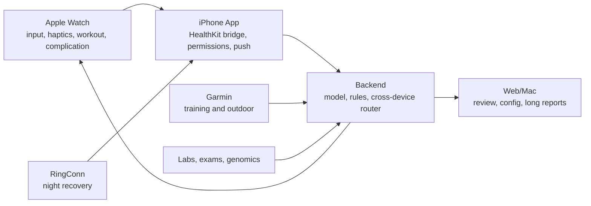

# Apple Watch Health Opportunities Roadmap

日期: 2026-06-16

范围: Apple Watch / watchOS 在 Reva Personal Health OS 中的健康场景、产品机会、系统改造和分阶段路线图。

定位: Apple Watch 不是完整健康系统的主屏, 而是最贴身的健康执行层。它负责低摩擦输入、即时确认、情境提醒、运动中的实时反馈、夜间和安全信号采集。长期价值不在于再做一个健康仪表盘, 而是把 "知道应该做什么" 变成 "现在就完成并被系统记录"。

> 医疗边界: 本文所有心血管、睡眠呼吸、血压、心电和恢复建议都应按筛查、风险提示和就医协助设计, 不能表达为诊断或治疗。

## 1. 核心结论

Apple Watch 对 Reva 最有价值的方向有四类:

1. **行为闭环**: 把饮食、补剂、喝水、运动、症状、睡眠准备从手机里的计划变成手腕上的一键执行、语音记录、确认完成。
2. **即时提醒**: 用触觉反馈和 Smart Stack/Complication 做低打扰提醒, 尤其适合餐后散步、补剂、训练开始、久坐、睡眠准备、复查。
3. **运动实时教练**: 通过 WorkoutKit、HealthKit workout session 和心率区间, 在训练中给出 Zone 2、恢复跑、间歇、强度过高、RPE 采集等反馈。
4. **安全与趋势哨兵**: 用 ECG、AFib History、Vitals、Sleep Apnea Notifications、Hypertension Notifications、静息心率、HRV、呼吸率、血氧、腕温等信号触发后续确认、复测、就医准备和长期趋势分析。

Reva 和 Athlytic、Bevel、Gentler Streak、AutoSleep 等竞品的区别应该是: 竞品多是 "解释可穿戴数据", Reva 应该是 "跨设备、跨日程、跨体检/基因/补剂/饮食的个人健康操作系统"。Apple Watch 是这个系统的执行入口, 不是唯一数据源。

## 2. 当前项目基线

当前代码已经具备 Apple Watch v1 的基础:

- Watch summary: `GET /api/v1/watch/summary`, 展示今日状态、readiness、top action、agenda、quick actions、push items。
- Quick record: water、exercise、diet voice, 其中语音记餐是 draft-first confirmation, 适合健康数据安全边界。
- Voice food draft confirmation: Watch 可以确认饮食草稿并写入 `/diet/records`, source 标记为 `apple_watch`。
- Complication/Widget 缓存: Watch 可以展示一眼状态。
- iOS HealthKit sync: 已覆盖步数、心率、静息心率、HRV、血氧、睡眠、能量、呼吸率、体温、VO2max、体重、腰围、ECG、血压、体脂等。
- Source-aware import: 已把 `apple-watch`、RingConn、Oura、Withings、Garmin 等来源做初步映射, 避免简单混合不同设备数据。
- ECG safety path: 后端有 `ECGObservation` 和 atrial fibrillation 风险规则, 已明确 "筛查信号, 非诊断"。

这意味着下一步不应从零做 Watch app, 而是把 Watch v1 从 "查看与记录" 推进到 "可执行健康行为系统"。

## 3. Apple Watch 的天然优势

### 3.1 贴身和高到达率

中年健康管理的难点不是缺少知识, 而是执行成本高、计划容易断、身体信号不容易被及时看见。Watch 在手腕上, 到达率高于手机通知, 适合做微行动:

- 餐后 10 分钟散步提醒。
- 补剂/药物确认。
- 喝水和咖啡因记录。
- 久坐打断。
- 训练前 readiness gate。
- 晚间睡眠准备。
- 突发症状快速记录。

### 3.2 低摩擦输入

Watch 适合 1 到 10 秒内完成的小输入:

- 一键: 喝水、补剂、开始散步、完成训练、睡前准备。
- 语音: "午餐牛肉面一碗, 鸡蛋一个, 无糖咖啡"。
- 选择: RPE、疼痛部位、疲劳程度、餐后饱腹感、症状严重度。
- 触觉确认: 完成、稍后、跳过、需要帮助。

这类输入比手机打开页面更可持续, 也更适合中年用户的真实生活节奏。

### 3.3 情境提醒和低打扰反馈

Watch 的触觉反馈、Smart Stack、Complication 和 Live Activity 适合把提醒变成 "当下的下一步动作", 而不是长篇建议。典型策略:

- 在日程空档提醒走路, 不在会议中打扰。
- 餐后根据血糖风险、减脂目标、当天活动量推荐短走。
- 晚上根据入睡目标提前 45 到 60 分钟提醒降亮度、减少咖啡因、准备睡眠。
- 训练中过高心率或偏离 Zone 2 时只给轻触反馈, 不打断运动。

### 3.4 运动中的实时传感器优势

Apple HealthKit 的 workout session 会让 Apple Watch 进入运动采集状态, 包括更高频的心率样本。结合 WorkoutKit 可以把训练计划发到 Apple Watch, 并在训练中使用区间、间歇和目标强度。Reva 可以把 "计划训练" 和 "训练中守护" 做成闭环:

- 今天适合练还是恢复。
- 如果练, 是 Zone 2、力量、拉伸还是休息。
- 运动中心率超区间时触觉提示。
- 训练结束后采集 RPE、疼痛、精神状态。
- 第二天结合 HRV、睡眠、静息心率判断恢复质量。

### 3.5 夜间基线和趋势优势

Apple Watch 的 Vitals、睡眠、呼吸率、腕温、血氧、心率、HRV 对中年人很重要。单个夜晚的偏差不应过度解释, 但连续趋势很有价值:

- 睡眠不足叠加 HRV 下降: 降低训练强度。
- 呼吸率/腕温异常: 提醒关注感染、压力、饮酒或睡眠质量。
- 静息心率上升: 结合训练负荷、饮酒、睡眠做解释。
- 夜间血氧/睡眠呼吸异常: 触发睡眠呼吸评估和医生沟通准备。

### 3.6 本地权限和隐私边界

HealthKit 是用户授权的本地健康数据仓库。Apple 没有公开的服务器端 Apple Watch Web API, 所以 Reva 的合理架构是:

- iPhone app 负责 HealthKit 授权、同步、后台观察和上传。
- Watch app 负责输入、确认、提醒、训练中反馈。
- Backend 负责建模、长期趋势、跨设备融合、个性化策略。
- Web/Mac 负责深度复盘、设置、体检和知识库管理。

## 4. 行业参照和可借鉴点

### 4.1 Athlytic

Athlytic 的核心是 Recovery、Exertion、Target Exertion。它把 HRV、静息心率、睡眠、活动负荷转成今天应该练到什么程度。

可借鉴:

- Readiness 不只是显示分数, 应该给出今日训练上限。
- Exertion 需要与目标强度配对, 不能只复盘昨天。
- Apple Watch 采样并不总是连续, 产品要解释数据新鲜度和置信度。

Reva 应避免:

- 只做一个恢复分数。
- 用不透明分数替代可执行动作。

### 4.2 Bevel

Bevel 强调 Recovery、Sleep、Strain、Stress、Energy Bank, 并把可穿戴、血检和生活方式连接到 AI coach。

可借鉴:

- Energy Bank 这种 "今天还剩多少可用精力" 的表达适合中年用户。
- Labs/bloodwork 与 wearables 合并是 Reva 的差异化空间。
- 压力、睡眠和训练不应拆成孤岛。

Reva 应增强:

- 把体检、专项检查、补剂、基因风险、日程和可穿戴放到同一个个体模型里。

### 4.3 Gentler Streak

Gentler Streak 的重点是可持续活动, 根据当天状态提醒用户不要过度训练。

可借鉴:

- 中年健康产品不能只鼓励更多运动, 也要鼓励恢复和减量。
- Watch 上的提示应该是轻量、温和、可跳过。
- 成功指标不应只有运动量, 还要有坚持率、受伤风险下降、过度疲劳减少。

### 4.4 AutoSleep

AutoSleep 把 Apple Watch 睡眠数据做成专门体验, 并兼容 Apple Sleep Stages。

可借鉴:

- 睡眠是独立高价值模块, 不应只作为 readiness 的一个输入。
- 用户需要看得懂的夜间解释: 睡眠时长、效率、阶段、呼吸、血氧、腕温、心率、HRV。
- 睡眠建议要落到今晚可以做什么。

## 5. Apple 平台能力与约束

### 5.1 可用能力

- HealthKit: 读取和写入授权的健康数据, 作为 iPhone/Apple Watch 健康数据中心。
- HKObserverQuery + HKAnchoredObjectQuery: 观察新数据并增量同步。
- HealthKit background delivery entitlement: 支持后台交付健康数据更新。
- HKWorkoutSession / HKLiveWorkoutBuilder: 支持运动中的实时采集和训练状态。
- WorkoutKit: 创建、预览、同步定制训练到 Apple Watch。
- WidgetKit: Complication 和 Smart Stack 的一眼状态。
- ActivityKit: Live Activities 可在 Apple Watch Smart Stack 中呈现持续状态。
- App Intents / Siri: 适合 "记录午餐"、"我吃了补剂"、"开始散步" 等语音动作。

### 5.2 约束

- HealthKit 没有官方 Web API, 后端不能直接拉取 Apple Watch 数据。
- 后台同步不是实时流, 需要处理延迟、权限关闭、低电量、未佩戴、设备更换。
- 非 workout 场景下的传感器采样存在稀疏和策略变化, 不适合假设连续监控。
- ECG、AFib、Sleep Apnea、Hypertension、Blood Oxygen 等功能受地区、设备、年龄和系统版本限制。
- Watch 屏幕小, 不适合长对话、复杂表单、长期报告和医疗解释。
- 通知疲劳风险很高, 必须有节流、静默窗口和用户可控规则。

## 6. 对中年人最有价值的 Watch 场景

### 6.1 早间 readiness 与当天策略

目标: 用户早上抬腕就知道今天该怎么安排健康行为。

输入:

- 睡眠时长、睡眠阶段、夜间心率、HRV、呼吸率、血氧、腕温。
- 昨日训练负荷、步数、酒精/咖啡因/晚餐时间。
- 今日日程和已有计划。

输出:

- 今日状态: green/yellow/red。
- 今日主动作: 例如 "午餐后走 12 分钟"、"今天 Zone 2 不超过 35 分钟"、"今晚 22:40 开始睡前流程"。
- 今日避免: 例如 "避免高强度间歇"、"下午 2 点后不建议咖啡因"。

Watch 交互:

- Complication 显示 readiness 和 top action。
- Smart Stack 卡片显示下一项健康动作。
- 一键确认 "接受计划"、"改轻一点"、"今天休息"。

### 6.2 语音记餐和餐后闭环

目标: 把饮食记录从高负担任务变成 5 秒语音。

流程:

1. Watch 上按下 "记餐" 或用 Siri/App Intent 启动。
2. 用户说食物、份量、场景。
3. 后端解析成草稿, 标注不确定项和风险标签。
4. Watch 只显示摘要和两个动作: 确认、稍后手机补全。
5. 系统根据餐食和目标生成餐后动作: 走路、喝水、下次餐建议。

适合中年人的价值:

- 控制体重、血脂、脂肪肝、血糖波动。
- 形成真实饮食数据, 不依赖回忆。
- 与 CGM、体检血糖、HbA1c、尿酸、血脂联动。

设计原则:

- Watch 上不做复杂营养编辑。
- 草稿先确认再入库。
- 不确定项不要伪装成准确营养数据。

### 6.3 补剂、药物和依从性

目标: 把长期健康计划中的 "每天做" 变成可追踪、可调整的闭环。

适用项:

- 医生处方药提醒。
- 补剂: 维 D、Omega-3、镁、肌酸、膳食纤维等。
- 周期性项目: 血压测量、体重、腰围、拉伸、复查预约。

Watch 交互:

- 到点触觉提醒。
- "已服用"、"跳过"、"稍后 30 分钟"。
- 如果连续跳过, 在 Web/Mac 复盘而不是继续轰炸。

安全边界:

- 不替代医生医嘱。
- 处方药变更需要明确确认。
- 补剂与用药冲突应进入安全规则。

### 6.4 运动训练和恢复守护

目标: 让中年用户获得可持续训练收益, 避免过度训练和受伤。

场景:

- 训练前: 根据睡眠、HRV、静息心率、近期负荷判断是否适合训练。
- 训练中: 心率区间触觉提示, Zone 2 保持, 间歇提醒。
- 训练后: RPE、疼痛、疲劳、满意度记录。
- 第二天: 恢复质量复盘。

功能:

- Reva Workout Gate: green/yellow/red。
- Zone 2 Haptic Coach。
- Strength session checklist: 组数、重量、RPE 简录。
- Recovery walk: 餐后或久坐后短走。
- Overload guard: 连续睡眠差 + 静息心率高 + 高负荷时建议降级。

### 6.5 睡眠准备和夜间异常

目标: 不只复盘睡眠, 而是帮助今晚睡好。

流程:

- 晚间根据目标入睡时间、咖啡因、运动、晚餐、日程自动安排睡前提醒。
- 睡前 Watch 提醒: 降低亮度、停止进食、准备洗漱、开始睡眠模式。
- 早上解释: 昨晚最大的影响因素和今晚一个改进动作。

异常:

- 连续呼吸率异常、腕温异常、血氧异常: 提醒关注感染、饮酒、压力或睡眠质量。
- Apple Sleep Apnea notification: 触发医生沟通清单和 PDF/数据导出准备。

### 6.6 心血管筛查和复测流程

目标: 把 Watch 的心血管信号变成安全、有边界的后续流程。

触发:

- ECG Atrial Fibrillation。
- Irregular Rhythm Notification。
- AFib History 长期变化。
- Hypertension notification。
- 静息心率持续升高。
- 运动中心率异常。

系统动作:

- 先询问症状: 胸痛、呼吸困难、晕厥、持续心悸。
- 有急症症状时明确建议紧急就医。
- 无急症但异常持续时: 建议复测、记录发生时间、准备给医生的摘要。
- 生成 "就医包": ECG 时间、症状、最近睡眠、训练、酒精、咖啡因、血压记录。

### 6.7 定期测量和体检协同

目标: Watch 负责提醒和小输入, Web/Mac 负责深度复盘。

可做:

- 每周血压测量提醒, 与外部血压计数据合并。
- 每周腰围/体重提醒。
- 每季度血脂、肝肾功能、尿酸、HbA1c 复查提醒。
- 根据可穿戴趋势调整体检优先级。
- 对专项检查结果做长期知识库沉淀。

### 6.8 症状和情绪微日志

目标: 用 Watch 捕捉难以回忆的身体状态。

输入:

- 疲劳 1 到 5。
- 压力 1 到 5。
- 胃肠不适、头痛、心悸、胸闷、关节痛。
- 酒精、咖啡因、夜宵、熬夜。

价值:

- 解释睡眠、HRV、静息心率、训练表现波动。
- 为医生沟通提供连续上下文。
- 帮助发现触发因素。

## 7. 产品架构建议

### 7.1 三端定位

| 端 | 角色 | 不适合做什么 |
|---|---|---|
| Watch | 执行、提醒、确认、短输入、运动中反馈 | 长报告、复杂编辑、完整聊天、医学解释 |
| Mobile | HealthKit 桥、拍照/语音/编辑、权限和同步、推送设置 | 大屏复盘和复杂配置 |
| Web/Mac | 深度复盘、PRD/知识库、体检/基因/补剂/规则配置 | 高频即时打点 |
| Backend | 个体模型、跨设备融合、规则、安全、计划生成 | 直接读取 Apple Watch |

### 7.2 Watch app 是否要做

结论: **要做, 但只做 wrist companion, 不做完整 Health OS。**

Watch app 的正确范围:

- 今日状态。
- 下一步动作。
- 快速记录。
- 语音记餐草稿确认。
- 训练中反馈。
- 补剂/药物确认。
- 安全提醒和症状确认。

不应该做:

- 完整健康报告。
- 复杂营养编辑。
- 长对话 AI coach。
- 医疗诊断解释。
- 图片/文档/体检报告处理。

### 7.3 数据流

### 7.4 新增核心对象

建议在现有模型上逐步增加:

| 对象 | 目的 |
|---|---|
| `watch_action_events` | 记录 Watch 上的 action shown/accepted/completed/snoozed/skipped |
| `watch_nudge_policy` | 每个用户的提醒频率、静默时间、偏好和降噪规则 |
| `wearable_signal_snapshots` | 每日/分时段的 readiness、sleep、strain、recovery、confidence |
| `healthkit_sync_ledger` | 每类 HealthKit 数据的 anchor、last_success、source breakdown、freshness |
| `symptom_micro_logs` | Watch 采集的疲劳、压力、疼痛、症状 |
| `workout_feedback_logs` | 训练后 RPE、疼痛、恢复感、目标达成 |
| `clinical_followup_tasks` | ECG、血压、睡眠呼吸、体检异常触发的复查/就医任务 |

### 7.5 API 建议

保留现有 `/api/v1/watch/summary`, 新增:

- `POST /api/v1/watch/actions/{action_id}/complete`
- `POST /api/v1/watch/actions/{action_id}/snooze`
- `POST /api/v1/watch/actions/{action_id}/skip`
- `POST /api/v1/watch/symptoms`
- `POST /api/v1/watch/workout-feedback`
- `GET /api/v1/watch/nudge-policy`
- `PUT /api/v1/watch/nudge-policy`
- `GET /api/v1/watch/data-freshness`
- `POST /api/v1/devices/healthkit/sync-ledger`

关键要求:

- 所有写入必须带当前用户鉴权和 user_id 隔离。
- 敏感事件进入 audit log。
- Watch 端 token 存储必须走 Keychain/secure storage, 不使用明文持久化。
- 后端不要信任客户端传入 user_id。

## 8. Nudge 策略

### 8.1 提醒优先级

| 优先级 | 类型 | 示例 | 策略 |
|---|---|---|---|
| P0 | 安全 | ECG AFib + 症状、严重异常 | 立即, 清晰, 可升级 |
| P1 | 日程强绑定 | 服药、体检、训练预约 | 到点提醒, 可稍后 |
| P2 | 行为机会 | 餐后走路、久坐打断、喝水 | 根据上下文触发 |
| P3 | 恢复建议 | 今天降强度、早点睡 | 每日少量 |
| P4 | 数据补全 | 昨餐未确认、HealthKit 未同步 | 低频 |

### 8.2 降噪规则

- 默认每天主动提醒不超过 3 到 5 次。
- P0 安全提醒不计入普通提醒额度。
- 会议、睡眠、驾驶、运动中按场景静默或改触觉。
- 同一类提醒连续跳过 3 次后自动降频, 在 Web/Mac 复盘。
- 每条提醒都要有明确动作: 完成、稍后、跳过、关闭此类。
- 不发送只表达焦虑、没有下一步的提醒。

## 9. 分阶段路线图

### Phase 0: 巩固 Watch v1

周期: 1 周

目标: 确保当前 Watch companion 可稳定使用并可观测。

任务:

- 增加 Watch action event 埋点: shown、tap、complete、snooze、skip、error。
- Watch summary 增加 data freshness: HealthKit 最近同步时间、睡眠数据是否可用、今日是否佩戴。
- Quick record 增加本地失败队列, 网络恢复后重试。
- Voice food draft 增加 "稍后手机补全" 状态。
- Complication 显示 top action 时避免过长文本。

验收:

- 能知道用户看到哪些 Watch 提醒、完成了哪些、跳过了哪些。
- 断网情况下不会丢失关键快速记录。
- 用户能理解数据是否新鲜。

### Phase 1: 手腕行为闭环

周期: 2 到 3 周

目标: 让 Watch 成为每日健康动作执行器。

功能:

- Morning readiness card: 今日状态、主动作、训练建议。
- Food voice capture v2: 语音记餐、草稿确认、餐后动作。
- Supplement/medication confirm: 已服用/跳过/稍后。
- Hydration/caffeine quick log。
- Symptom micro-log: 疲劳、压力、疼痛、胃肠、心悸。
- Nudge policy v1: 静默时间、每日上限、跳过降频。

验收:

- 每天至少 3 类健康动作可在 Watch 上完成。
- 饮食记录平均耗时低于 10 秒。
- 用户可以关闭或降频每类提醒。

### Phase 2: 夜间和安全信号

周期: 4 到 6 周

目标: 把 Apple Watch 的夜间和心血管信号纳入 Reva 安全与趋势系统。

功能:

- HealthKit sync ledger + background delivery 增量同步。
- Nightly vitals snapshot: sleep、RHR、HRV、respiratory rate、SpO2、wrist temperature。
- Outlier detector: 与个人基线比较, 不做跨人群泛化。
- ECG/AFib follow-up flow: 症状确认、复测、医生摘要。
- Sleep apnea notification follow-up: 睡眠数据包和就医问题清单。
- Hypertension notification follow-up: 家庭血压测量计划和复查提醒。

验收:

- 每日生成 wearable signal snapshot。
- 异常提示包含置信度、数据来源和下一步。
- 安全相关提示有审计和医学边界文案。

### Phase 3: 训练系统

周期: 6 到 10 周

目标: 从 "运动记录" 变成 "训练计划 + 实时反馈 + 恢复调整"。

功能:

- Workout gate: 根据 readiness 判断今天训练强度。
- WorkoutKit custom workouts: Zone 2、间歇、力量、恢复走。
- HKWorkoutSession live metrics: 心率区间、时长、配速/功率数据。
- Haptic zone coach: 心率过高/过低提醒。
- Post-workout RPE and pain log。
- Training load + recovery adjustment: 第二天自动调整计划。

验收:

- 用户可以从 Reva 下发训练到 Apple Watch。
- 训练中有可感知但不打扰的触觉反馈。
- 训练结束 30 秒内完成 RPE 和疼痛记录。

### Phase 4: 体检、基因、补剂和生活方式个性化

周期: 10 周以上

目标: 让 Watch 的行为闭环服务于更长期的中年健康目标。

功能:

- 体检异常 follow-up: 血脂、血糖、尿酸、肝肾功能。
- 基因风险只作为长期背景, 不直接触发急性提醒。
- 补剂实验: 目标、周期、指标、停用条件。
- Lifestyle experiments: 咖啡因 cutoff、晚餐时间、餐后步行、Zone 2 频率。
- Doctor packet: 可穿戴趋势 + 症状 + 体检 + 用药/补剂。

验收:

- 每个健康实验有开始、观察指标、结束判断。
- Watch 只承担执行和提醒, 解释留给 Web/Mac。

## 10. 优先级 Backlog

| 优先级 | 功能 | 用户价值 | 复杂度 | 说明 |
|---|---|---|---|---|
| P0 | Watch action event tracking | 知道提醒是否有效 | M | 所有后续优化的基础 |
| P0 | Data freshness on Watch | 避免用旧数据误导 | S | 显示 HealthKit 最近同步/佩戴状态 |
| P0 | Voice food "later on phone" | 降低 Watch 编辑负担 | S | 维持 draft-first |
| P0 | Nudge policy v1 | 防止通知疲劳 | M | 每日上限、静默、跳过降频 |
| P1 | Supplement/medication confirm | 中年长期健康高价值 | M | 需要安全边界 |
| P1 | Symptom micro-log | 建立身体状态上下文 | M | 可解释 HRV/睡眠/训练波动 |
| P1 | Nightly vitals snapshot | 恢复和异常检测基础 | M | 依赖 HealthKit sync ledger |
| P1 | ECG follow-up flow | 安全价值高 | M | 已有 ECG 模型可扩展 |
| P1 | Workout gate | 避免过度训练 | M | 与 readiness 结合 |
| P2 | WorkoutKit plan sync | 训练体验差异化 | L | 需要 native/watchOS 深度开发 |
| P2 | Zone 2 haptic coach | 运动中实时价值 | L | 依赖 HKWorkoutSession |
| P2 | Sleep apnea follow-up kit | 睡眠专项价值 | M | 受地区/设备支持影响 |
| P2 | Hypertension follow-up kit | 心血管专项价值 | M | 需要家庭血压流程 |
| P3 | App Intents/Siri deep actions | 输入更自然 | M | 适合语音记餐/补剂/症状 |
| P3 | Live Activity to Smart Stack | 训练/健康任务持续状态 | M | 适合正在进行的计划 |

## 11. 成功指标

### 行为指标

- 每日 Watch quick actions 完成数。
- 语音记餐成功确认率。
- 餐后走路完成率。
- 补剂/药物依从率。
- 症状微日志记录频次。
- Watch 提醒 skip/snooze/disable 比例。

### 健康过程指标

- 睡眠时长和规律性。
- 静息心率趋势。
- HRV 趋势。
- Zone 2 周分钟数。
- 每周力量训练次数。
- 餐后步行次数。
- 体重/腰围记录覆盖率。
- 血压测量覆盖率。

### 安全和质量指标

- 异常信号是否有明确后续动作。
- 安全提醒误触发投诉率。
- 数据新鲜度和来源置信度展示覆盖率。
- HealthKit 同步失败恢复率。
- 通知关闭率。

## 12. 风险和防线

| 风险 | 防线 |
|---|---|
| 把筛查信号说成诊断 | 所有文案使用筛查/建议/就医沟通, 不使用确诊 |
| 通知太多导致卸载 | 每日上限、静默、跳过降频、用户可控 |
| 数据来源混乱 | Source-aware import, source confidence, freshness display |
| Apple 功能地区不可用 | Feature availability gating, UI 不展示不可用能力 |
| Watch 屏幕承载过多 | Watch 只做短输入和确认, 复杂任务转手机/Web |
| HealthKit 同步不稳定 | Sync ledger, anchor query, retry, freshness |
| 误导训练强度 | Readiness 只给建议, 保留用户 override, 记录 RPE |
| 医疗/隐私风险 | 用户授权、最小化上传、审计、数据删除/导出能力 |

## 13. 推荐的下一步实现顺序

1. **Watch action event tracking**
   - 先知道用户是否真的使用 Watch。
   - 后续所有 nudge、quick action 和训练闭环都依赖这个数据。

2. **Data freshness + wearable source confidence**
   - 避免用昨天或缺失的 HealthKit 数据生成今天建议。
   - 给用户解释 "为什么今天建议保守"。

3. **Nudge policy v1**
   - 在新增提醒前先建降噪系统。
   - 这是 Watch 健康产品能否长期留存的关键。

4. **语音记餐 v2 + 餐后动作**
   - 当前已有基础, 投入产出比最高。
   - 能直接改善饮食记录、血糖/体重/脂肪肝相关行为。

5. **补剂/药物确认**
   - 与中年长期健康高度相关。
   - 需要安全边界和冲突提示。

6. **Nightly vitals snapshot**
   - 为 readiness、训练 gate、睡眠建议、安全异常提供基础。

7. **Workout gate + RPE**
   - 先不急着做复杂 WorkoutKit, 先做训练前建议和训练后反馈。

8. **WorkoutKit/Zone 2 haptic coach**
   - 等前面的 readiness 和训练反馈数据稳定后再做。

## 14. 资料来源

Apple 官方:

- [HealthKit documentation](https://developer.apple.com/documentation/healthkit)
- [HealthKit background delivery entitlement](https://developer.apple.com/documentation/bundleresources/entitlements/com.apple.developer.healthkit.background-delivery)
- [HKAnchoredObjectQuery](https://developer.apple.com/documentation/HealthKit/HKAnchoredObjectQuery)
- [HKWorkoutSession](https://developer.apple.com/documentation/healthkit/hkworkoutsession)
- [HKLiveWorkoutBuilder](https://developer.apple.com/documentation/healthkit/hkliveworkoutbuilder)
- [WorkoutKit documentation](https://developer.apple.com/documentation/workoutkit/)
- [WidgetKit widgets and complications](https://developer.apple.com/documentation/widgetkit/widgets-and-complications-collection)
- [ActivityKit documentation](https://developer.apple.com/documentation/ActivityKit/)
- [watchOS feature availability](https://www.apple.com/watchos/feature-availability/)
- [Apple Watch Vitals support](https://support.apple.com/en-us/120142)
- [Apple Watch Sleep Apnea Notifications support](https://support.apple.com/en-us/120031)
- [Apple Watch AFib History support](https://support.apple.com/en-us/108375)
- [Apple Watch Hypertension Notifications support](https://support.apple.com/en-us/117296)
- [Track your training load on Apple Watch](https://support.apple.com/guide/watch/track-your-training-load-apde4c07a6cf/watchos)
- [WWDC25: Track workouts with HealthKit on iOS and iPadOS](https://developer.apple.com/videos/play/wwdc2025/322/)
- [WWDC23: Build custom workouts with WorkoutKit](https://developer.apple.com/videos/play/wwdc2023/10016/)
- [WWDC23: Build a multi-device workout app](https://developer.apple.com/videos/play/wwdc2023/10023/)
- [WWDC24: Bring your Live Activity to Apple Watch](https://developer.apple.com/la/videos/play/wwdc2024/10068/)

行业产品:

- [Athlytic on App Store](https://apps.apple.com/us/app/athlytic-ai-fitness-coach/id1543571755)
- [Athlytic getting started](https://www.athlyticapp.com/getting-started)
- [Bevel on App Store](https://apps.apple.com/us/app/bevel-ai-health-coach/id6456176249)
- [Bevel official site](https://www.bevel.health/)
- [Gentler Streak on App Store](https://apps.apple.com/us/app/gentler-streak-workout-tracker/id1576857102)
- [Gentler Streak official site](https://gentlerstories.com/gentlerstreak)
- [AutoSleep on App Store](https://apps.apple.com/us/app/autosleep-watch-sleep-tracker/id1164801111)
- [AutoSleep overview](https://autosleepapp.tantsissa.com/home/overview)

