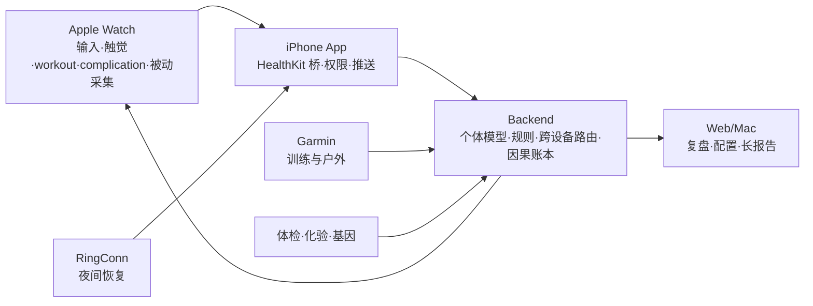

# Apple Watch Health Opportunities Roadmap (v2 · 整合稿)

日期: 2026-06-16
版本: v2 — 在 Codex 基线(v1)上,熔入 18-agent 多视角调研 + 战略脊柱,**就地升级,不另起炉灶**。
范围: Apple Watch / watchOS 在 Reva Personal Health OS 中的健康场景、产品机会、系统改造与分阶段路线图。

> **医疗边界(贯穿全文)**: 所有心血管、睡眠呼吸、血压、心电、恢复信号都按**筛查 / 风险提示 / 就医协助**设计,**不表达为诊断或治疗**。腕上只搬运 Apple 的分类结果交后端确定性规则(SafetyGuardian)裁决,分级措辞,critical → 引导就医。

---

## 0. 一句话定调(v2 的脊柱)

> **手表在复元里要发挥的,不是再造一块体征表盘,而是做飞轮上「被动采集」和「腕上执行」这两个手机够不着的物理面——把假的量变成真的量、把该做的事在「药在手 / 人在动 / 身在床」的那一刻零摩擦落账,让 per-user「干预→结果」因果账本天天自转。**

手表 = **腕上执行器 + 被动采集器**。它的全部差异化集中在三铁律最纯的交集:**被动 > 主动**(传感器能抓的绝不让用户点)× **可归因 > 连续天数**(每条数据至少触发状态机一个分支,否则不采)。Codex v1 给的是一份优秀的**功能清单 + 分阶段计划**;v2 把它**重排成「护城河建造序列」**——对每个功能只问一句:

> **它喂不喂那本 per-user「干预→结果」因果账本?喂的优先放大;不喂的(再炫也)降级或砍。**

这把文档从「watch 能做什么」升级成「watch 怎么把复元变成抄不走的健康操作系统」。

---

## 1. 核心结论(整合 Codex 四类 + 飞轮重排)

Apple Watch 对 Reva 的价值仍是 Codex 钉的四类,但**按"喂护城河"重排了主次**:

| # | 方向 | 喂飞轮哪一环 | v2 主次 |
|---|---|---|---|
| 1 | **被动采集哨兵**(RHR/HRV/SpO2/腕温/呼吸率/workout 自动检测/ECG/AFib/Vitals) | 「被动采集」环 — 零摩擦原料喂因果账本 | **抬到第一**(三铁律最纯) |
| 2 | **腕上行为闭环**(饮食/补剂/喝水/运动/症状/睡前的一键、语音、确认完成) | 「enter 键零摩擦记录」环 | **并列第一**(离手机最远的执行面) |
| 3 | **情境即时提醒**(触觉 + Smart Stack/Complication,餐后散步/补剂/训练/久坐/睡前/复查) | 「行动」环 — 把计划在对的时刻推成下一步 | 第二(必须门控,否则退化成闹钟) |
| 4 | **安全与趋势哨兵**(ECG/AFib/Sleep Apnea/Hypertension notification → 复测/就医准备) | 「信任」环 — 安全兜底建立长期信任 | 第二(价值在送达与归因,不在新规则) |

**与竞品的根本区别**(Codex 校准,保留):Athlytic / Bevel / Gentler Streak / AutoSleep 多是「解释可穿戴数据」;**Reva 是「跨设备、跨日程、跨体检/基因/补剂/饮食的个人健康操作系统」,Apple Watch 是这个系统的执行入口,不是唯一数据源**。护城河不在 L1 体征展示(卷不过原生),在 **L3 精力 + L4 抗衰的个人纵向归因 + 干预→结果数据复利**。

---

## 2. 当前基线与「接线度」(Codex 基线 + 工作流的代码实勘)

Watch v1 已具备的基础(Codex):`GET /api/v1/watch/summary`(状态/readiness/top_action/agenda/quick_actions/push_items)· 语音记餐 draft-first 确认写 `/diet/records`(source=`apple_watch`)· Complication/Widget 缓存 · iOS HealthKit sync(步数/心率/RHR/HRV/SpO2/睡眠/能量/呼吸率/体温/VO2max/体重/腰围/ECG/血压/体脂)· source-aware import(apple-watch/RingConn/Oura/Withings/Garmin)· ECG safety path(`ECGObservation` + 房颤规则,「筛查非诊断」)。

**工作流补的「接线度」实勘(决定哪些是"现在就做"的关键)**:

| 能力 | 现状 | 缺口 |
|---|---|---|
| `build_watch_summary` 已产 `status.light` / `top_action.time_window` | ~80% 接线 | Complication/Smart Stack 呈现层 |
| `personal_baseline.py` z-score 引擎(14 天冷启动 / z=2.0 / 低侧逻辑) | **已编码** | 只缺「deviation → HealthEvent + agenda 归因候选」 |
| `WatchConnectivity.sendQuickRecord` + `/supplements/records` / `/checkin/records/quick` | **端点已 ship** | 到点卡 + 一键回写 UI |
| `HealthEvent.confidence` + `auto_confirm_threshold=0.8` | 已存在 | workout 自动检测 → 议程自动闭合的接线 |
| watch target 的 HealthKit | **0 行**(纯 WatchConnectivity 中继) | HKWorkoutSession/CoreMotion 是净新 native + EAS 真机验 |
| `ExerciseRecord.perceived_exertion` | **无此列** | RPE 必须先路由到 `Workout`/`Episode` 路径 |
| `vo2_max` | **后端根本没存**(import 边界显式丢弃) | 建表 + 迁移 + schema |
| `react-native-health@1.19.0` | **不支持 iOS18** `HKUserAnnotatedMedication` / `HKStateOfMind` | native spike 或 fork |
| Apple `fall-detection` entitlement | 未申请 | **人工审批门 → 异步申请须先于写代码** |

结论(Codex + 工作流一致):**下一步不是从零做 Watch app,而是把 v1 从「查看与记录」推进到「可执行 + 可归因」的健康行为系统;且优先做"接线最薄、喂飞轮最直接、不碰 native 欠债"的那一批。**

---

## 3. Apple Watch 的天然优势(Codex,保留)

- **3.1 贴身高到达率** — 中年执行成本高、计划易断;腕上微动作(餐后散步/补剂确认/喝水/久坐打断/训练前 readiness gate/睡前准备/突发症状)到达率高于手机。
- **3.2 低摩擦输入** — 1–10 秒小输入:一键(喝水/补剂/开始散步/完成训练)、语音(「午餐牛肉面一碗,鸡蛋一个」)、选择(RPE/疼痛部位/疲劳)、触觉确认(完成/稍后/跳过/需要帮助)。
- **3.3 情境提醒、低打扰** — 触觉 + Smart Stack + Complication + Live Activity,把提醒变成「当下下一步」而非长篇建议;日程空档提醒、会议中静默。
- **3.4 运动实时传感** — HKWorkoutSession 进入高频心率采集 + WorkoutKit 下发计划;「计划训练 + 训练中守护」闭环(今天练还是恢复 / Zone2 / 超区间触觉 / 训后 RPE / 次日恢复)。
- **3.5 夜间基线趋势** — Vitals/睡眠/呼吸率/腕温/血氧/HRV;单夜不过度解释,**连续趋势**有价值(睡眠不足×HRV↓→降强度;RHR↑结合负荷/饮酒解释;夜间血氧异常→睡眠呼吸评估)。
- **3.6 隐私边界** — HealthKit 是本地授权仓库,**无官方服务器端 Watch Web API**;合理架构 = iPhone 桥 + Watch 执行 + Backend 建模 + Web/Mac 复盘(详见 §8)。

---

## 4. 分层路线图(v2 核心 — 按"喂护城河 × 三铁律 × 接线度"重排)

> 每条给「为什么 + 命中哪环 + 接线度 / native 欠债」。这是对 Codex §10 Backlog 的**战略重排 + 可行性实勘**。

### 🟢 现在就做 — 高杠杆 / 低风险 / 喂飞轮最直接 / 不碰 native 欠债

| 功能 | 为什么现在做 + 命中 |
|---|---|
| **到点项 Smart Stack 卡 + 服药/补剂一键回写**(★下一刀) | R18★1 钦定延伸;`top_action.time_window` 已 ship,单卡零后端;回写端点现成。**服药依从 = 锚点用户(12 药+长期 PPI)最高频、临床价值最硬的可归因变量**,`adherence_watch 未评分` 是当前最大 outcome 漏点。守 R15 走 P1/P2。 |
| **Readiness 训练灯 Complication + nudge** | 投产比最高:`status.light`/`top_action.time_window` 已产出,~80% 接线。命中可归因(灯=readiness×ACWR)。**门控逻辑必须落在 agenda 生成侧,不是手表侧**,否则退化成闹钟。 |
| **静息 HR 漂移哨兵**(王牌③) | 全场最佳:后台投递 + import + `personal_baseline.py` z-score 引擎**全真**,缺口只是「deviation→HealthEvent + agenda 归因候选」,**纯后端业务层,0 新 watchOS UI**。措辞红线:只说「偏离个人基线 X→Y」不说「可能感染」。 |
| **运动自动检测 → 议程自动打勾** | 三铁律最纯的被动>主动:任何穿戴记 workout → 议程自动闭合 + HR/时长进归因账本。`HealthEvent.confidence + auto_confirm_threshold=0.8` 已存在。匹配错宁可不打勾。 |
| **Crown 变量记录(饮水/RPE 一拧)** | 修飞轮第一环短板:`QuickRecordView` 写死 250/500/reps20 是**假量**,喂进 TDEE/ACWR 就是噪声。量参数已参数化,只换 `.digitalCrownRotation` 控件。命中可归因。 |
| **Haptic 语义脉冲(≤4 震型)** | R15 三级预算「真正被分级感知」的触觉地基,零新依赖(`WatchPushItem.tier/kind` 已带)。理解一条提醒从「读字」降到「感受震型」。 |
| **语音记症状 → SafetyGuardian 裁决**(王牌⑤) | 对长期 PPI+胃溃疡(HP-)+心血管风险锚点用户,「胸口闷/反酸」即时捕获+安全分级临床价值最高。**安全 stakes 最高,必过 safety-privacy-reviewer**;严禁请求内 `build_twin`(见 §9 实现注)。 |
| **Watch action event 埋点**(Codex P0 地基) | shown/tap/complete/snooze/skip/error。**所有后续 nudge/quick-action/训练闭环都依赖这个数据**——知道用户真用了哪些、跳了哪些。先做。 |
| **Data freshness on Watch**(Codex P0) | 显示 HealthKit 最近同步/今日是否佩戴/睡眠是否可用。避免用旧数据误导,给用户解释「为什么今天建议保守」。 |
| **Quick record 本地失败队列 + 重试** | 断网不丢关键记录(守 Rule#1 不假装成功)。 |
| **Complication 多尺寸分层** | 纯 swift render;`RevaComplicationView` 单体 VStack 浪费大尺寸地产。circular 守 readiness 综合灯+P0,别退化成单体征环。 |

### 🟡 下一批 — 建「watch 第一次碰 HealthKit」地基之后

| 功能 | 为什么是下一批 + native 欠债 |
|---|---|
| **Nudge policy v1**(Codex P0,提级到下一批前置) | 静默窗口/每日上限/跳过降频。**在新增任何高频提醒前必须先建降噪系统**——这是 watch 健康产品能否长期留存的关键(§7)。 |
| **Workout 引导执行(HKWorkoutSession)** | 唯一直补 PRD 明列「力量训练域 / 抗肌少盲区」,踩中「反馈环最短」飞轮入口。但 watch target **0 行 HealthKit**,净新 Swift+EAS 真机验。先做俯卧撑/深蹲可靠动作子集。 |
| **饭后散步窗 JITAI**(王牌②) | 对糖前锚点用户健康价值最高(餐后血糖峰=匹配机制),完整跑通 R17 JITAI。「记一餐→开窗→腕上起 session→打勾」四环前后两环净新。**频控 + 餐信号门控落地前不得上线。** |
| **睡前降光锚点** | 这批 feasibility 最实:纯时间窗,不碰 HKWorkoutSession,被动确认复用现成 RingConn sleep 管线;三处 PRD 直接背书。收敛为单次启动确认。 |
| **晨起 readiness 今日基调卡** | 晨起抬腕 moment 手机物理抓不到;HKObserverQuery 后台投递是 R18 边界钦定低耗。作 Smart Stack 同 widget 的 relevance 变体,**不开第二套**。 |
| **Double-Tap 单手确认** | `.handGestureShortcut`(watchOS 11 公开)。**必须搭在 R18★2 nudge 屏之上(该屏未建)** → 是 nudge 的紧后续,不能独立先行。破坏性动作(跳过)留点按。 |
| **夜间 SpO2/ODI 哨兵 + 双源互证** | 睡眠呼吸暂停是糖前/脂肪肝/心血管强共病。字段 `spo2_odi` 在但 ODI 聚合规则没写;`CrossSourceValidator` 现成 lane。**退化成「画血氧曲线」立即停手**。 |
| **Vitals 急性阈值即时强震** | 后端 59 规则急性子集的「最后一米触达」,价值在送达不在新规则;`problem_red_lines` 个性化红线体现 L3。绝不把每次心率波动推 P0。 |
| **症状/情绪微日志**(疲劳/压力/疼痛/胃肠/心悸 1–5) | 建立身体状态上下文,解释 HRV/睡眠/训练波动,为医生沟通提供连续上下文。 |
| **漏服补记 Crown 时间拨盘** | 12 药锚点用户医学价值最实:真实时间戳让 DDI 时序判断有意义。**服药记录端点 + `taken_at` 历史参数须先确认存在**,与服药档绑评估。 |
| **语音记食 v2 + 餐后动作**(Codex 高 ROI) | `/diet/voice/parse` 闭环就绪,复用度最高;餐后动作(走路/喝水/下次餐建议)与 CGM/HbA1c/血脂/尿酸联动。 |
| **RPE 捕获** | **`ExerciseRecord` 无 `perceived_exertion` 列**,必须先路由到 `Workout`/`Episode`,否则落不了地的噪声。 |

### 🔵 远期探索 — 高信任浓度 / 长反馈环 / native 欠债

| 功能 | 为什么远期 |
|---|---|
| **守护通道:Fall/Crash → 家人代管升级链**(王牌④) | 最高信任转化器(替父母管健康)。拦路虎不是工程是 **Apple `fall-detection` entitlement 人工审批门** → **异步申请要先于写代码启动**。与「主动一键 SOS」合并为一条功能两个触发源。 |
| **蜂窝离身自治** | Ultra 3 独有;补离身段安全网盲区。token 落表需端到端加密 + 后台投递预算,工程地基重。 |
| **VO2max 抗衰趋势归因** | 打在护城河最深处 L4。**但后端根本没存 `vo2_max`**(import 边界显式丢弃),需建表+迁移+schema。对外说「心肺体能 / 同龄分位」回避抗衰措辞。 |
| **夜间皮温×呼吸率漂移 / 步态肌少前驱 / 被动节律哨兵** | 真增量、长反馈环(月/季级),价值在纵向归因素材而非高频执行。皮温/步态需数据充足度门控防误报。 |
| **Medications / State of Mind 双向桥** | 价值×铁律最强,直补 enter 键最难环。**但 react-native-health 不支持 iOS18 `HKUserAnnotatedMedication` / `HKStateOfMind`**,需 native spike 或 fork(本仓库 ruby4/podspec 反复烧过)。State of Mind 可先用现成 quick_record 中继降级落地。 |
| **WorkoutKit 计划下发 + Zone 2 haptic coach** | 训练体验差异化,但依赖前面 readiness/训练反馈数据稳定 + native/watchOS 深度开发。 |
| **噪音/环境暴露 → 鼻炎关联** | 工程量最小、纯后端、接现成 RhinitisSpecialist;探索性信号(命中取决个体)→ value 中但 ROI 高。 |
| **Mindfulness RED 日恢复执行器**(深链 Apple Breathe)/ **直立性低血压自查** | 近零自建 UI;OH 自查低置信 MVP,误报压不下来 **最先可砍**。 |

### ⛔ 别做

- **再画一块心率/血氧/睡眠分期表盘** — L1 体征转,卷不过 Apple/Garmin/RingConn 原生。
- **腕上长对话 / 视频教程 / 本地诊断 / 解读 ECG 波形** — R4 死线。
- **劫持 Apple 原生 SOS 拨号** — autonomy;只补「家人侧健康上下文打包」。
- **庆祝态把「相关」讲成「因果」/ 对 critical 指标庆祝** — PRD 红线 + 医疗安全。

---

## 5. 尽情发挥的 5 张王牌(只有手表能做,且直接喂护城河)

### 王牌① 服药依从性闭环(到点卡 + 一键已吃 + 漏服真时间补记)
- **只有手表**:服药动作离手机最远——「药在手」时屏在身上的唯一面,戒指无屏。锚点用户 12 药 + 长期 PPI 减量周,这是 enter 键最难的一环。
- **喂护城河**:每次「已服」=真依从分支,直喂 SafetyGuardian 的 DDI/PGx 时序判断 + SupplementAdvisor 12 周 N-of-1;漏服补记给真时间戳,让「PPI 依从 × 反酸频率」成为可对账的个人自变量——**原生用药 App 永不碰的纵向归因边**。
- **watchOS 实现**:绿档(到点卡 + 一键回写,端点现成)立即做;漏服 Crown 时间拨盘(`.digitalCrownRotation` 离散档「大约 1h 前」)和 native Medications 双向桥(远期 spike)分层叠加。**R12 硬保证进代码:无确认→产 `data_quality`,绝不静默判完成。处方药 P0(≤3/周)、补剂 P1——别让十几种补剂撑爆 P0。**

### 王牌② 餐后散步窗 JITAI(记一餐 → 自动开窗 → 腕上被动打勾)
- **只有手表**:饭后那个 10–20min 窗口必须在腕上震一下把人推起来,手机在更衣室/兜里给不了;被动计步确认运动达成,手机不在手边。
- **喂护城河**:餐后散步是带时间戳的离散干预,与季度 CGM/HbA1c 做 L1↔L4 归因——对糖前 HbA1c 6.3 锚点用户,**单点 ROI 最高的循证微动作**(`metabolic.py` 已有话术,附录 A 的 B 级证据)。
- **watchOS 实现**:依赖「watch 接 HealthKit」里程碑(`HKWorkoutSession(.walking)` + `HKLiveWorkoutBuilder`)。**先用「接受后手动一键完成」降级 MVP 验闭环,再叠被动打勾。** 每天最多绑 1–2 餐走 P1,归因标「相关非因果」。

### 王牌③ 静息 HR 漂移哨兵(被动连续传感的教科书样板)
- **只有手表/戒指**:夜间最低 HR / 清醒静息全自动采集零点击,先于主观症状几天变化。
- **喂护城河**:每条 RHR 不为画曲线,只为触发归因分支——`personal_baseline.py` 的 z-score 引擎(14 天冷启动 / z=2.0 / 低侧逻辑)已编码,deviation→HealthEvent + 挂同窗口 agenda 候选,是「per-user 因果账本」的 0 摩擦原料。
- **watchOS 实现**:**纯后端业务层,无新 UI**。唯一前置:确认 Apple Watch 夜间最低 HR 真回灌进同一基线序列(当前 import 走 `resting_heart_rate` 日聚合,未必带「夜间最低」独立信号),缺则补一列。措辞红线守死。

### 王牌④ 守护通道:被动安全事件 → 家人代管升级链
- **只有手表**:跌倒/车祸检测/SOS/蜂窝是 Apple Watch 独有(戒指/Garmin 都没有);老人对手机 App 认知成本极高,抬腕看一眼/按一下是唯一可达执行面。
- **喂护城河**:每事件触发代管状态机(确认安全/未响应/升级),求助频次本身是父母健康恶化的归因信号;复用 `family.py` 的 shadow user + acting_as 代管基础。
- **watchOS 实现**:**把被动摔倒 + 主动一键 SOS + 房颤升级合并为单一「watch 安全事件 ingest 端点 + 现场上下文聚合 + family push」链路**(拆开重复造 80%)。最大不确定性是 entitlement 审批——**异步申请先行**。隐私必过 reviewer(健康上下文打包须代管授权 + 双向同意)。

### 王牌⑤ 语音记症状 → SafetyGuardian 确定性裁决(腕上只追问 1 句)
- **只有手表**:「胸口闷/反酸」这类瞬时主诉,抬腕一句话比掏手机打字摩擦低一个量级;对长期 PPI+胃溃疡+心血管风险锚点用户临床价值最高。
- **喂护城河**:症状文本进时间线成锚点,与用药/饮食/睡眠纵向关联(反酸 × 晚餐 × PPI 依从),是个人因果账本的高价值边。
- **watchOS 实现**:**严禁请求内 `build_twin`**(自开 SessionLocal 看不到刚写的症状行)——正解是 `HealthTwin()` 注入 `acute.symptom_texts_all=[text]` 再 `evaluate_rules`(新建只跑 symptoms+red_lines 子集的入口)。措辞「可能需要就医」非断言,critical 强震须真命中急症关键词。**全场安全 stakes 最高,必过 safety-privacy-reviewer。**

---

## 6. 平台能力与约束(Codex,保留 — 王牌/路线图的工程底座)

**可用能力**:HealthKit(读写授权健康数据)· `HKObserverQuery` + `HKAnchoredObjectQuery`(观察 + 增量同步)· HealthKit background delivery entitlement · `HKWorkoutSession` / `HKLiveWorkoutBuilder`(运动实时采集)· WorkoutKit(下发定制训练到 Watch)· WidgetKit(Complication/Smart Stack)· ActivityKit(Live Activity 进 Smart Stack)· App Intents / Siri(语音「记午餐/我吃了补剂/开始散步」)。

**硬约束(决定了上面很多功能的档位)**:① HealthKit 无官方 Web API,**后端不能直接拉 Watch 数据**(架构必经 iPhone 桥);② 后台同步非实时流,要处理延迟/权限关闭/低电量/未佩戴/换机;③ 非 workout 场景采样**稀疏且策略变化**,不能假设连续监控;④ ECG/AFib/Sleep Apnea/Hypertension/Blood Oxygen 受**地区/设备/年龄/系统版本**限制(UI 须 feature gating,不展示不可用能力);⑤ 屏小,不适合长对话/复杂表单/长报告/医疗解释;⑥ **通知疲劳风险极高**,必须节流 + 静默窗口 + 用户可控(§7)。

---

## 7. Nudge 策略(Codex P0–P4 + 降噪,叠 R15 + 三铁律收口)

| 优先级 | 类型 | 示例 | 策略 |
|---|---|---|---|
| **P0** | 安全 | ECG AFib+症状、异常 BP、跌倒、急症红线命中 | 立即强震穿透静默,清晰,可升级。**≤3 条/周** |
| **P1** | 日程强绑定 | 处方药、复查当天、训练预约 | 到点轻震,可稍后 |
| **P2** | 行为机会 | 餐后散步、久坐打断、喝水、补剂 | 情境触发,不要求确认 |
| **P3** | 恢复建议 | 今日降强度、早点睡 | 每日少量 |
| **P4** | 数据补全 | 昨餐未确认、HealthKit 未同步 | 低频 |

**降噪规则(硬性,且"必须进代码不能只写文档")**:默认每天主动提醒 ≤3–5 次;**P0 不计入额度**;会议/睡眠/驾驶/运动中按场景静默或改触觉;同类连续跳过 3 次自动降频,转 Web/Mac 复盘;**每条提醒都有明确动作(完成/稍后/跳过/关闭此类)**;**不发只表达焦虑、没有下一步的提醒**;睡前 90min 后仅 P0;**十几种补剂全 P0 会瞬间撑爆 → 分级逻辑落地是 nudge_policy v1 的核心验收**。

---

## 8. 产品架构(Codex,保留)

### 8.1 三端定位
| 端 | 角色 | 不适合做什么 |
|---|---|---|
| **Watch** | 执行、提醒、确认、短输入、运动中反馈、被动采集 | 长报告、复杂编辑、完整聊天、医学解释 |
| **Mobile** | HealthKit 桥、拍照/语音/编辑、权限同步、推送设置 | 大屏复盘和复杂配置 |
| **Web/Mac** | 深度复盘、PRD/知识库、体检/基因/补剂/规则配置 | 高频即时打点 |
| **Backend** | 个体模型、跨设备融合、规则、安全、计划生成 | 直接读取 Apple Watch |

### 8.2 数据流

### 8.3 新增核心对象(Codex,保留 — 这是把"行为"变"可归因数据"的关键)
| 对象 | 目的 |
|---|---|
| `watch_action_events` | Watch 上 action 的 shown/accepted/completed/snoozed/skipped(所有优化的地基) |
| `watch_nudge_policy` | 每用户提醒频率、静默时间、偏好、降噪规则 |
| `wearable_signal_snapshots` | 每日/分时段 readiness/sleep/strain/recovery/confidence |
| `healthkit_sync_ledger` | 每类 HealthKit 数据的 anchor/last_success/source breakdown/freshness |
| `symptom_micro_logs` | Watch 采集的疲劳/压力/疼痛/症状 |
| `workout_feedback_logs` | 训练后 RPE/疼痛/恢复感/目标达成 |
| `clinical_followup_tasks` | ECG/血压/睡眠呼吸/体检异常触发的复查/就医任务 |

### 8.4 API(Codex,保留;均强制鉴权 + user_id 隔离 + 敏感事件审计)
保留 `/api/v1/watch/summary`,新增:`POST /watch/actions/{id}/complete|snooze|skip` · `POST /watch/symptoms` · `POST /watch/workout-feedback` · `GET|PUT /watch/nudge-policy` · `GET /watch/data-freshness` · `POST /devices/healthkit/sync-ledger`。**后端不信任客户端传入 user_id;token 走 Keychain/App Group secure storage(见 §10 的 watch token 桥根因)。**

---

## 9. 竞品参照与可借鉴(Codex,保留 — 全部通过"喂护城河"重读)

- **Athlytic**(Recovery/Exertion/Target Exertion):借鉴「readiness 不只显示分数,要给今日训练上限 + 与目标强度配对」;避免「只做一个不透明恢复分替代可执行动作」。
- **Bevel**(Recovery/Sleep/Strain/Energy Bank + labs×wearables):借鉴「Energy Bank=今天还剩多少可用精力」对中年贴切;**labs+wearables 合并正是 Reva 差异化空间**——把体检/专项/补剂/基因/日程/可穿戴放进同一个体模型。
- **Gentler Streak**(可持续活动、提醒别过度):借鉴「中年不能只鼓励更多运动,要鼓励恢复减量;成功指标含坚持率/受伤风险↓/过度疲劳↓,不只运动量」。
- **AutoSleep**(睡眠专门体验):借鉴「睡眠是独立高价值模块,不只是 readiness 的一个输入;夜间解释要看得懂 + 落到今晚能做什么」。

> **统一重读**:竞品都在「解释一块表的数据」。Reva 的护城河是**把每条 watch 信号/动作接进 per-user 因果账本**,做跨设备×跨日程×跨体检的纵向归因——这是单设备解读型 App 结构上做不到的。

---

## 10. 分阶段执行(Codex Phase 0–4 + 工作流"下一刀"与可行性门控)

- **Phase 0(1 周)巩固 v1 + 可观测**:`watch_action_events` 埋点 · data freshness · quick record 失败队列重试 · voice food「稍后手机补全」状态 · Complication top_action 防过长。**验收**:知道用户看到/完成/跳过哪些;断网不丢记录;用户理解数据是否新鲜。
- **Phase 1(2–3 周)手腕行为闭环**:Morning readiness card · Food voice v2 + 餐后动作 · 服药/补剂确认 · 饮水/咖啡因 Crown 记录 · 症状微日志 · **Nudge policy v1(降噪先于新提醒)**。**验收**:每天 ≥3 类动作可在 Watch 完成;记餐 <10 秒;每类提醒可关/降频。
- **Phase 2(4–6 周)夜间与安全信号**:`healthkit_sync_ledger` + background delivery 增量 · nightly vitals snapshot · 个人基线 outlier detector(王牌③)· ECG/AFib follow-up · Sleep Apnea/Hypertension follow-up kit。**验收**:每日 snapshot;异常提示带置信度+来源+下一步;安全提示有审计+医学边界文案。
- **Phase 3(6–10 周)训练系统**:Workout gate · WorkoutKit 自定义(Zone2/间歇/力量/恢复走)· HKWorkoutSession live metrics · Haptic zone coach · 训后 RPE/pain · 训练负荷+次日调整。**验收**:可从 Reva 下发训练到 Watch;训练中可感知不打扰触觉;训后 30 秒完成 RPE。
- **Phase 4(10 周+)体检/基因/补剂/生活方式个性化**:体检异常 follow-up · 基因风险只作长期背景 · 补剂/lifestyle 实验(目标/周期/指标/停用条件)· Doctor packet。**验收**:每个实验有开始/观察指标/结束判断;Watch 只执行+提醒,解释留 Web/Mac。

### ★ 建议下一刀(工作流定,覆盖 Codex 的"先做埋点")
> **R18★1 Complication 脊柱已完成,下一刀做「到点项 Smart Stack 卡 + 服药/补剂一键回写」这一对(R18★1 延伸 + 王牌①)。**

理由:**① 接线最薄、反馈环最短**(`top_action.time_window` 已 ship、回写端点现成、本地 Sim 可验,不撞 EAS 异步长反馈环);**② 喂飞轮最直接**(服药依从是锚点用户最高频、临床价值最硬的可归因变量,补上它整条 SupplementAdvisor N-of-1 才转得动);**③ 地基依赖最少**(不碰 HKWorkoutSession/CoreMotion 那笔 native 欠债)。

> Codex 的 Phase 0「埋点/freshness/降噪」是对的**工程地基**,与下一刀**并行**做(埋点尤其要先,否则看不到 nudge 是否有效);战略叙事先立「为什么(护城河)」,工程先落「地基(埋点+降噪)」。

**配套立即并行启动(不占当前刀工期):异步提交 Apple `fall-detection` entitlement 申请**——审批周期长且是守护通道(王牌④)唯一拦路虎,**先于写代码启动**,做到远期那刀时凭据已就位。

---

## 11. 守住的边界(5 护栏 — 防"尽情发挥"变"功能堆砌+报警疲劳")

1. **R15 通知预算是硬天花板** — P0 强震 ≤3/周穿透静默,留给处方药/异常 BP/跌倒;补剂/训练/节律一律 P1 轻震;睡前 90min 仅 P0;**分级逻辑必须进代码不能只写文档**。
2. **R4 死线** — 腕上不诊断、不解读波形、不开方调量;只搬运 Apple 分类结果交确定性规则裁决,分级措辞,critical→就医。
3. **autonomy 不劫持** — nudge 不自动开 App,给「现在做/晚点/跳过(带原因)」;不抢 Apple SOS;不点不进。
4. **续航** — 被动信号走 `HKObserverQuery` + background delivery;workout session 仅在接受 nudge 后开、做完即 invalidate;**绝不常驻轮询/高频采样**。
5. **差异化警戒** — 任何功能一旦工作量主要落在「展示一张图」而非「裁决+归因+投影」,立即停手(那是在 L1 体征转上卷原生,卷不过)。

> **一票否决问句**(每个功能上线前问):**删掉这个震动 / 这张卡,飞轮会不会停?不会就别加。**

---

## 12. 风险与防线(Codex,保留)

| 风险 | 防线 |
|---|---|
| 把筛查信号说成诊断 | 文案统一用筛查/建议/就医沟通,不用确诊 |
| 通知太多导致卸载 | 每日上限、静默、跳过降频、用户可控(nudge_policy v1) |
| 数据来源混乱 | source-aware import、source confidence、freshness display |
| Apple 功能地区不可用 | feature availability gating,UI 不展示不可用能力 |
| Watch 屏承载过多 | 只做短输入+确认,复杂任务转手机/Web |
| HealthKit 同步不稳定 | sync ledger、anchor query、retry、freshness |
| 误导训练强度 | readiness 只给建议,保留 override,记录 RPE |
| 医疗/隐私风险 | 用户授权、最小化上传、审计、数据删除/导出 |

---

## 13. 成功指标(Codex + 护城河指标)

- **行为环**:每日 quick actions 完成数 · 语音记餐确认率 · 餐后走路完成率 · 补剂/药物依从率 · 症状微日志频次 · 提醒 skip/snooze/disable 比例。
- **健康过程环**:睡眠时长/规律性 · RHR 趋势 · HRV 趋势 · Zone2 周分钟 · 每周力量次数 · 餐后步行次数 · 体重/腰围/血压覆盖率。
- **安全质量**:异常信号是否都有明确后续 · 安全提醒误触发投诉率 · 数据新鲜度/来源置信度展示覆盖率 · HealthKit 同步失败恢复率 · 通知关闭率。
- **★护城河指标(v2 新增)**:**「干预→结果」可归因覆盖率**——有多少 watch 动作/被动信号最终挂上了一个 outcome 归因分支(而非沉为孤立记录)。这是判断手表是否真在"喂账本"而非"画看板"的唯一终极指标。

---

## 14. 实现锚点(代码,供下一刀落地)

- `backend/app/services/watch_summary.py` — `top_action.time_window` / `status.light` 已 ship,Smart Stack 卡零后端。
- `backend/app/services/personal_baseline.py` — z-score 引擎(王牌③只缺 deviation→HealthEvent)。
- `backend/app/agents/supplement_advisor/` — 服药/补剂依从喂 12 周 N-of-1(王牌①)。
- `apps/watch/WatchApp/QuickRecordView.swift` — 写死量参数,换 `.digitalCrownRotation`(Crown 记录)。
- `apps/watch/Sources/WatchCompanionCore/ComplicationState.swift` — R18★1 已落地"下一项脊柱";多尺寸分层在此扩。
- `mobile/native/watch/WatchPhoneBridge.swift` + `mobile/modules/shared-keychain/` — token 桥(App Group `group.life.executor.health`);App Group entitlement 是 watch 取数前置。
- `backend/app/agents/cross_source_validator/` — 夜间 SpO2/ODI 双源互证 lane。
- `backend/app/services/family.py` — 守护通道代管状态机基础(王牌④)。
- `backend/app/agents/safety_guardian/` — 语音记症状裁决(王牌⑤;严禁请求内 `build_twin`)。

---

## 15. 资料来源(Codex,保留)

**Apple 官方**: [HealthKit](https://developer.apple.com/documentation/healthkit) · [background delivery entitlement](https://developer.apple.com/documentation/bundleresources/entitlements/com.apple.developer.healthkit.background-delivery) · [HKAnchoredObjectQuery](https://developer.apple.com/documentation/HealthKit/HKAnchoredObjectQuery) · [HKWorkoutSession](https://developer.apple.com/documentation/healthkit/hkworkoutsession) · [HKLiveWorkoutBuilder](https://developer.apple.com/documentation/healthkit/hkliveworkoutbuilder) · [WorkoutKit](https://developer.apple.com/documentation/workoutkit/) · [WidgetKit complications](https://developer.apple.com/documentation/widgetkit/widgets-and-complications-collection) · [ActivityKit](https://developer.apple.com/documentation/ActivityKit/) · [watchOS feature availability](https://www.apple.com/watchos/feature-availability/) · [Vitals](https://support.apple.com/en-us/120142) · [Sleep Apnea Notifications](https://support.apple.com/en-us/120031) · [AFib History](https://support.apple.com/en-us/108375) · [Hypertension Notifications](https://support.apple.com/en-us/117296) · [Training load](https://support.apple.com/guide/watch/track-your-training-load-apde4c07a6cf/watchos) · [WWDC25 HealthKit workouts](https://developer.apple.com/videos/play/wwdc2025/322/) · [WWDC23 WorkoutKit](https://developer.apple.com/videos/play/wwdc2023/10016/) · [WWDC23 multi-device workout](https://developer.apple.com/videos/play/wwdc2023/10023/) · [WWDC24 Live Activity on Watch](https://developer.apple.com/la/videos/play/wwdc2024/10068/)

**行业产品**: [Athlytic](https://apps.apple.com/us/app/athlytic-ai-fitness-coach/id1543571755) · [Bevel](https://apps.apple.com/us/app/bevel-ai-health-coach/id6456176249) · [Gentler Streak](https://apps.apple.com/us/app/gentler-streak-workout-tracker/id1576857102) · [AutoSleep](https://apps.apple.com/us/app/autosleep-watch-sleep-tracker/id1164801111)

---

*v2 整合方法:Codex v1(平台机制 / 数据架构 / 竞品 / nudge 降噪 / 安全 / 分阶段)× 18-agent 多视角调研(三铁律硬筛 / 飞轮重排 / 接线度实勘 / 5 王牌)× 战略脊柱(护城河建造序列)。原 v1 内容全部保留并重读,新增战略主线 + 可行性门控 + 王牌差异化 + R17/R18 衔接。一切以本文为整合后的权威 Watch 路线图。*
