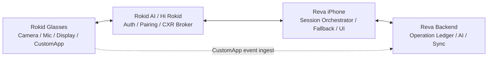
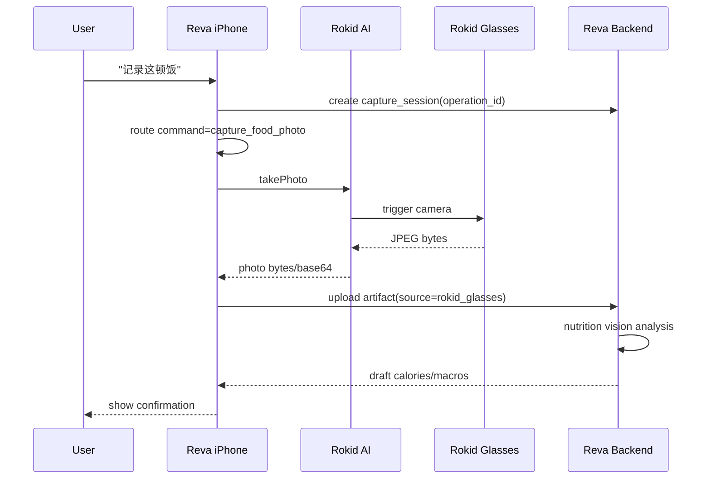
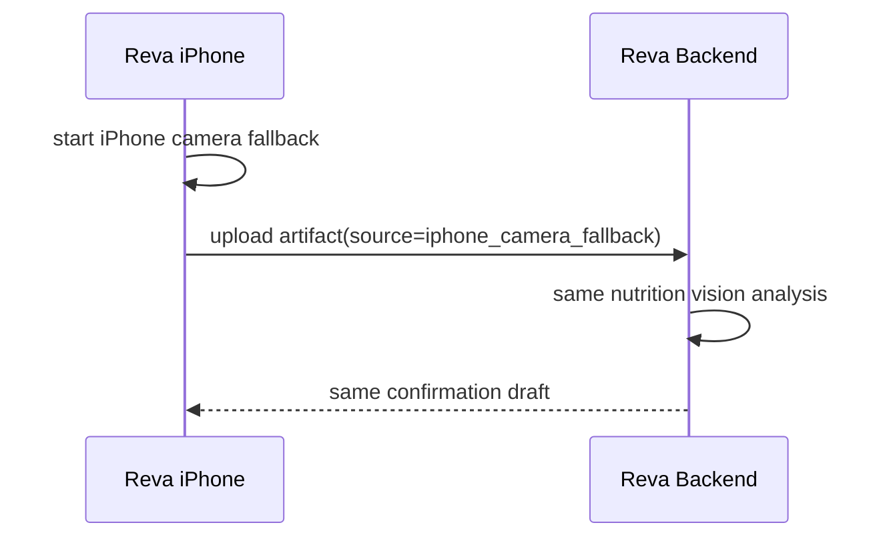
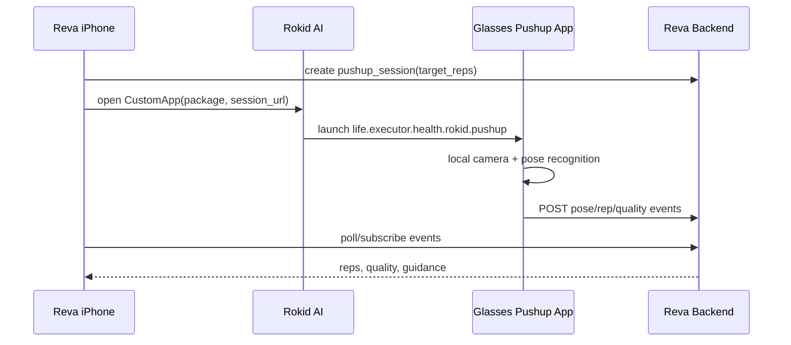

# Rokid + Reva 全链路架构重设计

> For Claude/Codex: this is a design document, not an implementation patch. Before turning it into code, review the prompts in §14 and create a task-by-task implementation plan.
>
> Date: 2026-06-23
> Status: design draft for review
> Scope: Rokid Glasses hardware, iPhone Reva app, iPhone Rokid AI / Hi Rokid app, and Reva backend

Related context:

- `docs/plans/2026-06-17-rokid-sdk-integration-plan.md`
- `docs/plans/2026-06-18-rokid-cxrl-auth-debugging-lessons.md`
- `docs/plans/2026-06-18-rokid-pushup-real-data-integration.md`
- `docs/plans/2026-06-20-rokid-cxrl-customview-silence-support-package.md`
- `docs/plans/2026-06-20-rokid-glasses-health-product-roadmap.md`
- `docs/specs/reva-product-governance-spec.md`
- `mobile/modules/rokid-bridge/index.ts`

## 1. Problem Statement

Rokid integration has entered a bad debugging loop:

- the user has to repeatedly screenshot and copy app diagnostics;
- build, OTA, SDK linkage, BLE, CustomView, audio, photo, APK install, and server ingest failures look similar in the UI;
- a partial success in one build is often lost by a later OTA or non-Rokid native build;
- core product flows such as food capture, voice command, and push-up recognition still do not run end-to-end reliably.

The main problem is not a single button or SDK call. The current system treats four separate actors as if they were one synchronous path:

1. Rokid Glasses: camera, microphone, near-eye display, local Android app runtime.
2. Rokid AI / Hi Rokid iPhone app: account, authorization, companion pairing, BLE / CXR brokerage.
3. Reva iPhone app: Health OS client, privacy gate, fallback surface, command router.
4. Reva backend: source of truth, AI analysis, audit ledger, cross-device synchronization.

The new design must make this a stateful, observable, degradable device integration rather than a chain of manual retries.

## 2. Design Goals

1. **No more screenshot-first debugging.** Every Rokid action must create a structured operation timeline that can be copied and uploaded.
2. **Every capability has an independent state machine.** Auth, BLE, CustomView, photo, audio, CustomApp install, CustomApp start, and backend ingest cannot collapse into one "connected" bit.
3. **Glasses-first, not glasses-only.** Diet and movement should try Rokid first, but Mobile/Watch fallback must remain explicit and safe.
4. **CustomView is display, not a business precondition.** Food capture and exercise flows must not fail just because CustomView is silent.
5. **Server is the durable source of truth.** Reva backend owns operations, artifacts, events, drafts, and verification evidence.
6. **Native build capability is non-negotiable.** If the installed binary has `sdkLinked=false`, the app must block Rokid native debugging immediately.
7. **No fake success.** A local/manual push-up count is allowed, but it must never be labeled as real glasses pose recognition.

## 3. Product Governance Fit

This design strengthens the Personal Health OS loop:

```text
observed scene / voice / workout
  -> HealthTwin evidence
  -> SafetyGuardian / privacy gate
  -> LeverageAction or HealthAgendaItem
  -> glasses / mobile / watch execution
  -> ExecutionEvent / WriteIntent
  -> outcome review
```

First-class object mapping:

| Capability | Health OS object |
|---|---|
| Food photo from glasses | `WriteIntent`, `ExecutionEvent`, `HealthTwin` evidence |
| Nutrition draft | `WriteIntent`, `SafetyGuardian`, review queue |
| Voice trigger | `HealthAgendaItem`, `LeverageAction`, `ExecutionEvent` |
| Push-up recognition | `HealthProtocol`, `ExecutionEvent`, `InterventionCycle` |
| Glasses prompt | `GlanceCard`, `HealthAgendaItem` |
| Diagnostics upload | audit / support artifact, not health record |

## 4. Four-Actor Architecture



Responsibilities:

| Actor | Owns | Must not own |
|---|---|---|
| Rokid Glasses | low-friction capture, local camera/mic, short display, movement CustomApp | long health reasoning, final medical claims |
| Rokid AI / Hi Rokid | authorization, companion pairing, CXR transport mediation | Reva product state, nutrition/exercise records |
| Reva iPhone | user control, command routing, permissions, fallback, UI confirmation | durable source of truth for multi-device state |
| Reva Backend | operation ledger, artifacts, drafts, event ingest, audit, AI analysis | raw always-on camera/audio capture |

## 5. Layered Design

The integration should be split into four planes.

### 5.1 Control Plane

Purpose: auth, build capability, SDK linkage, BLE, session mode, CustomApp lifecycle.

Examples:

- `sdkLinked`
- `authorizationState`
- `iosBleConnected`
- `cxrSessionMode=customView|customApp`
- `customAppInstalled`
- `customAppRunning`

### 5.2 Media Plane

Purpose: photo and audio bytes.

Examples:

- `takePhoto` request/result;
- JPEG bytes/base64/hash;
- audio stream chunks/bytes/codec;
- phone microphone ASR fallback.

### 5.3 Execution/Event Plane

Purpose: product events that Reva can trust.

Examples:

- food capture session created;
- nutrition draft created;
- push-up pose/rep event ingested;
- command routed;
- action confirmed/skipped/saved.

### 5.4 Display Plane

Purpose: short near-eye prompts only.

Examples:

- CustomView open/update/close;
- "正在记录这餐";
- "保持身体直线";
- "请在手机确认草稿".

Display plane failure must not block media or execution planes.

## 6. Rokid Operation Ledger

Every user-visible Rokid action must create a `rokid_operation` with one stable `operation_id`.

Examples:

- `capture_food_photo`
- `start_voice_command`
- `start_pushup_session`
- `install_pushup_app`
- `open_custom_view`
- `sync_glasses_status`

Minimum schema:

```text
rokid_operations
  id
  user_id
  device_id
  operation_type
  state                  -- queued | running | succeeded | degraded | failed | cancelled
  primary_surface        -- rokid_glasses | iphone | watch | backend | manual
  fallback_surface
  native_build
  app_version
  eas_channel
  sdk_linked
  companion
  auth_state
  ble_state
  session_mode
  started_at
  finished_at
  error_code
  error_message
  artifact_refs
```

```text
rokid_operation_events
  id
  operation_id
  event_type
  phase
  status
  payload_json
  created_at
```

Required event vocabulary:

| Boundary | Events |
|---|---|
| build | `app_build_checked`, `sdk_linkage_checked`, `channel_checked` |
| companion | `companion_open_requested`, `companion_open_result` |
| auth | `auth_started`, `auth_callback_received`, `auth_succeeded`, `auth_failed` |
| BLE/session | `ble_connected`, `ble_disconnected`, `session_mode_selected`, `session_mode_rejected` |
| display | `custom_view_open_requested`, `custom_view_open_callback`, `custom_view_running`, `custom_view_failed` |
| photo | `photo_requested`, `photo_received`, `photo_upload_started`, `photo_upload_succeeded`, `photo_timeout`, `photo_fallback_started` |
| audio | `audio_start_requested`, `audio_chunk_received`, `asr_partial`, `asr_final`, `audio_timeout`, `phone_mic_fallback_started` |
| CustomApp | `app_install_requested`, `apk_download_started`, `apk_download_completed`, `app_install_result`, `app_open_requested`, `app_open_result` |
| backend | `capture_session_created`, `draft_created`, `pushup_event_ingested`, `operation_closed` |

## 7. Capability State Machines

### 7.1 Build Capability

```text
unknown
  -> native_bridge_available
  -> sdk_linked
  -> rokid_channel_verified
  -> ready
```

Hard rule: if `sdkLinked=false`, the Rokid native screen must stop and show:

```text
当前安装包不支持 Rokid 原生能力。
请安装 Rokid-enabled TestFlight/production 包。
OTA 无法修复 native SDK linkage。
```

Do not continue into auth, CustomView, photo, audio, or install flows from this state.

### 7.2 Auth + BLE

```text
not_authenticated
  -> auth_requested
  -> callback_received
  -> authenticated
  -> ble_waiting
  -> ble_connected
```

`authenticated` does not imply `ble_connected`.

`ble_connected` does not imply CustomView, audio, photo, or install are ready.

### 7.3 Display / CustomView

```text
not_open
  -> open_requested
  -> command_accepted
  -> running
```

Failure states:

- `open_callback_false`
- `open_callback_missing`
- `running_event_missing`
- `wrong_session_mode`
- `ble_not_connected`
- `network_or_data_channel_not_ready`

Business rule: this state controls only near-eye display.

### 7.4 Food Photo

```text
idle
  -> capture_session_created
  -> rokid_photo_requested
  -> rokid_photo_received
  -> uploaded
  -> draft_created
  -> user_confirmed
```

Fallback path:

```text
rokid_photo_timeout | rokid_photo_error
  -> iphone_camera_fallback_started
  -> uploaded
  -> draft_created
```

### 7.5 Voice

```text
idle
  -> listening
  -> transcript_partial
  -> transcript_final
  -> command_routed
  -> action_started
```

Voice source priority:

1. Rokid audio stream if chunks arrive.
2. iPhone microphone ASR fallback.
3. Manual button fallback.

Rokid audio failure does not mean voice command failure if phone ASR succeeds.

### 7.6 Push-up Recognition

```text
idle
  -> backend_session_created
  -> glasses_app_installed
  -> glasses_app_opened
  -> pose_events_ingesting
  -> reps_counted
  -> session_saved
```

Fallback:

```text
app_install_failed | app_open_failed
  -> local_manual_counter
```

The fallback must be labeled as manual/local and must not be stored as glasses pose recognition.

## 8. Food Capture Flow



If Rokid photo does not return within the timeout:



Acceptance criteria:

- one real meal creates a server-side capture session;
- the operation timeline shows whether source was `rokid_glasses` or `iphone_camera_fallback`;
- a nutrition draft is created only after an image artifact exists;
- no image bytes in diagnostics logs; diagnostics may include hash, size, mime, and source.

## 9. Voice Flow

Do not wait for Rokid audio to become reliable before making voice useful.

Recommended first reliable route:

```text
phone mic ASR
  -> Reva deterministic command router
  -> Rokid photo / phone fallback / push-up session / agenda action
```

Rokid audio should be an enhancement:

```text
Rokid startRecord
  -> audio chunks arrive
  -> iOS SFSpeech or server ASR
  -> same command router
```

Voice self-check should separate:

- "voice command is usable";
- "Rokid audio stream is usable";
- "phone microphone fallback is active";
- "last command was routed";
- "last action was executed".

This avoids a false failure where eye audio is unavailable but phone ASR routed the command successfully.

## 10. Push-up Flow

iOS CXR-L should not be treated as a real-time pose/video API. The real route is:



APK install must be treated as a deployment problem, not normal user flow. If CXR-L `installApp` remains unreliable, use one of these routes:

1. official Rokid app distribution;
2. manual developer install through wireless ADB for beta;
3. smaller APK plus resumable download only as a temporary route.

Acceptance criteria:

- a glasses-side app starts with a backend session URL;
- the backend receives at least one `session_state` event;
- the backend receives pose or rep events;
- iPhone UI updates from backend events;
- manual/local counting is clearly marked as fallback.

## 11. Release And Build Rules

Observed class of failure: a non-Rokid production build can show the Rokid screen while `sdkLinked=false`, making every native diagnostic meaningless.

Rules:

1. Rokid native features must require a native build with `ROKID_IOS_SDK_ENABLED=1`.
2. OTA must not be used to claim fixes for native SDK linkage, Info.plist, entitlements, CocoaPods, or framework changes.
3. `production` and `rokid-production` channel differences must be shown in the diagnostics panel.
4. The app must display native build number, channel, app version, callback scheme, and SDK linkage at the top of Rokid diagnostics.
5. Long term, production iOS should link Rokid SDK and gate feature exposure at runtime. This avoids installing a production build that silently removes Rokid native capability.

## 12. Diagnostics UX

Replace screenshot-copy debugging with operation diagnostics.

Required buttons:

- "复制本次操作诊断"
- "上传本次操作诊断"
- "查看最近 10 分钟 Rokid 事件"
- "重试当前操作"
- "切换到手机兜底"

Diagnostic output must include:

```text
operation_id
operation_type
state
build/version/channel
sdkLinked/sdkLinkedReason
callbackScheme
companion
authState
bleState/deviceName
sessionMode
customView state
photo state/source/bytes/hash
audio state/source/chunks/bytes
asr state/source/transcript redacted if needed
customApp install/open state
backend session ids
last 30 operation events
```

Privacy rules:

- never include raw photo base64 in copied diagnostics;
- never include raw audio;
- never include medication/supplement free text unless user explicitly chooses a private export mode;
- use artifact hash, size, mime, source, and operation id instead.

## 13. Implementation Roadmap

### Phase 0: Stop Misleading States

- Block native Rokid flows when `sdkLinked=false`.
- Show build/channel/profile/callback scheme in diagnostics.
- Make CustomView display-only in capability gateway.
- Ensure food and movement recommendations do not depend on CustomView running.

### Phase 1: Operation Ledger

- Add local operation model in mobile first.
- Add backend `rokid_operations` and `rokid_operation_events`.
- Add upload diagnostics endpoint.
- Thread `operation_id` through voice, photo, CustomView, install, push-up.

### Phase 2: Food Capture End-to-End

- Create capture session before taking photo.
- Try Rokid photo first.
- Fall back to phone camera on timeout/error.
- Upload artifact.
- Generate one reviewable nutrition draft.

### Phase 3: Voice Command Reliability

- Treat phone ASR as reliable baseline.
- Use Rokid audio only when chunks arrive.
- Route all transcripts through one deterministic command router.
- Persist command route events.

### Phase 4: Push-up App Distribution And Event Ingest

- Shrink APK where possible without losing pose recognition.
- Decide install route: CXR-L install, manual ADB, or official distribution.
- Ensure glasses app posts events to backend.
- Update iPhone from backend, not from fake local status.

### Phase 5: Display Polish

- Use CustomView only for short state and next action.
- Add clear copy when display unavailable.
- Avoid blocking capture, voice, or movement when display fails.

## 14. Prompts For Claude Review And Design Improvement

Use these prompts with Claude Code after giving it this document and the repo.

### Prompt 1: Architecture Review

```text
请基于 docs/plans/2026-06-23-rokid-reva-end-to-end-architecture-redesign.md 和当前代码，做一次架构 review。

重点检查：
1. 四方关系（Rokid Glasses、Reva iPhone、Rokid AI App、Reva Backend）是否边界清晰。
2. 是否还把 CustomView 当成饮食、语音、运动的硬前置。
3. 是否每个能力都有独立状态机，而不是一个“Rokid connected”状态。
4. 是否有遗漏的失败模式：SDK 未链接、OTA 覆盖、BLE 断开、session mode 错误、photo bytes 未回传、audio chunks 为 0、APK 安装失败、后端 ingest 失败。
5. 是否有过度设计或不必要的对象。

请输出：
- P0/P1/P2 问题列表；
- 每个问题对应的文件路径和建议修改方向；
- 你建议保留、删除或重写的设计段落。
```

### Prompt 2: Product Governance Review

```text
请用 docs/specs/reva-product-governance-spec.md 审查这份 Rokid 架构设计。

判断：
1. 哪些能力真正增强 Personal Health OS core loop？
2. 哪些能力只是设备炫技，应该降级或删除？
3. 新增对象是否应该是 First-Class Product Object，还是只作为 ExecutionEvent / WriteIntent / GlanceCard 的来源？
4. 饮食、运动、语音是否都有安全边界和用户确认边界？

请给出一版更符合 Reva 产品治理的重写建议。
```

### Prompt 3: Implementation Plan Prompt

```text
请把 docs/plans/2026-06-23-rokid-reva-end-to-end-architecture-redesign.md 转成可执行 implementation plan。

要求：
1. 每个 task 只做 2-5 分钟粒度的一件事。
2. 每个 task 必须列出要改的具体文件、要新增/修改的测试、验证命令。
3. 优先顺序必须是：
   Phase 0: 阻断 sdkLinked=false 的误调试 + CustomView 降级；
   Phase 1: operation_id 和诊断上传；
   Phase 2: 饮食拍照 end-to-end；
   Phase 3: 语音可靠路径；
   Phase 4: 俯卧撑眼镜端 App 事件链路。
4. 不要先做 UI 美化。
5. 不要把 native SDK 变更写成 OTA 可修复。

请输出 docs/plans/YYYY-MM-DD-rokid-reva-operation-ledger-implementation.md。
```

### Prompt 4: Codebase Gap Analysis

```text
请阅读当前代码，和这份架构文档逐项对照，列出已经实现、部分实现、未实现的能力。

请特别检查：
- mobile/modules/rokid-bridge/index.ts
- mobile/modules/rokid-bridge/ios/RokidBridgeModule.swift
- mobile/app/rokid-health.tsx
- mobile/app/rokid-pushup-coach.tsx
- mobile/services/rokidVoiceControl.ts
- backend/app/api/v1/endpoints/devices_rokid.py
- backend ambient visual/audio/voice endpoints
- apps/rokid-pushup-glasses

输出表格：
能力 | 当前状态 | 证据文件 | 缺口 | 建议优先级
```

### Prompt 5: Failure-Mode And Observability Review

```text
请只从可观测性和故障定位角度 review 这份设计。

目标是不再依赖用户截图。

请检查：
1. 是否每个跨进程/跨设备边界都有事件。
2. 是否能从 operation_id 还原一次失败链路。
3. 是否能区分下载失败、安装失败、启动失败、运行失败。
4. 是否能区分 Rokid audio 不可用和 voice command 不可用。
5. 是否能区分 CustomView failure 和 photo/food flow failure。
6. 复制诊断中是否有隐私泄露风险。

请给出需要补充的 event type、payload 字段和 UI 文案。
```

### Prompt 6: Minimal Viable Redesign

```text
请站在“最快让真实用户可用”的角度，压缩这份架构设计。

要求：
1. 保留能立刻提升稳定性的 20% 改动。
2. 删除会拖慢落地但不是当前 P0 的内容。
3. 给出 1 天、3 天、1 周三个版本的交付边界。
4. 饮食和运动都必须优先走眼镜，但必须有手机兜底。
5. 不允许再用用户截图作为主要排障方式。
```

## 15. Non-Negotiable Invariants

Any future implementation or redesign must preserve these invariants:

1. `sdkLinked=false` means native Rokid capability is unavailable. Do not debug CXR from that binary.
2. CustomView is not a hard prerequisite for food capture, voice command, or push-up event ingest.
3. Food capture must create an image-backed draft before nutrition values are saved.
4. Rokid audio stream failure must fall back to phone ASR rather than disabling all voice command.
5. Push-up real recognition must come from glasses-side pose events, not from iPhone-side fake counters.
6. Every meaningful Rokid action must have an `operation_id`.
7. Diagnostics must be copyable and uploadable without raw photo/audio payloads.
8. Native SDK, entitlements, Info.plist, framework, and EAS profile fixes require native builds, not OTA.
