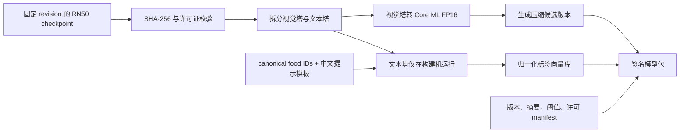
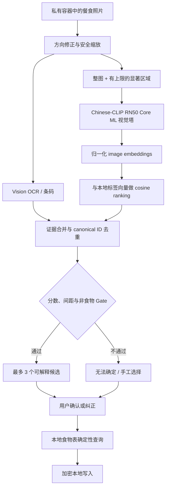

# Chinese-CLIP 本地饮食图片候选设计

| 字段 | 值 |
|---|---|
| 日期 | 2026-07-18 |
| 状态 | 设计已批准，等待实现与独立 G2 评测 |
| 模型选择 | `OFA-Sys/chinese-clip-rn50` |
| 运行位置 | iOS 设备内 Core ML，不依赖 Apple Intelligence |
| 产品职责 | 从照片提出食物身份候选，不判断权威营养和份量 |
| 上线状态 | BLOCK，直到质量、许可、包体与真机性能 Gate 全部通过 |

## 1. 决策摘要

首轮端侧照片识别只走 Chinese-CLIP RN50，不再把 TinyCLIP 或 Apple Foundation Models 放进同轮选型。选择理由是：它是 Chinese-CLIP 官方发布的最小型号，原生支持中文图文对齐，视觉侧为 38M 参数 ResNet-50，并且官方仓库已有 PyTorch 到 Core ML 的转换脚本。

App **不携带文本塔**。构建机使用 RBT3 文本塔把固定、可审计的中文食物标签与提示模板预先转换为归一化向量；iPhone 只分发：

- Chinese-CLIP RN50 视觉塔的 Core ML 产物；
- 版本化、归一化的标签向量库；
- 标签到本地食物 canonical ID 的映射；
- 阈值、校准版本、模型来源和许可证 manifest。

照片在本地经过 Vision 辅助裁切和视觉塔编码，再与标签向量做余弦相似度排序。结果只是最多 3 个候选，用户确认食物身份后，营养信息才由有来源的本地食物表确定性查询。低置信、候选间距不足、多菜混拍或异常输入都必须允许返回“无法确定”。

## 2. 产品治理与准入

- first_class_objects：`WriteIntent`、确认后的 `ExecutionEvent`；模型结果只属于尚未确认的草稿 provenance。
- core_loop：`Capture -> candidate draft -> Confirm/Correct -> local write -> Review`。
- target surface：Mobile / iOS native。
- safety level：`privacy_sensitive`。
- autonomy tier：`manual_confirm`，模型不能自动写入健康记录。
- local source of truth：加密 Local Health Kernel；模型和标签库不是营养真源。
- 最小价值切片：飞行模式拍摄单一常见餐食，设备内返回候选，用户确认后离线保存。

该能力属于本地优先饮食切片的“智能增强”，不是基础可用性的前置条件。模型缺失、损坏、不兼容或运行失败时，App 仍须保留手工、历史常用项、条码和 OCR 路径，且不得静默改走云端。

## 3. 模型与授权边界

### 3.1 固定来源

- 代码仓库：<https://github.com/OFA-Sys/Chinese-CLIP>
- 代码许可证：仓库根目录 `MIT-LICENSE.txt`
- 模型仓库：<https://huggingface.co/OFA-Sys/chinese-clip-rn50>
- 模型卡标记：Apache-2.0
- 官方规模说明：RN50 总计 77M 参数，其中视觉侧 38M、文本侧 39M，输入分辨率 224。
- 官方 Core ML 转换入口：`cn_clip/deploy/pytorch_to_coreml.py`

仓库代码许可与模型卡许可不是同一证据。实现阶段必须把下载 URL、不可变 revision、模型原文件 SHA-256、代码 revision、两份许可证原文的 SHA-256 和转换工具版本写进 manifest。任何字段缺失、上游许可互相冲突、文件摘要变化或无法取得许可证原文时，构建应硬失败，模型继续 BLOCK。

本设计不是法律意见；对外分发前仍需完成最终授权审查并在 App 的第三方声明中展示所需 notice。

### 3.2 不提交上游模型文件

原始 checkpoint、转换后的 `.mlpackage` / `.mlmodelc` 和生成向量进入忽略的 `.build/models/`，不直接提交 Git。仓库只提交：

- 来源与摘要 manifest；
- 下载、验证、转换与向量生成脚本；
- 标签输入清单和提示模板；
- 许可证副本或可验证的 notice；
- 不含私人照片的结构化评测结果。

## 4. 构建期架构

### 4.1 标签与提示模板

标签库只包含食物身份和检索提示，不含热量、重量或营养数值。每个条目至少包含：

- 稳定 `canonicalFoodId`；
- 中文主名和经审核别名；
- 食物/饮品类别；
- 提示模板版本；
- 对应文本向量；
- 标签来源和维护者来源标记。

首版提示采用小而固定的中文模板集合，例如“{食物名}”“一张{食物名}的照片”“一份{食物名}”。每个标签的多个文本向量归一化后求均值并再次归一化。模板、别名或标签变化都生成新的 label-bank version，不能在同一版本内静默改变。

标签 canonical ID 必须指向本地食物表中的身份记录，但向量库不能复制未授权营养数据。复合菜只作为“可能是什么菜”的身份标签；模型仍不知道实际配方和份量。

### 4.2 模型转换与压缩

先生成视觉塔 FP16 基准，再生成压缩候选。首轮只评测 Core ML 官方支持、可重复生成的压缩方案，不进行微调或蒸馏。每个产物必须记录：

- 输入尺寸、色彩空间、归一化参数；
- 输出维度与 L2 归一化契约；
- Core ML Tools 与 PyTorch 版本；
- precision / quantization 配置；
- 文件摘要、未压缩大小和安装后大小；
- 与 PyTorch 视觉塔的 embedding 相似度回归结果。

分发候选必须满足安装资产不超过 50 MB。若没有压缩版本能在 50 MB 内且食物身份 precision 相对 FP16 下降不超过 2 个百分点，则不把 Chinese-CLIP 放入首版 App；本地基础路径不受影响。

50 MB 是本次移动端智能增强的初始包体预算，不是对模型大小的先验结论。真实 `.mlmodelc` 大小必须由构建产物测量。

## 5. 设备端数据流

### 5.1 图像与区域策略

整图始终编码一次；Vision 只提供有界数量的显著区域作为额外视图，避免对任意照片产生无界推理。区域候选按重叠度合并，太小、模糊或超出边界的裁切被拒绝。首轮不引入独立目标检测或分割模型。

这种方案只能降低多菜混拍的漏项风险，不能声称完成实例分割。评测必须单独报告 mixed-plate 的 missing-item rate；一张照片中未被提出的菜品不能被当作“照片里没有”。

### 5.2 排序与“未知”

视觉向量和标签向量都必须是有限数值且单位归一化。每个区域先取局部 Top-K，再按 canonical ID 合并。最终候选必须同时经过：

- 最低相似度阈值；
- 第一名与第二名的最小 margin；
- 非食物拒绝校准；
- OCR / 条码冲突规则；
- 最多 3 个用户可见候选限制。

原始 cosine、softmax 或未校准模型分数不直接显示为“可信度 90%”。用户界面的“较可能 / 可能 / 不确定”只能来自在冻结评测集上校准、版本化的策略。

### 5.3 OCR 与条码优先级

包装食品有清晰条码时，条码映射是更强的身份证据；有清晰包装文字时，OCR 结果可缩小候选集合。Chinese-CLIP 不覆盖条码/OCR 已能确定的事实，也不能用视觉相似度推翻明确的用户选择。

## 6. 隐私、安全与失败语义

- 所有视觉推理、向量检索和排序在设备内完成；严格本地模式禁止照片、crop、embedding、候选和提示词出站。
- 原始照片保存在 Data Protection 保护的私有容器，按用户配置的留存策略删除；不进入日志、崩溃报告或评测报告。
- image embedding 可能泄露照片语义。首版只驻留内存，不持久化；未来若做个性化原型，必须加密并走新的隐私评审。
- 模型文件和标签库需在加载前校验版本和签名/摘要。校验失败是显式本地能力不可用，不允许静默使用未知文件。
- Core ML 抛错、内存压力、温度过高或取消操作时返回结构化失败，并立即退回手工/OCR 路径，不写半成品记录。
- 任何自动生成候选都必须携带 `modelId`、model artifact hash、label-bank version、calibration version 和证据类型；确认后的记录保留 provenance，但不保留原始 embedding。
- 不把照片识别包装成医疗判断，不对过敏原、食物安全或疾病相关饮食作仅凭图片的确定性结论。

## 7. 评测与放行 Gate

Chinese-CLIP 智能增强沿用 `docs/evals/local-diet/on-device-eval-contract.json` 的质量与性能契约，并补充下列模型专属证据：

| Gate | 放行条件 |
|---|---|
| 来源与许可 | 固定 revision、checkpoint SHA-256、代码/模型许可证及 notice 全部可验证 |
| 转换一致性 | Core ML FP16 与 PyTorch 的归一化 embedding 在固定公开/合成样本上达到预设相似度容差 |
| 压缩质量 | 选中压缩版的 identity precision 相对 FP16 下降不超过 0.02（绝对值） |
| 包体 | 分发的视觉模型 + 标签向量安装资产不超过 50 MB |
| 基础质量 | `foodIdentityPrecision >= 0.85`、`missingItemRate <= 0.10`、`nonFoodRejection >= 0.98` |
| 纠正成本 | 中位数不超过 1 次、P90 不超过 2 次 |
| 稳定性 | crash-free rate = 1.0；无 NaN、无越界候选、模型失败不触发云 fallback |
| 设备性能 | 在代表性低/中/高档真机记录冷/热时延、峰值内存和最差温度；补齐内存上限后再裁决 |
| 隐私 | 飞行模式可完整使用；网络抓包无照片、embedding、标签或候选出站 |

现有 4 秒 warm P95 是绝对上限，不代表体验目标。首轮应同时记录 1 秒内完成率，以决定它是“拍照后即时反馈”还是需要显式进度态。

评测集必须是合成、公开可再分发或获得明确授权的中文餐食照片，覆盖：单一常见食物、中式复合菜、mixed plate、包装食品、饮品、相似食物、非食物和低质输入。私人照片不能提交仓库。所有指标按模型产物、标签版本、校准版本、设备和 OS 独立记录，不能用同一张汇总表掩盖弱设备或 mixed-plate 失败。

## 8. 错误处理与降级

| 场景 | 行为 |
|---|---|
| 模型未安装或校验失败 | 显示“本地图片识别不可用”，保留条码/OCR/手工，不联网 |
| 低相似度或低 margin | 返回“无法确定”，不强行给第一名 |
| 多菜漏项风险 | 提示用户补选，允许多选和手工追加 |
| 温度/内存不满足 | 停止额外 crop，只保留整图或完全退回手工 |
| Core ML 推理失败 | 返回结构化错误，删除临时内存数据，不创建记录 |
| 标签没有营养映射 | 候选仍可显示身份，但营养保持 unknown，不能填 0 |
| 用户纠正 | 用户选择优先；记录纠正事件用于本地体验分析，不上传私人照片 |

## 9. 明确不做

- 不把 TinyCLIP、FastVLM、MobileCLIP 或 Apple Foundation Models 加入首轮对照实现。
- 不分发 Chinese-CLIP 文本塔，不在手机上动态输入任意文本生成标签向量。
- 不从照片推断克数、热量、宏量营养、配方或隐藏食材。
- 不做自动写入、自动过敏原判断或健康建议。
- 不在首轮微调、蒸馏、个性化 embedding 持久化或云端回退。
- 不在智能增强 G2 通过前接入生产饮食页面。

## 10. 阶段顺序

1. 锁定来源、许可、revision、摘要与可复现下载。
2. 在构建机生成中文标签向量并验证确定性。
3. 转换视觉塔，得到 FP16 基准与压缩候选。
4. 用纯 Swift 排序器和假模型先完成单元契约。
5. 接入独立的非生产真机 benchmark host。
6. 跑授权中文餐食质量集和代表性真机性能集。
7. 补齐内存上限，做 Chinese-CLIP 智能增强的独立 G2 PASS/BLOCK 裁决。
8. 只有 PASS 后，另开生产接入计划；否则保留本地手工/Vision/OCR 基线。
