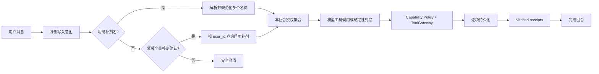

# 小巴补剂批量记录修复设计

## 背景

移动端聊天里存在两类可复现失败：

1. 用户明确说“记录下来，吃了一粒甘氨酸镁和一粒褪黑素”，意图分类已经识别为补剂写入，但目标提取把“下来”误当作补剂名，模型最终没有发起写工具，回合落到通用“补充记录类型和值”提示。
2. 小巴上一轮明确询问是否把全部补剂记为已服用后，用户回复“全部已服用”，当前轮缺少补剂目标，无法安全生成写入调用，再次落到同一通用提示。

这不是移动端按钮或展示层故障。移动端展示的是后端回合的真实未完成状态；修复点应在后端 Agent 的目标解析、上下文授权和确定性写入兜底。

## 目标

- 一句话包含多个明确补剂名时，逐项写入，每项都必须得到真实持久化回执。
- “全部已服用”只在紧邻上一轮明确询问“全部补剂是否已服用”时生效，并且目标只能来自当前用户启用中的补剂定义。
- 快速模型没有调用工具时，服务端能确定性补齐安全、可验证的补剂写入调用。
- 成功后回合进入完成态，不再出现英文内部字段或通用缺字段提示。

## 非目标

- 不改变药物记录、剂量调整或临床建议流程。
- 不新增数据库表、批量写入 API 或客户端协议。
- 不根据模糊的“都吃了”自行猜测补剂；没有紧邻确认上下文时继续要求澄清。
- 不把模型文本或上一轮助手列出的名称当作健康数据写入授权。

## 方案比较

### 方案 A：只改提示词

让模型在遇到多补剂和“全部已服用”时主动发起多个工具调用。改动小，但快速模型漏调用时仍会复现，且上下文授权边界依赖自然语言推理，不能满足健康写入的确定性和可审计性。

### 方案 B：只修当前轮解析器

可解决“下来”误截取和显式补剂名，但无法安全解析“全部已服用”的指代，也不能保证模型实际发起所有写入调用。

### 方案 C：解析器 + 服务端上下文授权 + 确定性兜底（采用）

服务端负责确定目标集合和授权边界，模型只负责正常工具路径；模型漏调用时，服务端为已经明确授权的目标生成逐项调用。该方案复用现有 `health_record(supplement)`、ToolGateway、写计划和 verified receipt，不引入第二套写入协议。

## 详细设计

### 1. 显式多补剂目标解析

在 capability policy 的补剂目标解析中：

- 去掉“记录下来”“记下来”等写入动作残留，避免把“下来”识别成实体；
- 按顿号、逗号、“和/与/以及”等连接词拆分多个补剂目标；
- 保留现有规范化、别名匹配和较短别名防误配规则；
- 投影每次工具调用时保留本次请求且已获授权的规范名称，不能一律覆盖成第一个目标。

当前轮明确说出的每个名称分别成为一个允许的 `health_record` 调用目标。

### 2. “全部已服用”上下文授权

上下文续接必须同时满足：

- 当前用户文本属于收紧的完成短语集合，例如“全部已服用”“全部都吃了”；
- 紧邻上一条助手消息是明确的全量补剂确认问题，含“全部补剂”或“全部 N 种记为已服用”等高置信表达；
- 当前用户存在启用中的补剂定义。

满足后，服务端从数据库按 `user_id` 查询启用中的 `SupplementDefinition`，去重并稳定排序，形成这一回合唯一的补剂授权集合。助手文本只帮助解析“全部”指向补剂，不提供名称；实际名称始终来自当前用户自己的持久化定义。

授权集合使用服务端内部状态传递，不接受模型伪造字段。gateway 投影和执行器 grounding 只对该集合内的精确规范名称放行。没有上下文、没有活动定义或名称不在集合内时继续 fail closed。

### 3. 确定性工具调用兜底

当回合已经被识别为补剂写入、没有任何 verified receipt，且模型没有给出工具调用时：

- 显式多补剂句使用当前轮解析得到的名称集合；
- “全部已服用”使用服务端上下文授权集合；
- 为每个名称生成一个稳定 ID 的 `health_record(record_type=supplement)` 调用；
- 仍经过现有 capability policy、ToolGateway、planned-write checkpoint、用户隔离和 receipt 校验；
- 每回合最多触发一次确定性兜底，避免循环或重复写入。

不新增绕过 gateway 的直接数据库写入。任何一项失败都按现有真实工具结果返回，不宣称全量成功。

### 4. 回合状态与文案

只要所有确定性调用获得 verified receipt，现有写入结果聚合会把回合标记为完成，移动端的“上一轮未完成”提示自然消失。用户可见名称来自正常补剂回执，不展示 `follow_up_completed` 等内部枚举；本修复不添加新的英文用户文案。

## 数据流

## 安全边界

- 健康写入仍要求当前用户身份和 `user_id` 隔离。
- 上下文授权仅覆盖 supplement，不会投影到 medication。
- “全部”目标取自当前用户活动定义，不取自模型、助手文本或其他用户数据。
- 不因一项成功就伪造全量成功；只有正资源 ID 的持久化结果能形成 verified receipt。
- 无明确授权时保持现有澄清，不以易用性为由放宽健康写入。

## 测试策略

- 单元测试复现“下来”被误识别，并验证两个补剂目标都能独立授权和正确投影。
- 单元测试验证“全部已服用”只在紧邻全量补剂确认后成立，普通上下文仍拒绝。
- Executor 回归测试让模型返回无工具文本，验证服务端产生两个/全部活动补剂调用、每项有 receipt、回合完成。
- 负例覆盖无上下文、跨域药物、非当前用户定义和重复兜底。
- 运行相关后端集成测试、Ruff、文档漂移和 dossier consistency；健康写入变更进入独立安全评审。

## 发布与回滚

这是后端兼容性修复，无 schema、无客户端合同变化。通过 main 推送后执行 backend-only 部署；若生产验证异常，回滚到部署前 SHA。上线验证使用用户给出的两句锚点表达，确认逐项写入回执与完成态，并精确清理任何合成测试数据。
