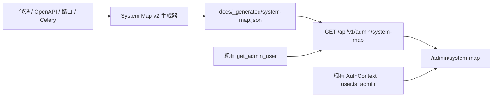

# System Map v2 管理员视图设计

**日期:** 2026-08-11

**状态:** 已确认

**范围:** System Map 代码派生模型、管理员 API、管理员专属 Web 页面和防漂移验证

## 1. 背景

现有 `docs/system-map/INDEX.md` 已经提供统一的 Agent 导航入口，
`docs/_generated/system-map.json` 也通过 `scripts/check_doc_drift.py` 与代码保持一致。
当前机制能可靠回答“系统有哪些可计数结构”，但生成内容仍以计数和少量 roster 为主，
无法直接表达组件、API、资源、任务和 UI surface 之间的关系。

现有 `/admin/architecture` 又维护了一份手写技术架构页面，与 System Map 的代码生成原则重复，
存在叙事继续漂移的风险。项目已经有完整的 Reva 登录和 `is_admin` 权限体系，因此无需引入
Backstage、GitHub OAuth、独立数据库或新的公网入口。

## 2. 目标

本次演进要实现：

1. 把 `system-map.json` 从计数快照升级为轻量实体关系模型。
2. 保留现有计数字段，避免破坏已有文档和漂移检查。
3. 新增独立的管理员专属路径 `/admin/system-map`。
4. 复用现有前端 `AuthContext` 和后端 `get_admin_user` 权限体系。
5. 让管理员能查看系统全景、依赖、业务流和地图覆盖质量。
6. 为本机和 CI 提供单一、可复现的 System Map 验证入口。
7. 消除 `/admin/architecture` 中重复维护的手写架构事实。

## 3. 非目标

首期明确不做：

- Backstage、GitHub OAuth 或独立开发者门户。
- 新的 PostgreSQL database、常驻 Node 服务或 Nginx 子路径。
- 匿名公开系统拓扑。
- 把用户健康数据、日志、环境变量、密钥或数据库连接串暴露给 System Map。
- 自动推断所有动态 Python/TypeScript 调用。
- Kubernetes、多实例部署或实时拓扑采集平台。
- 用运行态结果自动改写 Git 中的架构声明。

## 4. 总体架构



代码扫描器和少量显式声明共同构建规范 JSON；后端只读该文件，通过现有管理员依赖提供 API；
前端管理员页面消费 API 并渲染不同架构视图。前端权限用于改善交互，后端权限才是安全边界。

## 5. System Map v2 数据模型

生成文件保持确定性排序且不写时间戳：

```json
{
  "schema_version": "2.0",
  "entities": [],
  "relations": [],
  "counts": {},
  "coverage": {}
}
```

### 5.1 实体

首期实体类型限定为：

| 类型 | 含义 | 典型来源 |
|---|---|---|
| `component` | 可独立理解的应用或后端组件 | 端目录、后端注册表、部署配置 |
| `surface` | 用户或管理员可访问的 UI surface | Mobile/Web 文件路由 |
| `api` | 组件提供或消费的接口 | FastAPI OpenAPI、MCP 注册表 |
| `resource` | 数据库、缓存、队列和外部系统 | 配置、Compose、显式声明 |
| `job` | 后台任务和计划任务 | Celery task、beat schedule |

每个实体至少包含：

- `id`：稳定且全局唯一。
- `kind`：上述受控类型之一。
- `name`：管理员可读名称。
- `source`：代码路径、symbol 或声明文件。
- `coverage`：`complete`、`partial` 或 `declaration`。

实体可选包含 `owner`、`lifecycle`、`domain`、`data_classes`、`trust_boundary` 和描述。
不能可靠从代码派生的字段必须明确标记为 declaration，不能伪装成 generated fact。

### 5.2 关系

首期关系类型限定为：

- `partOf`
- `providesApi`
- `consumesApi`
- `dependsOn`
- `readsFrom`
- `writesTo`
- `publishesTo`
- `consumesFrom`
- `renders`

每条关系必须引用已存在的 `from` 和 `to` 实体，并带来源证据。生成器拒绝未知关系类型、
重复关系和悬空端点。

### 5.3 兼容性

现有 `counts`、`safety_rules_by_category`、`specialists_roster` 和
`twin_partitions_roster` 保留。新增实体与关系不能改变这些既有字段的语义。

## 6. 生成与覆盖边界

首期自动发现：

- FastAPI：优先从 OpenAPI 和 router 注册信息派生 API。
- Mobile/Web：从文件路由派生 surface；静态跳转派生部分导航关系。
- Celery：派生 task、beat schedule 和能够静态确认的队列关系。
- 数据资源：派生项目明确配置的 PostgreSQL、Redis、ChromaDB 等资源。
- 多端组件：从仓库稳定入口声明 Backend、Mobile、Frontend、Mac、Watch、MCP 等组件。

动态路由、通知深链、运行时条件注册等不能完整静态发现的范围必须在 `coverage` 中标记
`partial` 并说明限制，不能用“全覆盖”描述。

## 7. 管理员 API

新增只读接口：

```text
GET /api/v1/admin/system-map
```

接口必须使用：

```python
admin: User = Depends(get_admin_user)
```

权限契约：

- 匿名请求返回 `401`。
- 已登录普通用户返回 `403`。
- 管理员返回 `200` 和经过 schema 校验的 System Map。

接口只允许返回实体、关系、生成来源、代码路径、覆盖率和非敏感版本信息。禁止返回环境变量、
连接串、Token、密钥、用户健康数据、服务器凭证或原始日志。

## 8. 管理员页面

新增路径：

```text
/admin/system-map
```

页面复用现有 `AuthContext`：未登录跳转 `/login`，非管理员跳转 `/`，管理员才加载 API。

页面包含四个视图：

1. **系统全景**：用 C4 Container 风格显示主要端、后端、Worker 和资源。
2. **依赖图**：显示组件、API、资源和任务关系，支持类型、端、owner 和数据等级过滤。
3. **业务流**：展示 Agent 对话、健康记录、安全判断、Agenda、设备同步和 OTA 主链。
4. **地图质量**：显示覆盖边界、未知跳转、孤儿实体、失效关系和叙事复核日期。

节点详情显示代码路径、来源、覆盖率和上下游影响。图形实现复用仓库现有管理员知识图谱的
纯 SVG 模式，不新增 D3、React Flow 或其他大型图形依赖。

Admin 首页把“技术架构”入口替换为“系统地图”，指向 `/admin/system-map`。
旧 `/admin/architecture` 改为重定向，防止继续维护第二份手写架构事实。

## 9. 本机验证与 CI

新增统一入口：

```bash
./scripts/system-map-check.sh
```

脚本创建或复用项目 `.venv`，使用锁定的 Python 和依赖执行：

1. System Map JSON Schema 校验。
2. 实体 ID 唯一性和关系端点完整性。
3. 受控 enum 和敏感字段校验。
4. 连续生成两次的确定性比较。
5. committed JSON 与当前代码比较。
6. Mobile 导航图 `--check`。
7. 现有 doc-drift 检查。

CI、pre-commit 和 `scripts/validate.py` 调用同一验证逻辑，避免本地与 CI 分叉。能够用 AST、
文件系统或 OpenAPI 静态生成的事实不再依赖 SQLite 兼容环境。

叙事文档仍使用 `last-reviewed`，不因日期自动阻塞 CI；相关代码路径变化时输出需要复核的 facet。
结构事实、链接、实体引用或关系端点失效则硬失败。

## 10. 测试策略

所有行为按 TDD 实现。

### 10.1 生成器测试

- v2 schema 和兼容字段。
- 实体排序、关系排序和输出确定性。
- 重复 ID、未知类型、悬空关系失败。
- partial coverage 被保留。
- Mobile 导航 `--check` 在 committed 文件漂移时失败。

### 10.2 后端测试

- 匿名 `401`。
- 普通用户 `403`。
- 管理员 `200`。
- 缺失、损坏或 schema 不合法的生成文件 fail loud。
- 响应敏感字段负例扫描。

### 10.3 前端测试

- 非管理员无法加载 System Map API。
- 管理员页面正确加载、过滤和选择节点。
- 空图、部分覆盖和 API 失败有明确状态。
- 旧 `/admin/architecture` 正确重定向。

### 10.4 集成验证

- 后端测试、前端测试和前端 production build。
- `scripts/check_doc_drift.py`。
- `scripts/system-map-check.sh`。
- 正常 `deploy.sh` 健康闸和线上管理员验收。

## 11. 交付顺序

1. 加固 Mobile 导航检查和统一验证入口。
2. 升级 v2 schema、实体、关系与覆盖模型。
3. 新增管理员 API 和权限测试。
4. 新增 `/admin/system-map` 和 UI 测试。
5. 替换 Admin 入口并重定向旧架构页。
6. 运行全量验证、部署并做管理员线上验收。

每一步必须独立通过对应测试；任何 Gate 失败都停在当前阶段，不带红继续部署。

## 12. 验收标准

- 管理员能从 Admin 首页进入 `/admin/system-map`。
- 匿名和普通用户无法读取 System Map API。
- 页面能展示系统全景、依赖、业务流和覆盖质量。
- 点击实体能看到来源、代码路径和上下游影响。
- `system-map.json` 保持确定性并通过 schema 校验。
- 现有计数和 roster 契约继续通过。
- 修改代码但未刷新生成文件时，本地和 CI 都失败。
- 旧 `/admin/architecture` 不再承载手写架构事实。
- 不增加新认证体系、数据库、常驻服务或部署入口。
