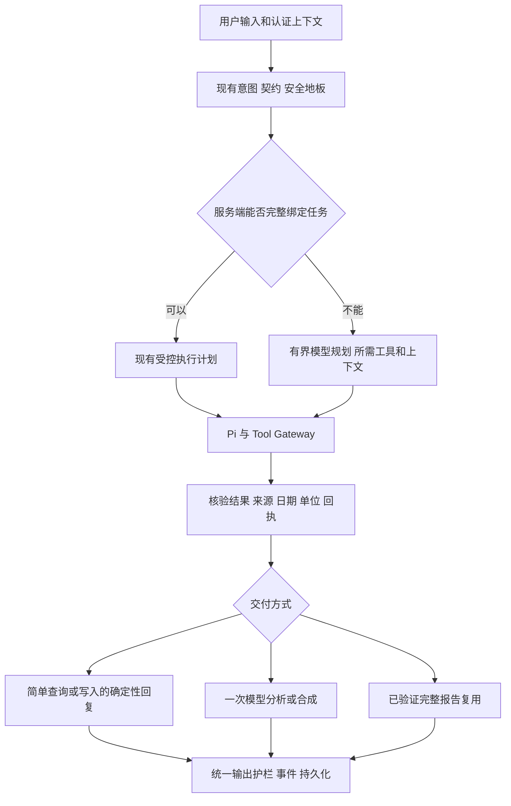

# Reva 输入 Token 与响应速度优化方案

日期：2026-10-04。基线分支：`codex/reva-prompt-optimization`，HEAD `7d934b3c6`。归属：[现有交接 Dossier](../dossiers/2026-10-04-prompt-optimization-handoff.md)。状态：已按用户“优化、执行”推进 P0–P2，完成默认逐字等价重构、评测器和两个 eval-only 候选；真实模型验收待环境，语义候选不进入运行路径。暂不合并或部署。

目标是减少**每个完成任务的总输入和关键路径等待**。优先减少无关材料和不必要的模型轮次，再处理缓存与并发。写入工具说明精简已发生真实模型回归，保持否决；参数 JSON 空白实验仅作留证，不继续作为主线。复杂医学任务保留质量地板与完整安全证据。

## 一 现状和证据

历史生产审计见 [10 月 4 日输入审计](../reviews/2026-10-04-prompt-token-audit.md)。该窗口 API 输入 694446 tokens、输出 129265 tokens；输入约为输出的 5.37 倍。按字符估算的材料分项，工具定义占 60%，system 占 31.29%。这两个比例是定位线索，不是 API token 精确分解，也不代表本分支的当前生产分布。旧 7 月方案中的工具数量、未实现状态、模型时延和价格不沿用。

本轮新增 [离线诊断 JSON](../reviews/2026-10-04-prompt-plan-profile.json)，使用 cl100k_base tokenizer，保留源码摘要，不输出输入正文。完整 registry 序列化诊断为 13430 tokens；其中 health_record 3483、health_query 2314、health_query_batch 1322。它解释了为何应先选择任务所需工具；不能推导每次线上请求都发送完整 registry。

现有真实 Pi 接线测试导出的固定合成 payload 显示：

| 合成场景 | 现有优化开启后的首轮 system | 首轮工具 JSON | 答案轮 system |
| --- | ---: | ---: | ---: |
| 多维读取测试 | 7456 | 2730 | 5484 |
| 饮食读取测试 | 5743 | 5770 | 3880 |

以上均为组件 JSON 的本地 tokenizer 诊断，不能与 API usage 混用；组件 token 边界不可严格相加。测试使用 stub provider 和合成数据，并且固定了工具提案，不能由这两个测试的调用次数推导真实用户请求的多余轮数。两项接线测试本轮重新运行通过。

代码确认已有：

- provider 出口工具集合筛选、OwnedReadScope 描述投影、只读答案去执行手册、结果 JSON 紧凑化。
- 部分服务端写入/组合读取预规划、写回执确认、严格重复旧回答引用。
- 报告复用的进程内回执及公共输出护栏，默认 off。
- 稳定前缀布局、显式缓存 capability 门控、简单答案思考控制；不能视为已在当前生产环境开启。
- Laya 的 partial 能力建议与可靠档位采纳分离。它只能建议，不能越过服务端权限或降低安全档位。

当前空白实验只有 0.24%–1.33% 本地诊断收益，真实 API 因缺凭据未完成。报告复用、并行分段合成和缓存的既有开关不直接开启。

## 二 验收指标

所有下降比例都是候选目标，不是已实现或承诺值；以当前分支、相同输入与数据快照的 A/B 为基线，按任务分组验收，不相加宣称全站收益。

| 任务组 | 输入目标 | 延迟目标 | 质量约束 |
| --- | --- | --- | --- |
| 明确单领域读取、公共信息 | 每完成任务总输入下降至少 30% | 首个有用结果和完成时间 P95 均下降至少 20% | 日期、单位、来源、缺失状态、任务覆盖零回归 |
| 明确且已支持的简单记录 | 优先减少一次不必要模型调用；总输入目标下降至少 30% | 完成时间 P95 下降至少 20% | 实际执行、幂等、鉴权、回执、告警及未明确量的追问行为完全保留 |
| 已封闭单报告分析 | 合格样本消除外层重复合成；总输入目标下降至少 20% | 完成时间 P95 下降至少 20% | 报告完整、安全验证和用户请求全部覆盖 |
| 复合任务、未知意图、高风险医学分析 | 不设强制 token 上限 | 不允许靠降低质量提速 | 任务完成率及盲评质量不下降；未知信息不得补编 |

统计每任务及每模型调用的 `prompt_tokens`、`completion_tokens`、缓存 token（未报告保持 null）、模型调用数、重试数、工具调用数、质量终态，以及 context / decision / tool / first token / first useful / completion 各阶段耗时。缓存命中不等于输入 token 消失；费用按实际 provider 计费证据另算。失败任务的消耗也计入总体，另报告每完成任务成本，防止通过少完成任务改善均值。

保留 P50/P95/P99、样本量、冷启动、预热和失败。每个 cohort 有限样本的 P99 只作诊断；证据不足时记 Unknown，不承诺线上长尾改善。端到端时间用 span 依赖关系计算，不能把并行段耗时直接相加。

## 三 目标执行结构



任务契约延续既有 GoalSpec / OwnedReadScope，不另建一套意图分类器。Laya 提供可忽略的有界建议。模型只能看到已授权工具的子集，不能因筛选而获得权限；确定性计划也必须经过原 Pi、Gateway 与真实回执。

## 四 实施批次

### P0 建立可比较的输入和耗时基线

本轮已增加 `scripts/profile_prompt_inputs.py`，输出 registry 与合成 provider 捕获的 tokenizer 分项。下一步在既有 `_prompt_payload_budget`、usage capture 和 `[perf.agent]` 上补齐 run / call / phase 对齐，复用现有指标而非新增重复日志。生产日志只记录长度、计数、状态和耗时，不记录正文、健康值或凭据。

冻结样本、模型 ID、参数、日期/时区、数据快照与代码 SHA。分别测当前优化已开启的基线、每个单独候选及最终组合。基线必须包括成功、正确澄清、失败和回退；不要把旧分支未优化版本当作所有新收益的基线。

交付：输入分项、请求调用图、关键路径、质量终态和成本表。没有真实 API usage 的数据只进入诊断列。

### P1 以服务端任务范围缩小工具和固定材料

先做只读路线，复用 `agent_tool_prompt_projection.py` 和 `_model_tools_for_turn`：为完整绑定的单领域任务确定可见工具；请求包含多个目标时取各子目标需要的工具集合与已授权集合的交集。未知、附件、修正、待确认、跨领域和依赖历史的请求保留保守路径。工具返回新的安全问题需要升级任务时，经既有受控恢复流程扩展，不额外发起一个通用规划回合。

然后拆分 `_build_system_prompt` 的材料构建，生成“共享安全规则 + 当前阶段规则 + 当前任务证据”。先处理已完成读取后的答案轮：不再传入写入/提醒/AIGC 操作手册和无关分析材料。医疗边界、来源规则、缺失语义与任务所需个体风险信息始终保留。高风险判定和“要传全部无关材料”应分开，但风险判定不降档；高风险证据裁剪放在普通只读路线验收之后。

实现时将已存在的大函数逐块提取为纯材料构建函数，先证明默认路径逐字节等价，再启用按任务选择；不要重写整个 executor。每块带来源、适用阶段、必需条件与缺失状态。未知任务不硬截断。保留现有权威 transcript，provider 投影不能影响授权、时间解析或后续修正。

**写入边界：health_record 的说明、单位范例和参数 schema 本批完全保留。** 即使移除不相关工具也必须覆盖写入+分析、否定写入、历史追问及安全告警。之前否决实验不得作为候选开关复活。

验收：实际 stream / non-stream provider payload、direct endpoint 和 Pi 路径均覆盖；工具集合与授权交集正确；所有日期、数值、来源和复合目标保留；flash 与 max 同批真实 A/B 通过才保留语义投影候选。

### P2 扩展已有预规划和核验后直接交付

检查 `_initial_composed_read_calls`、daily read plan 和 preplanned water 路径的实际命中及漏覆盖。先扩展服务端已经解析完整的单领域读请求，让它直接经过 Gateway 取数，省去“询问模型选哪个已确定工具”的轮次。用户要求分析时仍保留一次模型分析；只是列数值/记录时可由确定性模板交付，复用统一数字格式和来源、缺失、错误表达。

写入路线只扩展已有、完整绑定的简单记录任务，不从自由文本猜测缺失字段。0.5 升、350 毫升、250ml、昨天日期、否定、杯量未知、重复提交、写失败和复合任务必须实际执行回放。数据库测试使用一次性 PostgreSQL；不借真实用户写入测速度。

确定性回复必须由本次真实持久化回执驱动，经现有输出护栏和持久化流程；有高危告警、用户还要求建议、回执缺失或错误时进入对应原流程。禁止缓存写入成功答案或把已入队说成已完成。

验收：通过自然请求命中真实 Pi / Gateway 的端到端测试，证明减少调用且结果相同。不能仅测试 helper 或人为强制生成预规划调用。

### P3 核验并利用完整报告复用

先用现有 `orchestrator_synthesis_passthrough` 的 off / shadow 能力收集资格、否决原因与对照。现有进程内回执已经绑定用户、run、工具和完整请求，继续沿用；只有唯一、完整、无冲突、无缺失/回退、已安全验证且覆盖全部目标的报告可以省去外层重写。

多工具、引用未核验、卡片续接、部分数据、模型异常或取消的请求留在原合成路径。必须验证模型完成事件、最终流内容和保存回复相同。shadow 只在有界评测批次使用，其额外调用/输入单独计入，不让影子评测变成长期额外费用。

验收：实际减少一次模型调用；盲评信息完整性、安全性和回答任务能力不下降；不能只比较字数。通过本地验证也不自动开启生产开关。

### P4 优化上下文构建和独立 I/O 的关键路径

先测 prompt 构建中档案、KB、基因、肝脏、血常规、用药疗程等块的耗时和命中。优先在同一请求内复用一份认证用户资料、冻结 Twin 与已查证据，消除相同数据重复查询和重复格式化。请求内复用不跨用户、不跨数据版本；先不引入跨请求健康数据缓存。

确认依赖无交叉后，才把独立只读查询/检索并发起来，初始上限 2，可在同批负载测试后调整。每个数据库工作单元用独立 Session/连接，不把 `self.db` 或同一 ORM Session 扔给多个线程。已授权写入保持原顺序，取消必须清理子任务。延迟到达的旧查询结果不能覆盖更新后的事实。

orchestrator 现有 cross-review/arbitration 与外部检索在源码上顺序等待；这是调查点，不是已证明可无条件并发。先核对同意、危机过滤、同一证据版本、provider 配额和检索结果对裁决的依赖，再实施。并发后报告 wall time 和总调用成本，不能只看某一子调用变快。

### P5 稳定前缀 缓存与路由预算

优先复用现有 prefix layout：稳定公共规则、稳定任务工具集合在前，时间、当轮证据等动态材料在后。保持材料的信任归属和注入防护，不能为了命中缓存把不可信检索内容提升为系统指令。不得为了缓存重新塞入无关 schema。

显式缓存只在实际 endpoint/model 已验证 capability 和 cached_tokens 回传后使用；分别测试冷启动、命中、过期、模型切换、摘要更新和缓存失败。供应商 TTL/计费/数据保留以届时官方文档和实测为准，不在此假定价格或收益。业务数据缓存如后续引入，必须定义 user/tenant、数据版本、query、schema 版本、TTL 与写后失效，且单独审查。

Laya 的耗时若处在关键路径上，先量测“建议是否改变任务结果”。规则已经能完整绑定的简单任务可研究跳过冗余决策；模糊或医学请求不因此降档。deadline 与熔断阈值依据部署环境延迟分布和任务预算确定，不用先前本机几十毫秒样本直接配置生产。超时使用原有保守路径，保留失败证据，不串行追加另一个决策模型。

模型选择尊重用户选择和服务端质量地板；不全局换弱模型、不全局关思考。已有简单答案思考控制先做实际命中与 A/B 核验，高风险和深分析保留原控制。

### P6 历史证据预算与流式交付

保留已实现的严格重复历史引用。先减少反复出现的已核验工具结果和已完成报告，避免把“同一事实以多种形式重复注入”算作必要历史。进阶摘要需保留原文可追溯引用、时间/单位、过敏、医嘱、未完成任务、待确认选择和用户更正；先从非医疗已完成内容试验，历史修正/摘要窗口缺口继续走现有保真测试。软预算用于诊断，不能静默删去必须证据。

前端保留现有 Markdown 节点稳定性修复，测量流事件→可见内容延迟和用户首次可用结果。简单核验结果可先显示真实数值或卡片；高风险建议继续经过既有缓冲与安全检查后展示。状态提示不能计为 TTFT/首个有用结果改善，不能提前显示未经验证的医学文本或“已记录”。

并行分段合成暂列后续实验：现有实现会把 Twin 输入传给各段，可能增加总 token，且部分段失败会减少报告覆盖。必须同时证明任务完整、总成本及长尾合格，不能直接开关换速度。

## 五 评测设计和停止条件

1. 固定回归集覆盖公共信息、只读、简单记录、改删/提醒、复合任务、长历史/纠正、多模态、高风险、失败/取消/超时。包含已否决的 0.5 升、350 毫升和 250ml，以及昨晚睡眠日期契约。另保留未用于调参的 holdout。
2. 每个候选先进行 provider payload、Pi/Gateway、数据隔离和失败语义测试。写入或 PostgreSQL 语义使用一次性 PostgreSQL 做实际执行与回执验证。SQLite 不作生产 DB 证明。
3. 小规模真实 API 筛查先用 12 个相关用例 × flash/max × 基线/候选，即 48 个任务运行；复合任务每次可含多次 API 调用，预算按真实调用和 token 累计，达到预设批次上限即停。筛查只能淘汰，不能证明非劣。
4. 筛查通过后，对至少 120 个冻结用例进行完整回放，分批执行；关键和有波动的用例至少重复 3 次。两个模型分别裁决，不让 max 的通过掩盖 flash 的回归。同参数、同快照、A-B-B-A 交替次序、限制并发，保留全部异常与慢样本。调用数、输入/输出上限由首批 API usage 推算后记录在该批 manifest 中，避免无界评测。
5. 确定性 oracle 检查工具/参数、实际效果、日期、单位、来源、禁止操作、回执与终态；医学内容做盲评，重点检查事实、遗漏、建议边界和不确定性。模型 judge 只辅助定位，关键差异需要独立审查。所有强制契约通过、任务完成率无观测下降；带置信区间的质量差异不能支持不退化时继续收集或保持候选关闭，不降低 oracle 求绿。
6. 关联离线 harness、真实 LLM gate 和独立 safety review 通过后，记录候选源码摘要、评测批次、拒绝原因及残余 Unknown。上线前另需目标 revision 的项目 CI-mode 与真实 CI；这一步在当前未授权范围外。

任何新增越权/跨用户访问、错误记录、单位/日期错误、医学安全失败、任务遗漏或提前成功声明立即 NO-GO；修复并重新验证。任何新增 provider/工具重试、缓存陈旧、取消泄漏或 P95/P99 持续恶化也暂停该候选。安全与正确澄清不算失败优化掉。基线自身不通过的用例单独修复并保留证据，不能放宽评测合同。

运行时变更每批独立可回退；新增候选默认关闭或留在 eval，关闭后恢复当前分支行为。报告复用、缓存、路由、并发分开验收，再测组合，防止相互作用被各自的单项通过掩盖。

## 六 顺序与交付物

| 顺序 | 工作 | 前置与交付 |
| --- | --- | --- |
| 1 | P0 与 P1 只读阶段材料 | 当前已开始 P0；输出 A/B 基线、阶段规则清单与只读候选 |
| 2 | P2 已有预规划覆盖 | P1 的工具/任务契约稳定；交付真实执行后少一次模型调用的证据 |
| 3 | P3 报告复用 | 可独立在默认关闭状态验证；完整报告与流/保存一致性证据 |
| 4 | P4 数据构建和 I/O | 已有分段耗时证明热点；不共享 Session 的有界并发与取消证据 |
| 5 | P5 前缀/路由 | 已有真实 endpoint 凭据与部署环境测量；缓存真值及路由覆盖证据 |
| 6 | P6 历史与流式 | 前述高收益批次完成后再扩大；语义保留和用户可用结果证据 |

本阶段完成标准：通过上述质量和性能裁决的候选实现、独立安全审查、可复现评测与回退说明，保留在指定分支。当前执行结果见第八节；不是全部优化已交付。没有真实模型凭据时可继续纯重构和离线测试，但语义候选不进入默认运行路径。

## 七 复现与代码入口

```bash
SECRET_KEY=local-synthetic-test-key-only-000000 DATABASE_URL=sqlite:///:memory: REDIS_URL=redis://127.0.0.1:1/15 REVA_ARCHITECTURE_PAYLOADS=/tmp/reva-plan-read-payloads.json REVA_ARCHITECTURE_DIET_PAYLOADS=/tmp/reva-plan-diet-payloads.json .venv/bin/python -m pytest backend/tests/test_agent_prompt_architecture.py::test_health_read_provider_budget_replay backend/tests/test_agent_prompt_architecture.py::test_diet_provider_budget_replay -q --no-cov
.venv/bin/python scripts/profile_prompt_inputs.py --capture owned-read=/tmp/reva-plan-read-payloads.json --capture diet-read=/tmp/reva-plan-diet-payloads.json --output /tmp/reva-prompt-profile.json
```

诊断器需可选依赖 tiktoken，仅供开发环境使用，不加入生产依赖；默认 cl100k_base。首次使用编码时库可能下载公开 tokenizer 缓存，此过程不传 prompt。输入只允许上述固定合成 fixture 导出；报告仅保存计数、稳定工具名和源码摘要。原始合成捕获在 /tmp，不提交 Git。

主要实现位置：`backend/app/services/agent_executor.py` 的 `_build_system_prompt`、`_model_tools_for_turn`、`_initial_composed_read_calls`、`_transport_messages`；`agent_tool_prompt_projection.py`；`agent_kernel/read_task_scope.py`；`llm/prompt_cache.py` 与 `usage_tracker.py`；`decisions/routing.py`；`backend/app/orchestrator/orchestrator.py`。

邻近回归：`test_agent_prompt_budget_execution.py`、`test_agent_record_prompt_provider.py`、`test_agent_composed_read_scope.py`、`test_agent_composed_read_completion.py`、`test_agent_diet_synthesis_projection.py`、`test_agent_executor_synthesis_passthrough.py`、`test_prefix_cache_layout.py`、`test_agent_history_provider.py`、`test_decision_routing.py`。最终按实际改动增补风险相称测试，不把此列表当作一次通过即可覆盖全部方案。

## 八 本轮执行结果与下一步

| 批次 | 已执行 | 当前裁决 |
| --- | --- | --- |
| P0 | 增加内容无关的输入分项、成对重复 API 评测、流式首正文与完成时间、API usage、失败和取消留证、调用预算 | 工具与离线测试通过；真实测量被凭据阻断 |
| P1 | 将基础规则提取到纯函数，32 种组合与 HEAD 冻结摘要逐字相同；独立 eval 候选去掉只读答案轮已不参与执行的任务规划材料 | 默认行为等价；语义候选仅 eval，未启用 |
| P2 | 封闭本人睡眠+饮食日期范围复用 OwnedReadScope，经 Pi/Gateway 执行后仍交给模型分析 | 合成 SQLite / 一次性 PostgreSQL 执行等价，provider 2→1；仅 eval |
| P3 | 重新验证现有报告交付回归 | Pi 路径的 legacy passthrough flag 仍保留最终模型轮，不能靠切旧开关宣称少一次调用；新接线待独立完整报告资格与 API 验收 |
| P4–P6 | 复核现有请求内 KB 复用、缓存布局及历史投影并运行相关回归 | 未新增并发、共享缓存或路由降档；按前述真实请求分段基线与前置验收继续 |

后续 P4 增量：字节等价的 tool JSON 扫描 CPU 优化及其微基准见第十节；不代表真实请求的 P4 验收完成。

P1 的实际 Pi 捕获在已有 domain 优化开启的两臂比较：首轮 12227 不变，答案轮 4441→3688（下降 **16.96%**），整任务 16668→15915（下降 **4.52%**）。这是 cl100k_base 序列化 JSON 诊断，不是 API token、计费或延迟。另有四个固定答案用例的三次成对 dry-run：睡眠/血氧读答案材料减少；成功/失败写回执控制组逐字不变。固定规则和证据长度不等于模型回答质量。

P2 正向“分析我最近7天的睡眠和饮食记录。”由已有范围解析成功后才适用；查询动词、近似句式不保证命中，不扩大权限解析器来提高命中率。实际 Pi、Gateway、规范化日期、合成数据库返回、流回答及保存回答一致；provider 是 stub。否定、假设、他人、混合写入/用药、附件、待确认、原话或 owner 不一致、历史工具及重入均保留原调用。后续已补一次性 PostgreSQL 验证，见第九节；仍缺真实模型证据，不能扩大到生产/写路径。

新鲜验证：707 项关联回归通过；评测器安全审查发现兼容重试可能越预算、取消未留证，已修复并追加测试，最终 12 项评测器测试及独立复跑通过。System Map 与离线 harness 通过。路径敏感真实 LLM gate 为 **failed / live required / unconfirmed**；独立审查 GO 只覆盖默认等价重构、实验隔离及评测工具。

真实 API 入口已尝试：provider 内客户端初始化缺凭据，OpenAIError。usage tracker 记录一次失败的 provider 包装层调用，没有 API usage 或回答；这不是成功的 API 请求计数。不可把初始化失败的本机耗时计作模型速度。当前需要已有私有测试配置路径或配置好的服务；不需要在聊天中发送密钥。P1/P2 无应用导入或配置开关，关闭状态天然恢复基线；不修改被否决写说明实验的处置。

可复现入口（先由安全方式加载已有私有测试配置；数据库只允许一次性测试环境）：

```bash
SECRET_KEY=local-synthetic-test-key-only-000000 APP_ENV=test DATABASE_URL=sqlite:///:memory: REDIS_URL=redis://127.0.0.1:1/15 .venv/bin/python scripts/benchmark_read_synthesis.py --include-live-llm --stream --repetitions 3 --max-api-calls 48 --timeout-seconds 90 --output /tmp/reva-read-synthesis-live.json
```

这是四个答案阶段用例 × 两模型 × 两臂 × 三次重复的筛查，**不是**第五节要求的完整任务/holdout 非劣验收。显式要求 API usage；SDK 重试、兼容重试和自动恢复在该评测范围禁用；错误立即停批，保存已执行与缺失样本；取消留证后继续抛出。没有替代生产恢复策略。下一步先取得真实筛查结果，失败则撤回候选；通过后补完整任务矩阵、PostgreSQL 和盲评，再考虑运行时接线，不跳过质量闸。

证据：[P1 dry-run](../reviews/2026-10-04-read-synthesis-dry-run.json)、[P1 Pi 分项](../reviews/2026-10-04-read-synthesis-pi-profile.json)、[P2 Pi/Gateway](../reviews/2026-10-04-read-preplan-pi-evidence.json)、[真实 API 失败](../reviews/2026-10-04-read-synthesis-live-attempt.json)、[真实 LLM 闸](../reviews/2026-10-04-prompt-implementation-live-gate.json)。

## 九 PostgreSQL 与组合验证接续

本轮只增强验证，未再改变应用或候选实现。重新检查指定工作树、Router 和开放 PR：保留全部已有改动，当前分支无开放 PR。标准配置位置只有 example 文件，真实模型配置仍缺失。

P2 日期覆盖扩为 1、7、31 天（包含跨月范围）。断言实际读数、日期和记录数量，排除同日他人数据和本人未来数据，空饮食记录保留 `no_data`；两臂的流与保存回答、健康数据行数一致。一次性 PostgreSQL 17.11 的 18 项检查通过，随后将完整组合回归加入该数据库，最终 **21 passed**；实例仅开放私有 Unix socket，停止并删除，无生产数据库访问。

组合用例经过实际 prompt 构建、provider 出口投影、Pi、Gateway、数据库和回答保存。provider 回答以及不相关上下文块使用合成替身；已有 domain 优化在两臂均开启。测试覆盖正常、空记录和真实适配器抛错三种状态，每种运行 baseline / P1 / P2 / P1+P2：

| 正常合成场景 | 整任务 JSON tokenizer 诊断 | 相对同批基线减少 | 模型调用 |
| --- | ---: | ---: | ---: |
| 基线 | 16825 | — | 2 |
| P1 | 16072 | 4.48% | 2 |
| P2 | 6649 | 60.48% | 1 |
| P1+P2 | 5896 | 64.96% | 1 |

这些是一个合成场景的序列化输入诊断，**不是**真实 API token、全量平均或速度结果。P1 的此处基线是睡眠+饮食场景，与第八节饮食单场景不同，不能混用比例。收益主要来自省去规划调用；剩余一次分析仍保留安全规则、查询证据和原输出预算。没有通过缩短模型输出测得速度。

正常与空数据路径逐字比较非 system 证据，比较规范化查询、结果、终态、流和保存回答。失败路径保留原有一次受限工具重试，共两次 Gateway dispatch；P1 不精简其完整 system。服务端规划的调用 ID 和参数预绑定日期与模型提案可以不同，比较真实规范化参数、失败回执及用户/tool 内容；四臂终态一致且没有 Pi 错误。

首版失败测试错误地假定任何路径都只 dispatch 一次，stub 又在失败后重复提出同 ID 调用，独立复跑 20 passed / 1 failed。已按真实恢复路径修正 fixture，并明确禁止 `Pi agent failed`；未修改生产重试策略或放宽失败为成功。最终本地关联 **77 passed**，独立 **21 passed / GO**；PostgreSQL **21 passed**。GO 仅覆盖离线实验隔离与执行等价，G3 的真实模型非劣闸继续 BLOCK。

证据：[组合分项](../reviews/2026-10-04-composed-optimization-pi-profile.json)、[P2 PostgreSQL 回放](../reviews/2026-10-04-read-preplan-postgres-pi-evidence.json)、[组合 PostgreSQL 与清理](../reviews/2026-10-04-composed-postgres-verification.json)。临时日志 `/tmp/reva-composed-candidate-verification.log`、`/tmp/reva-composed-postgres.log`；前次失败 `/tmp/reva-composed-states.log` 保留。

下一步仍是加载已有私有测试模型配置，先跑有限 API 筛查，再完成整任务/holdout/重复盲评。不能将本轮 64.96% 直接作为启用候选的依据；P3–P6 维持原前置 Gate，暂不合并或部署。

## 十 P4 局部 CPU 优化与收益边界

本轮只优化现有 tool JSON 紧凑化的执行成本。现行实现先校验 JSON，再以 Python 逐字符扫描；新实现保留相同校验，将合法字符串及其转义作为完整片段取回，其余非空白片段保持原顺序。没有反序列化后重新输出数值，没有修改健康字段、权限或错误处理。保持既有开关默认值，输出与冻结 `7d934b3c6` 实现逐字节相同，故**不产生新的输入 token 降幅**。

采用前预设局部诊断目标：大于 10 KB 的记录用例 P50 至少改善 15%；所有用例 P95 不超过基线的 110% 加 0.02 ms。首先保留未优化版本的测量（目标失败），再实现和验证。正式最后一轮没有并行执行本任务测试；101 组交替基线/候选，每组执行 10 次。百分位基于批均值，不能解释为单请求或端到端长尾。

| 合成 tool 结果 | P50 基线→候选 | P50 减少 | P95 基线→候选 |
| --- | ---: | ---: | ---: |
| 100 条格式化记录 | 0.25→0.18 ms | 30.69% | 0.26→0.18 ms |
| 1000 条格式化记录 | 2.5→1.69 ms | 32.11% | 2.55→1.76 ms |
| 1000 条已紧凑记录 | 1.9→1.06 ms | 43.9% | 1.93→1.09 ms |
| 长字符串 | 3.96→0.74 ms | 81.42% | 4.38→0.78 ms |

17 组含格式化/紧凑结果、密集转义、字符串外空白、大整数、非法值和真实 Pi 合成回放捕获。捕获的消息只有 system/user，不命中优化，是透传对照。错误结果仍不扫描，误差内计时波动不计作提速。结果只支持上述局部 CPU 改善，不支持整任务响应速度或生产效果；P1/P2 的输入诊断百分比不能与此相加。真实流量基线仍缺失，不能绕过性能治理的生产准入。

新保真用例在旧实现先通过 18 项，改动后关联 48 项、独立 31 项通过；包括 768 个确定性随机字符串样本、极大整数/指数、重复键、Unicode/控制字符、长转义串、非法 JSON、decoder 递归错误、非 tool 消息与实际 stream/non-stream provider。独立 GO 限字节等价与局部 CPU 范围。离线 harness、System Map 通过；路径敏感真实模型 Gate 仍 BLOCK。

可复现（纯本地合成数据，不需要模型凭据；不要与性能测量并行跑测试）：

```bash
.venv/bin/python scripts/benchmark_prompt_transport.py --output /tmp/reva-transport-cpu.json
SECRET_KEY=local-synthetic-test-key-only-000000 DATABASE_URL=sqlite:///:memory: REDIS_URL=redis://127.0.0.1:1/15 .venv/bin/python -m pytest backend/tests/test_prompt_transport_equivalence.py backend/tests/test_agent_prompt_architecture.py backend/tests/test_prompt_optimization_composed_experiments.py backend/tests/test_experimental_argument_transport.py -q --no-cov
```

可选 `--capture name=/tmp/synthetic-pi.json` 接收现有测试生成的 `[{enabled,calls},...]`，仅限合成数据。报告只保留计数、耗时和哈希，不写原始内容。回退仅还原 `prompt_transport.py` 的扫描实现，保持其他候选、开关和用户工作不动；任何字节差异、失败语义变化或持续长尾超目标均撤回此优化。

证据：[改动前](../reviews/2026-10-04-transport-cpu-before.json)、[首轮](../reviews/2026-10-04-transport-cpu-after.json)、[最后测量](../reviews/2026-10-04-transport-cpu-final.json)、[验证摘要](../reviews/2026-10-04-transport-verification.json)、[真实模型闸](../reviews/2026-10-04-transport-live-gate.json)。全部改动保持本地，未合并或部署；下一步为私有测试环境上的真实模型非劣与分段速度测量。

## 十一 P4 公共说明解析复用

本轮将已有只读工具说明投影中的重复文本解析缓存化。`_query_description` 与 `_batch_description` 各使用最多 64 项 LRU；仅存放公共代码注册表的不可变字符串，不复用动态 schema 或任何用户健康材料。查询说明的键包含完整 registry 描述和维度集合；批说明的键包含完整批描述和当前查询说明。文字更新立刻 miss，进程结束即释放，旧版本达到容量后淘汰；没有健康数据 TTL 或写后失效的新问题。

保留每次调用的身份校验、当前授权工具集合、封闭参数检查以及返回 schema 的独立 deepcopy。日期、owner、原话、scope、模型提案与工具结果不进入缓存键/值；不同请求只有相同公共文字可以复用。修改上次返回对象不能污染后续结果，已有撤权或移除工具不能被暖缓存恢复。格式不识别仍用原有完整描述，旧缓存不能覆盖新安全规则。

测试先 4 failed / 4 passed，再最小实现；关联 **135 passed**、独立 **32 passed / GO**，模块合并覆盖率 **93%**，离线 harness 与 System Map 通过。所有非空支持维度组合与 `7d934b3c6` 冻结投影比较，并验证冷热结果、内容失效、固定容量、sealed schema、原对象保持以及真实 provider 准备阶段的完整参数一致性。没有重新启用已否决的写说明精简。

性能基线与改动后都测六组合成请求，101 组交替基线/暖缓存、每组 100 次；冷缓存单独清空后测一次，不把清空操作计入投影。预设诊断目标是支持范围的暖缓存 P50 至少改善 25%，暖 P95 不超过基线的 110% 加 10 μs，冷 P95 不超过基线批均 P95 的 120% 加 20 μs。后一项只是保守的微基准告警，不是冷启动请求非劣统计。

| 睡眠+饮食工具说明准备 | P50 | P95 |
| --- | ---: | ---: |
| 冻结基线（批均） | 59.25 μs | 64.74 μs |
| 暖缓存（批均） | 25.48 μs | 27.37 μs |
| 缓存未命中（单次） | 61.54 μs | 72.5 μs |

暖缓存 P50 减少 **56.99%**，每次只省约 **33.77 μs**；首次填充有小幅开销。测量时没有并行跑本任务测试；完整原始样本和源码摘要见[改动前](../reviews/2026-10-04-tool-projection-cpu-before.json)及[改动后](../reviews/2026-10-04-tool-projection-cpu-after.json)。未知维度为无缓存的透传对照，计时波动不算收益。

该优化不减少发送 token，不证明 API 或端到端提速；不能把此处百分比与第十节 CPU 收益或 P1/P2 输入诊断相加。业务请求同批基线和真实模型质量闸仍未满足，语义候选继续 eval-only，当前仅是本地可审查差异。已经请求测试模型私有配置路径或可用服务；下一步优先真实 A/B，不用更多微基准代替 P1/P2 非劣验收。

```bash
SECRET_KEY=local-synthetic-test-key-only-000000 DATABASE_URL=sqlite:///:memory: REDIS_URL=redis://127.0.0.1:1/15 .venv/bin/python scripts/benchmark_tool_projection.py --output /tmp/reva-tool-projection-cpu.json
SECRET_KEY=local-synthetic-test-key-only-000000 DATABASE_URL=sqlite:///:memory: REDIS_URL=redis://127.0.0.1:1/15 .venv/bin/python -m pytest backend/tests/test_tool_projection_cache.py backend/tests/test_agent_tool_prompt_projection.py backend/tests/test_scoped_prompt_provider.py -q --no-cov
```

回退仅移除两个 LRU 装饰器与导入，保持原始解析函数、权限检查和其他优化不变。出现文本失效错误、可变结果复用、授权工具变化或超出上述耗时门槛立即撤回并保留证据。[验证摘要](../reviews/2026-10-04-tool-projection-verification.json)、[真实 LLM 闸](../reviews/2026-10-04-tool-projection-live-gate.json)。未提交、推送、合并或部署。

## 十二、整任务 A/B 入口与失败留证（本轮执行）

较大收益仍来自 P1/P2 的少材料、少一次规划调用。原真实模型入口只测答案阶段，本轮新增 `scripts/benchmark_prompt_full_task.py` 与 `eval/full_task_prompt_benchmark.py`，使 baseline、P1、P2、combined 可以在同一组完整任务中比较。应用没有导入该模块；不新增运行开关、不改默认候选状态，不重新启用写工具说明精简。

入口默认只生成计划，必须显式选择 `--scripted` 或 `--include-live-llm`。任务经过实际 prompt 构建、Pi、Gateway、只读适配器、完成事件和回答保存。夹具为独立内存 SQLite 用户、真实同意审计及合成睡眠/饮食记录；另放其他用户和未来日期记录，核对结果不能混入。CGM、化验、医生背景等未播种的上下文为空，知识库未配置；这不是复杂患者覆盖或 PostgreSQL 性能证明。固定所选模型、温度 0、关闭 decision/staged 路由及 Redis/Twin 缓存，模型路由与生产缓存收益不在此次比较范围内。

成本与失败边界：默认 24 个任务、最多 72 次 provider 尝试；每任务最多 3 次模型调用、3 次只读工具分发，每批查询最多两个不同维度。单次输入最多 262144 字节、输出最多 1200 tokens、单次 45 秒、任务 90 秒。SDK 禁重试参数显式进入客户端缓存键，避免旧连接池保留重试；兼容性重试及自动恢复关闭。流结束后必须获得单次真实 API usage，否则失败，不能用估算补成 API 值。取消保留当前样本并继续抛出；任一失败立即停止后续样本。报告保存源码摘要、输入摘要、API 用量未知项、首正文/首 UI/任务耗时及合成回答，耗时排除夹具准备与事后核验。

评审发现并修复两项问题：旧 SDK 客户端可保留重试；部分懒加载上下文模型未在建表前注册。后者的两份早期回放已标为 `invalidated_fixture_context_degradation`，不再作为通过证据。最终入口显式注册上下文模型，并监听实际数据库错误；即使应用处理后继续运行，也会将样本判为失败。Twin 后台会话绑定同一临时数据库，不读取另一个测试连接中的空数据。

最终关联回归 **64 passed**；[最终整任务回放](../reviews/2026-10-04-full-task-scripted-final.json)的两个模型标签、三个场景、四个变体共 **24 个脚本任务通过**，数据库错误为零，36 次脚本 provider 调用。正常、无数据、读取失败均覆盖；baseline/P1 每任务 2 次，P2/combined 每任务 1 次。真实读取失败仍保持 `failed` 终态及原重试语义；意外写提议不产生健康数据写入。脚本模型没有 API usage，不能从这些耗时和调用数声明真实提速或非劣。

```bash
# 默认零调用，只生成可审查的运行计划。
.venv/bin/python scripts/benchmark_prompt_full_task.py --output /tmp/reva-full-task-plan.json

# 完整离线管线；两个 model 标签均由 scripted provider 回答。
SECRET_KEY=local-synthetic-test-key-only-000000 APP_ENV=test DATABASE_URL=sqlite:///:memory: REDIS_URL=redis://127.0.0.1:1/15 .venv/bin/python scripts/benchmark_prompt_full_task.py --scripted --output /tmp/reva-full-task-scripted.json

# 仅在用户授权的私有模型凭据已配置到测试进程后运行；先做 2 个任务，最多 6 次调用。
SECRET_KEY=local-synthetic-test-key-only-000000 APP_ENV=test DATABASE_URL=sqlite:///:memory: REDIS_URL=redis://127.0.0.1:1/15 .venv/bin/python scripts/benchmark_prompt_full_task.py --include-live-llm --model qwen3.8-max --variant combined --case owned_read_7d_available --max-api-calls 6 --output /tmp/reva-full-task-live-smoke.json
```

**下一步仍是有界真实模型筛查**：先执行上面的 baseline/combined，再通过两模型、正常/缺数据/失败的四变体矩阵与盲评；任何质量退化停止该候选。通过后才能扩展未见样本、复杂临床上下文、PostgreSQL 及同批真实请求的速度验证。此小矩阵不足以证明长尾或非劣，语义复核始终标为 required。当前没有可用凭据，未重试已知失败的 API，未读取 `.env-online`。[真实模型闸](../reviews/2026-10-04-full-task-live-gate.json)仍 failed / required / unconfirmed；全方案尚未完成，候选维持 eval-only。此次没有新增生产 token 或端到端延迟收益，未合并或部署。


## 十三、线上发布前的真实模型闸（2026-10-04）

最新部署请求已授权交付，但当前停止在 G3。私有模型环境障碍已通过临时测试进程解决；真实请求只使用合成记录和真实 consent，不把配置写入仓库。

P1/P2 单组 API 输入 12270→4314 不能推导全量收益：扩大样本出现不通过和更慢样本，因此继续保持 eval-only。整批发布还包含 7d934 的既有语义变化，必须比较 origin/main 完整运行时与候选，不能用已经优化过的候选 baseline 冒充线上对照。

标准 5 用例 live synthesis 已通过，且有 10 次实际 API 使用记录；完整分析入口的候选仍出现查询维度冲突、任务失败，所以不进入发布。原严格读 oracle 和一般分析场景分开保留，所有失败报告不覆盖、不计为通过。

执行顺序调整为：

1. 保留失败提案的脱敏维度、日期与 Gateway 裁决，复现并确认模型/提示/解析器归因。
2. 只修确认根因；写入鉴权、只读范围和错误终态不放宽。一般分析需覆盖已审定知识库命中/未命中、来源与缺失说明，纯读需覆盖正常/空数据/读失败。
3. 固定同一批请求，main/候选交替顺序，分别记录实际模型、API 输入/输出/缓存、调用数、工具、保存与完整任务耗时；保留失败。单组和小样本百分位不作为生产 SLA。
4. 通过完整质量门后，固定本地 commit 进行独立 G4，再推送、核对精确 main 全量 CI、使用 canonical trusted-release validate/backend 入口，最后核验实际部署回执、SHA、健康和用户路径。Web 若发布另需对应前端制品回执，不触发 Mobile/native 发布。

本轮修复 PostgreSQL NULL 历史排序和评测审计初始化；没有启用新的语义压缩。最新证据及具体测试见同一 [Dossier](../dossiers/2026-10-04-prompt-optimization-handoff.md#部署授权与真实发布验证2026-10-04-续)。

独立复审补充：历史读取排序与摘要写入必须共用顺序，摘要缓存不得用数值 ID 大小判断已覆盖消息。已改 v3 缓存和有序来源前缀校验；不复用 v2，旧 key 依原 TTL 自然过期。新增源前缀计算有 CPU 成本，未宣称此修复提速或产生新增 token 节省。

固定提交 `eeb71eafde8554b1bb793c731b512cee13c537f0` 已获独立代码 G4 GO，SQLite/PostgreSQL 各 52 项与 reviewer 独立 52 项通过。后续 3 次原句 Flash 诊断（6 次 API 调用）均通过契约，但没有复现此前失败，也没有确认根因；完整任务 G3 和整批发布仍为 NO-GO。诊断不替代同批成对与 holdout 验收，不新增线上 token/延迟收益声明。最新检查点与证据保存在同一 Dossier，未推送、合并或部署。
