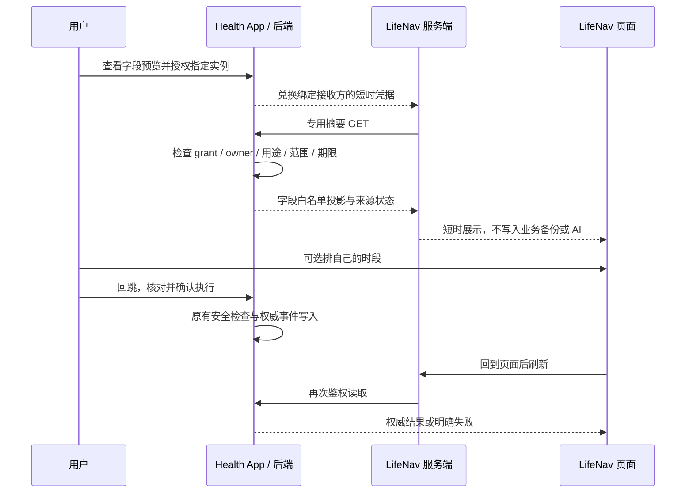

# LifeNav 与 Reva / Health 整合计划

本文供另一台电脑上的 Codex 接续开发。当前交付仅为规划，提交到 main 不代表产品方案已批准、业务已实现或真实数据共享已授权。实施、生产数据接入和发布仍各自遵循用户授权及仓库 Gate。

## 1. 建议与选择

建议保持 LifeNav 独立，Health 继续负责健康事实、健康行动、安全判断、执行事件和效果复盘。先在 Health 内补齐可复用的周导航摘要，再让 LifeNav 通过可撤销授权读取这个摘要。LifeNav 负责人生方向、时间分配和综合复盘，只保存健康行动的引用与自己的时间安排。

这项整合首先要消除重复录入，而不是增加一套健康任务。首期用户可以在 LifeNav 看到今日健康行动与 7 天摘要，选择自己的空闲时段；完成、跳过和健康目标调整仍回到 Health。健康安全限制不能被生活效率目标覆盖。

| 方案 | 能解决的问题 | 代价与边界 | 裁决建议 |
|---|---|---|---|
| A. 独立 LifeNav 连接 Health | 用户继续使用既有的人生战略、机会地图和周复盘；健康事实只记一次 | 要验证 LifeNav 服务端身份、隔离、数据用途、连接授权和回跳；临时隧道不适合作为稳定接收方身份 | 适合作为整合终点；先完成 Health 摘要及接入门槛，再启用真实共享 |
| B. 把必要周导航能力融入 Health | 在现有 Chat / Today / 我的进展中查看本周健康行动、执行障碍与下周调整，无外部传输 | 只承接健康周导航；若复制愿景、事业、投资、人生周历，会偏离 Personal Health OS 且增加录入负担 | 作为第一阶段可独立交付的能力；复用现有页面，不新增人生管理首页 |

推荐顺序为 B 的最小健康切片，再接 A。两者共用一个 Health 投影服务与语义契约，不能生成两套计划或两种完成率。如果 LifeNav 接收端尚不可核验，Health 内部切片和合成数据适配仍可继续，外部真实共享保持关闭。

## 2. 问题与证据边界

### 2.1 本次核验范围

- 2026-10-09 Asia/Taipei 重新执行 `git fetch origin main`，分析基线为 `0022cdb0c2376ecd49daab219721901b34c814a2`。共享目录 HEAD 为 `05b6e4d396084103975c43e4a5fc4d044d8e66da`，有大量其他任务改动，全部排除在分析和提交之外。
- 从远端提交导出快照，阅读源码与邻近测试；提交在独立干净副本的 main 上进行，不更新原共享目录的 HEAD、索引或已有文件。
- Router 采用 `analysis`，无 primary controller；实际 CLI 为 `recommend --mode analysis --overlay safety`，映射到 `safety-gate`。跨组件分析按需读取 System Map，再回到源码。注册表接受的是 `safety` trigger，直接传 `safety-gate` 会报 `unknown_overlay`。
- 已查看开放 PR，相关在途工作包括 [Today 动态行动 #225](https://github.com/itsoso/health-llm-driven/pull/225)、[因果表述 #221](https://github.com/itsoso/health-llm-driven/pull/221) 与[发布流程 #252](https://github.com/itsoso/health-llm-driven/pull/252)。这些不是已合入能力；开发前重新核对。共享目录中的 API-key 治理 WIP 也不是本计划依赖。
- 基线 [CI 运行](https://github.com/itsoso/health-llm-driven/actions/runs/37938611767) 查询结果为 completed/success。本文只确认这一提交的 CI 状态；未运行本地业务测试，未验证线上 Health revision、接口、模拟器或设备行为。

### 2.2 LifeNav 的已见行为与未知项

本次浏览器可打开 [LifeNav 站点](https://throws-heater-beauty-even.trycloudflare.com/)，核对了今日与设置页。今日有 1 主 2 辅、完成标准、预计/实际分钟、时段、执行状态、事件/错误/差距、习惯及状态记录；睡眠、体重和精力都存在重复录入入口。精力与满意度采用 0–100 刻度，默认分值需要确认，不应被当作已记录观测。

前一聊天的只读观察还包括：周末复盘按已有日记录生成草案、本人确认归档；当时本周为 0/7 天，生成按钮禁用，未验证生成结果。季度战略会目前主要为自由填写框。一生页包含愿景、价值观、梦想、多阶段目标及人生周历。外部机会地图已经有来源、证据、关键假设、小步验证、投入上限、继续/调整/停止标准和实际结果，不能再列为缺失能力。

设置页声称业务数据统一保存在运行 LifeNav 的 Mac，浏览器不保存业务记录，多端共享工作区，并提示避免同时编辑同一字段。这属于 UI 声明，未证明磁盘落盘、鉴权、租户隔离、并发控制或实际备份范围。该实例与曹宇原版或派生版的具体归属、源码授权和维护方仍未确认。

设置页存在 `LifeNav-空白工具.zip` 下载入口，本次只读请求返回 HTTP 404，未取得或执行源码；提示词未下载、未执行。没有导出业务备份，没有填写健康数据。接入点目前只能制定逻辑契约，不能声称已确认 LifeNav 源码文件、API 或存储实现。

### 2.3 Health 现有能力、复用点与缺口

下表“已实现”仅指上述基线中存在源码与测试证据，全部尚未做本次部署核验。文件行号绑定该 SHA，后续代码变化应重新核对。

| 能力 | 源码证据 | 整合判断 |
|---|---|---|
| Twin 语义对象与来源 | [twin API](../../backend/app/api/twin.py) 23–39；[Twin schema](../../backend/app/twin/schema.py) 20–34、472–482 | 已实现完整 Twin 输出，内容远超需要；禁止全量传出后由 LifeNav 删字段。分区失败要保留为 unavailable |
| 每日行动与安全处理 | [daily_plan API](../../backend/app/api/daily_plan.py) 174–181；[daily_operating_plan](../../backend/app/services/daily_operating_plan.py) 504–505、713–749 | 已实现，但 GET 会生成/更新计划并提交，还会归档卡片及写 advice ledger。不能直接作为无业务副作用读取 |
| 行动身份与执行事件 | [daily_plan API](../../backend/app/api/daily_plan.py) 118–170、196–323；[计划模型](../../backend/app/models/daily_operating_plan.py) 17–36 | 语义 action_key 可跨天重复，计划 JSON 可覆盖且无 revision。旧 feedback 无请求幂等；events 有按用户/日期/行动/事件类型去重，但不校验 payload/version 冲突 |
| 7/30/90 天复盘 | [health_operating_review](../../backend/app/services/health_operating_review.py) 25–109、124–153 | 已实现事件与指标聚合。completion_rate 是完成事件/全部事件，不是计划任务完成率。首期不输出计划完成百分比 |
| 复盘时间窗与推断 | [review 服务](../../backend/app/services/health_operating_review.py) 37–44、70–95；[causal_memory](../../backend/app/services/causal_memory.py) 129–142 | 默认 date.today，HTTP 未开放 end_date；causal_memory 含窗口外背景。首期不外发这部分，也不宣称观察到的变化证明行动有效 |
| Program / Protocol | [health_program_service](../../backend/app/services/health_program_service.py) 40–50、64–108、129–138 | 已实现归属校验与健康项目关系。latest 是已有值，不保证实时测量。LifeNav 仅引用，不能另建同名健康计划真源 |
| API Key | [deps](../../backend/app/api/deps.py) 21、67–89、238–262；[key 模型](../../backend/app/models/user_api_key.py) 12–25 | 当前 read/write 以方法分类，不具备接收方/字段/用途的最小范围。需新增集成凭据与 grant，不能复用宽 read Key |
| 外部 WriteIntent | [write_intents API](../../backend/app/api/write_intents.py) 28–73、76–132；[服务](../../backend/app/services/write_intent_service.py) 1448–1454 | GET 列表可生成提议并触发自治执行。POST 仅限定外部动作，不是健康目标/计划写接口；manual_confirm 标签也不证明确认者与提议客户端分离 |
| 授权模式 | [ai_consent](../../backend/app/services/ai_consent.py) 173–258 | 可复用政策版本、接收方/用途披露、每次发送重查和撤回审计的模式；现有 AI 同意不等于授权 LifeNav 或其模型 |
| Mobile 日常与复盘入口 | [根路由](../../mobile/app/(tabs)/index.tsx) 12；[Chat](../../mobile/app/(tabs)/chat.tsx) 783；[我的进展](../../mobile/app/my-progress.tsx) 39–72；[Agenda](../../mobile/app/agenda.tsx) 164–280 | 已实现 Chat-first、Today、Agenda 与复盘。我的进展默认 30 天，未接外部 window 参数；应扩展原页面而非增加平行首页 |
| 行动回跳 | [daily artifact 详情](../../mobile/app/daily-artifact/[date].tsx) 33–59；[artifact 服务](../../backend/app/services/daily_artifact_service.py) 24–63；[App 配置](../../mobile/app.config.ts) 30–57 | 现有 artifact 只回读今日当前 top action；HTTPS 入口没有任意健康行动回跳。专用 opaque ref、登录恢复及过期处理待新增 |
| 月度记录与本地提醒 | [这一路](../../mobile/app/journey.tsx) 14、131；[月度 spec](../specs/active/2026-09-22-monthly-journey.md) 10–25；[TodayContent](../../mobile/components/home/TodayContent.tsx) 211；[行为提醒](../../mobile/services/behaviorLoopReminders.ts) 195 | 已有源记录引用、个人片段和本地提醒。复用已有记录，不另建日记；“Health 单一责任方”是整合边界，不代表 Health 内所有提醒已统一实现 |

邻近测试包括 [test_daily_plan_feedback.py](../../backend/tests/test_daily_plan_feedback.py)、[test_health_operating_review.py](../../backend/tests/test_health_operating_review.py)、[test_api_key_scope_enforcement.py](../../backend/tests/test_api_key_scope_enforcement.py)、[test_write_intents_api.py](../../backend/tests/test_write_intents_api.py)、[test_health_program.py](../../backend/tests/test_health_program.py)。例如反馈测试 373–401 明确覆盖 GET 后卡片归档，说明“GET 等于只读”并不成立。

已有 [Health Day v2 spec](../specs/active/2026-08-15-quiet-proactive-health-day.md) 仍有 draft/G2 blocked 标记，不能把其中统一版本与确认设计当作已交付依赖。第一阶段复用当前可验证服务；不顺带接管该大改。

## 3. 需求准入

按 [产品治理](../specs/reva-product-governance-spec.md) 与 [feature spec 模板](../specs/templates/feature-spec-template.md) 做规划准入。以下为待评审的产品裁决，不是实施或发布 GO。

```yaml
RequirementAdmission:
  request: 在 LifeNav 周导航中复用 Health 行动和健康周摘要，减少重复记录
  classification: product_change
  first_user_fit: 已使用 Health 且需要在生活时间中安排健康行动的高强度工作者
  core_loop_step: 议程呈现、执行回流、复盘
  first_class_objects: [HealthAgendaItem, LeverageAction, ExecutionEvent, HealthProgram, HealthTwin]
  target_surface: Health Mobile 现有入口及受控 LifeNav 外部展示
  source_of_truth: Health backend
  safety_level: privacy_sensitive
  prescription_or_causal_verdict: none
  autonomy_tier: none
  evidence_provenance: 带来源引用和观察窗口的 Health 最小投影
  claim_hedging: hedged
  verification_window: 首个完整 7 天使用周期
  success_metric: 无重复健康录入、无重复提醒、行动状态和来源可核对
  added_user_burden: 一次授权；平时零强制新增字段；可选一次排时段
  burden_justification: 只收能改变执行安排的信息；不要求补齐 LifeNav 模板
  non_goals: 人生战略迁入 Health、健康原始数据导出、自动改计划、自动新增提醒
  smallest_end_to_end_slice: 摘要展示、返回 Health 确认行动、刷新同一行动状态、查看 7 天摘要
  stale_surface_to_remove_or_archive: 连接范围内重复健康填写入口改为 Health 引用，历史保留
  spec_required: yes
```

## 4. 范围与对象归属

| 对象 | 主记录与写入方 | 对侧可以做什么 |
|---|---|---|
| 人生愿景、价值观、事业/家庭/投资目标、机会验证卡 | LifeNav | Health 首期不摄入 |
| 生活时间块、可用时段、出差约束 | LifeNav | 首期只本地排期；后续由本人选择最小约束提议给 Health |
| HealthProblem / Program / Protocol / InterventionCycle | Health | LifeNav 仅保存 opaque 引用；简短标题在有效授权下动态展示，不进入本地存储、历史归档或备份；不复制诊断、处方、剂量和目标编辑权 |
| HealthAgendaItem / LeverageAction | Health | LifeNav 展示、收藏为引用、安排自己的时间块；不改变安全级别、排序真源、截止要求或动作强度 |
| ExecutionEvent、完成与跳过、设备观察 | Health | LifeNav 只显示 Health 回执；本地计时结束或勾选不能变成完成事件 |
| 睡眠、体重及其他健康观测、来源裁决 | Health | 选择授权后显示摘要；已有 LifeNav 同类历史不自动写入 Health，不自动去重合并 |
| 主观精力与满意度 | 保留原记录来源与刻度 | LifeNav 评分独立；首期不回流。不能把未确认默认值、0–100 自评分或设备恢复分数互相等同 |
| 健康周复盘与证据 | Health | LifeNav 引用摘要；人生综合复盘仍由本人在 LifeNav 确认 |
| 授权、访问审计、集成凭据 | Health；LifeNav 管理自身会话 | LifeNav 能申请连接/断开，不能自授范围或假冒本人确认 |
| 健康提醒与通知 | Health | LifeNav 首期不复制健康提醒、到点通知或安全通知；生活时间块可显示但不能额外推送同一健康动作 |

首期不传完整 Twin、医学原文、药物/补剂名及剂量、化验/基因/CGM 原始数据、家庭成员数据、自由日记或 Health 对话。也不扩建 LifeNav 已有机会地图，或把 10 个事件/3 个错误等模板配额移入 Health。

## 5. 最小第一阶段用户动线

1. 用户在 Health 的连接设置里查看准确的 LifeNav 实例、接收方、用途、字段预览和期限，主动开启。默认不开启任何外部共享；没有可核验接收方时只展示合成示例。
2. LifeNav 今日页出现一张“来自 Health”的引用卡，显示当前安全可分享行动、更新时间和状态。普通行动以 Health 当前排序显示；安全限制独立可见，不受 1 主 2 辅名额限制。不能用排序 P0 直接推断医疗紧急等级。
3. 仅对 Health 明确标记 `scheduling_mode=flexible` 的行动，用户可选一个 LifeNav 时段。固定时点、医疗约束或约束未知的项为 `view_only`，只能回 Health 处理。时间块只记 `action_ref` 和自己的安排，标明“已安排，尚未记录执行”。不要求再填完成标准、实际分钟、根因和健康数值。
4. 点“到 Health 处理”进入已登录的行动详情。用户在那里完成、跳过或稍后；跨端回来时重新取摘要，依据权威执行回执显示结果。回跳失败则显示 Health 入口和明确错误，不能本地乐观显示已完成。
5. 周末显示截至当前用户本地日的滚动 7 天健康摘要，标明起止日期、含当日、有效记录覆盖和缺失。首期不能任意选择历史截止日。可作为 LifeNav 复盘的只读引用，允许本人隐藏该模块；不自动写进归档、AI 提示词或自由文本笔记。没有 LifeNav 日记不应阻断独立 Health 摘要查看，也不伪造 0/7 变成完整记录。

Health 内部切片通过现有 Chat/Today 进入 7 天复盘，复用 `/my-progress` 的内容。首期不增加一级入口；Watch、Mac 继续现有执行职责，不分别开发 LifeNav 页面。

### 5.1 合并重复输入与提醒

| 当前重复项 | 连接后的行为 | 历史与断开处理 |
|---|---|---|
| 两侧睡眠、体重填写/导入 | 选中共享的指标在 LifeNav 改为来源明确的只读摘要；更正返回 Health | 保留 LifeNav 原历史与来源，不后台导入 Health；断开后用户可手动恢复本地录入 |
| 早睡、运动、饮食等同名习惯打卡 | 只有完成定义、来源和映射经确认一致才改为 Health 引用；不同含义保持独立且不混算 | 不因同名自动合并，不以设备睡眠存在证明睡前习惯完成 |
| 行动完成与失败原因 | 一次写入 Health，LifeNav 展示摘要或泛化原因类别 | 缺失仍为未记录，跳过不是失败诊断；不要求写六层根因 |
| 健康重复提醒 | Health 单一出口；LifeNav 引用项不再生成健康提醒 | 只在试点验证映射后关闭对应重复提醒，不影响其他人生安排 |
| 每周健康复盘复制粘贴 | 显示动态 Health 引用与截至时间，详情返回 Health | 归档/AI 使用不是首期默认；不能把旧缓存当新复盘 |

低录入负担是验收约束：接入后每日强制新增字段为零；同一健康行为只确认一次；排时段为可选操作。试点记录额外点击与录入耗时的匿名汇总，用同一批用户接入前后的真实流程比较。连续一个完整周仍增加重复录入或提醒就缩减/停止该切片，不以打开次数和打卡连续天数证明价值。

## 6. 最小数据契约

以下名称均为拟新增契约，不代表当前 API 已存在。建议新增 `GET /api/v1/integrations/lifenav/summary`，只允许 `lifenav.summary.read` 专用能力；日期和字段必须受 grant 约束，不接受任意 `user_id`。内部 Health 页面复用同一投影服务，以本人登录获取其允许视图。

首期默认只共享普通行动的泛化摘要和记录覆盖；睡眠/体重是逐项选择项，默认不含数值。外部分享范围越小越好；没有用途或来源的字段不输出。

### 6.1 授权记录，仅在 Health 服务端

| 字段 | 类型及用途 |
|---|---|
| `grant_id`, `owner_user_id`, `client_id`, `recipient_instance_id` | 服务端绑定身份与接收实例；外部不能自行指定 owner，内部用户 ID 不外发 |
| `policy_version`, `purpose`, `scopes`, `allowed_fields` | 固定为周导航展示目的；字段白名单分别控制行动、记录覆盖和选中指标；不含提议、确认或通用 read/write |
| `allowed_window_days`, `granted_at`, `expires_at`, `revoked_at` | 首期最多当前日行动和一个 7 天摘要窗口；建议试点授权 7 天后到期，由本人续期，不自动扩大 |
| `window_policy`, `allowed_date_start`, `allowed_date_end` | 首期为 `current_local_day_trailing_7`；服务端从当前用户时区计算唯一窗口，再校验授权日期上下界。授权预览披露有效期内持续展示的日期范围，不能通过轮换 end_date 扫描历史；历史固定窗口必须另行授权 |
| `allowed_origin`, `redirect_uri`, `credential_version` | 精确匹配已验证接收方和回调；TLS；轮换撤销旧凭据；拒绝任意重定向 |
| `retention_policy`, `ai_use_allowed`, `export_allowed` | 首期无持久化摘要，后两者固定 false。后续用途变化重新披露、重新授权 |

不能只在当前 `read,write` 枚举里加一个字符串就宣告完成。集成凭据必须走独立验证或严格 audience 分流，禁止降级到通用 Key/JWT 路径，且访问旧 Twin、WriteIntent、健康数据等路由全部拒绝。

### 6.2 响应信封

| 字段 | 类型/语义 |
|---|---|
| `schema_version` | 固定 `health_week_navigation.v1`；不兼容版本明确拒绝 |
| `snapshot_id`, `projection_revision`, `projection_sequence` | 不透明引用、确定性内容版本及同一授权视图内单调递增的源投影序号；源内容不变时版本/序号一致，`generated_at` 不参与版本变化。序号只用于丢弃迟到旧响应，不能比较不同 grant |
| `generated_at`, `source_as_of`, `expires_at` | RFC3339 UTC，分别表示响应生成、实际源证据截至、投影可展示期限；不能相互替代 |
| `timezone`, `timezone_source` | Health 解析的 IANA 用户时区及 manual/detected/profile/default 来源；不能使用服务器 OS 日期推断 |
| `local_date`, `review_window` | 后者含 `start_date`, `end_date`, `days=7`, `includes_today`, `kind=rolling`；窗口范围明确 |
| `availability`, `sections` | 顶层 ready/partial/not_generated/unavailable；各部分独立状态，未授权字段直接省略，不暴露其是否存在 |
| `restrictions` | 仅传可分享的 `check_in_health` 等代码与泛化提示，不能从不存在 restrictions 推断健康正常 |

### 6.3 今日行动

| 字段 | 类型/语义 |
|---|---|
| `action_ref`, `action_revision` | 对该接收方稳定的不透明引用，服务端映射 owner + 来源类型 + 原行动标识 + 本地日期/发生次序；版本含行动内容、执行状态和安全约束变更 |
| `program_ref` | 可选，不透明引用；不暴露病名或长期指标目标 |
| `share_title`, `share_completion_criterion` | Health 构造的可分享泛化文本，不直接复制原始标题/剂量/自由文本。不能安全投影时只显示“到 Health 查看待处理事项” |
| `rank`, `safety_state`, `requires_health_review` | 排序与安全语义分开。安全值只表达 allowed/restricted/unknown 的已知边界，不输出临床诊断；restricted/unknown 禁止外部当作行动许可 |
| `estimated_minutes`, `suggested_window` | 可空；没有原始值不编造。LifeNav 本地时段不得反写为 Health 临床时间要求 |
| `scheduling_mode`, `fixed_time_constraint` | `flexible` 只用于 Health 已确认可自由安排的普通行动；固定时点或不能可靠分类的项为 `view_only`，约束明细留在 Health。缺字段默认 view_only，不从空 suggested_window 推断可随意排期 |
| `execution_status`, `status_source`, `status_observed_at` | pending/completed/skipped/deferred/withdrawn/unknown；需确定映射，auto_observed 与本人 confirmed 来源分开；当前列表消失不代表完成 |
| `verification` | 可选 `window_days`, `review_due_date`, `state` 泛化说明，不外发医学目标数值 |
| `detail_ref` | 仅为回跳引用；不得带 Bearer、完整 JSON、标题或健康数值到 URL |

首期不向 LifeNav 提供提交完成事件的接口。LifeNav 可以保存 `local_schedule_id, action_ref, action_revision_at_scheduling, local_start, local_end, timezone`，其中不包含 Health 原始内容。本地状态应命名为 planned 等安排状态，不能复用 Health 的 completed。

### 6.4 7 天摘要与可选指标

| 字段 | 类型/语义 |
|---|---|
| `review_ref`, `review_revision` | 绑定真实时间窗、时区、源数据版本和授权白名单 |
| `recorded_days`, `window_days`, `coverage_status` | 说明覆盖的是何种执行记录或指标，不把有记录天数当作有计划/已完成天数 |
| `completed_occurrences`, `skipped_occurrences`, `deferred_occurrences` | 对唯一行动发生次序归并后的权威状态计数；只计能映射的事件，无法映射的另列 unknown，不把多次反馈重复相加 |
| `planned_occurrences`, `completion_rate` | 首期固定不提供，直到稳定计划清单和分母定义落地；禁止照搬现有事件比率 |
| `obstacle_categories` | 可选，来源为本人已记录的类别汇总；不传根因原文，不推断人格或诊断 |
| `metrics[]` | 仅逐项授权后的 sleep_duration / weight 等最小白名单；首期按需裁剪，非必选 |
| 指标内 `metric_code, value, unit, scale, observed_at, source_ref, source_kind` | 保留来源、单位和刻度；主观评分另有 confirmed 标志，不默默换算 0–100 与 0–10 |
| 指标内 `sample_count, window, freshness, missing_reason, display_value` | freshness 为 fresh/stale/missing/unknown/unavailable；值可空；display_value 统一使用 Health 数字格式化函数 |
| `claim_boundary`, `detail_ref` | 固定说明“记录摘要/时序观察，不证明因果”，详情回到 Health |

初期不导出 `causal_memory`、完整预测时间轴、医学推断或全量历史。用户界面读数最多两位小数并去尾零，复用 `format_display_number` / `format_card_numbers`；原始存储和安全阈值精度不变。

## 7. 数据流、用户授权与写入确认



### 7.1 第一阶段安全要求

- 凭据只留 LifeNav 服务端的安全凭据存储，不放浏览器、日志、URL、源码包或备份。授权兑换采用一次性 code、state 和固定回调；code 短时有效并绑定发起会话。具体协议实现须先有威胁模型和测试。
- 每次请求检查接收实例、当前账户、grant、scope、字段和到期/撤销状态，派生 owner 并绑定租户。拒绝家庭代理和代管授权隐式扩大。任何授权检查不可用均返回明确失败。
- 摘要 GET 只查询既有状态，不调用 `build_daily_operating_plan`、WriteIntent 生成器、LLM、提醒调度或外部执行。业务读取事务设置只读；必要访问审计单独记录授权 ID、字段类别、结果、时间和 request ID，不记健康正文。
- Health 自有生成/写入流程负责物化行动发生次序、版本和安全快照。没有可用快照就返回 `not_generated`；不借外部读取启动业务生成，不把当前 Twin 重算出的旧日期计划冒充历史快照。
- 专用响应默认 `Cache-Control: private, no-store`，首期 LifeNav 不做磁盘/浏览器持久化。页面内存显示建议最多 5 分钟，离开/登出清除；这是展示缓存上限，不是医学新鲜度标准。每次回到页面重新取数，授权检查不能因缓存绕过。
- 摘要不能进入 LifeNav 全文日志、备份、导出、全文索引、AI 战略伙伴或提示词。接收端必须验证上述用途限制，而非仅在 UI 写承诺。无法隔离的站点只能接合成数据。
- 链接回 Health 需本人重新鉴权，opaque ref 只定位对象，不授予读取权。服务端再次校验 owner 和可见性；固定 Health 域名/路由、防开放重定向、登录恢复后重新取状态。链接被转发或失效不泄露内容。
- 健康通知首期仍只由 Health 发出；若后续增加出口，必须复用 `push_privacy.llm_push_backstop` 等既有隐私处理，并有敏感/良性文案正反测试。

### 7.2 后续约束与健康提议

后续可先支持本人选择的空闲分钟、可用时段、旅行时区、场地限制，不传完整日历标题、联系人或人生笔记。LifeNav 提议是外部输入，不是可信指令；只解析有类型白名单字段，并限制长度、时间窗与来源。

拟新增 `health_schedule_change` / `health_goal_adjustment` 类型必须有 schema、安全校验、有效期、预期版本和执行适配器。可复用 WriteIntent 的 owner 查询、状态机和原子认领思想，但不能直接复用现有外部 POST。当前外部 kind 是 alarm_set、food_order、doctor_booking、environment_actuation，且“executed”不统一等于真实外部设备或订单成功。

将来 LifeNav 只能 propose，不能 confirm。本人在 Health 看到冻结的具体差异、来源、影响和安全限制后确认；确认端必须拒绝集成凭据，核验本人会话、CSRF/来源、展示凭证、原对象版本及最新安全条件。失败、过期或源对象变化都返回冲突并重新核对；禁止直接调整药量、处方或绕过临床边界。

## 8. 时间、新鲜度、缺失与同步语义

| 问题 | 约定 |
|---|---|
| 今天归属 | 用 Health 用户时区与现有解析工具，响应必须给出时区来源；未知/回退显式标记。本文讨论日期用 Asia/Taipei，不能据此改动用户资料 |
| 7 天 vs 本周 | 首期只提供截至当前用户本地日、含当日的滚动 7 天；所有请求 start/end 必须符合 grant 的窗口政策与日期范围。LifeNav 周一至周日另有周期标识，不能把两者同名混算；未来历史窗口/自然周需明确 start/end 并另行授权 |
| 跨午夜、旅行、夏令时 | 存 UTC 观察时刻及当时采用的时区/本地日期；旅行不重写历史发生日期。测试跨午夜、DST、手动锁定与默认回退 |
| 睡眠归日 | 保留睡眠区间与 wake_date 语义；缺少定义时标 unknown，不因上传日期改变前一晚归属 |
| 新鲜度 | `generated_at` 是生成时间，`observed_at/source_as_of` 才是证据时间；各指标依据来源采集节律判断，不能统一用页面刷新时间。失效安全状态不显示为允许 |
| 空值与错误 | missing=未记录，unknown=无法确定，unavailable=查询/计算失败，stale=已有旧记录；未授权字段省略。不得用 0、未完成或健康正常填空 |
| 未生成与无行动 | not_generated 与已生成但无可分享行动区分；敏感行动被隐藏时只给泛化返回 Health 提示，不暴露类别计数 |
| 结果一致性 | 同一响应使用一致源版本与授权视图；旧版本响应晚到不能覆盖新版本。原对象撤回/被替代标 withdrawn/stale_reference，不能因为卡片消失推断完成 |

首期不进行双向同步，但要把以后可能用到的边界定清楚：

- 幂等读取：在源内容不变时返回相同 projection_revision；不产生业务写。LifeNav 排期以本地 schedule ID 唯一关联 action_ref，同步失败不复制新健康任务。
- 后续写入幂等：服务端唯一键至少为 `(grant_id, operation_id)`，保存 payload hash 和结果回执；同键同内容返回同结果，同键异内容返回 409。另设同一行动状态转换约束，不能只靠客户端重试或当前 pending 查询去重。
- 乐观并发：请求带 `expected_revision`，确认时事务内比较；版本不一致返回明确 diff/409，不采用“最后写入覆盖”。撤权与确认并发需串行裁决，撤权后未提交提议不得执行。
- 撤销排期：只删除/撤回 LifeNav 自己的时间引用，不影响 Health 行动和完成事实。
- 撤销授权：Health 立即拒绝后续请求并废止未用兑换凭据；在线页面清除内存，离线最多展示到已下发 expires_at，然后清除。不能声称撤权已经追回对方曾读取、截屏或违规复制的数据。
- 撤销已执行写入：不是 dismiss。后续通过新的更正/补偿提议与本人确认记录原事件引用，保留审计；临床事实和已执行事件不得静默删除。
- 失败恢复：401/403 不自动换宽权限，409 不自动覆盖，429/5xx 受限退避；超时显示未知结果，使用同一个 operation_id 查询/重试，不伪装成功。首期无需跨系统写入重放队列。

## 9. 工作包与依赖

以下为开发顺序，不作工期承诺。每个工作包都要先有能失败的行为测试，再实现；schema 变化另外选择 `database` trigger，对应 `add-managed-migration` overlay。建议后续实现按 `implementation --overlay safety` 重新路由，不能从本规划直接推定发布授权。

W1 实现前先完成局部 feature spec/阶段设计评审，明确发生次序、版本、物化与安全分类的责任方。优先复用届时已合入的快照 owner；若尚无可复用真源，只新增范围受限的源引用索引和只读投影，不复制一套计划写入引擎。本文不能绕过 Health Day 的未决设计，也不因未启动完整流水线而省略局部准入。

| 工作包 | 依赖与内容 | 文件/接口落点 | 完成证据与回退 |
|---|---|---|---|
| W0 基线与接收端核验 | 重新 fetch；核对相关 PR/Health Day/API-key 已合入情况；取得可审源码、维护归属与稳定 LifeNav 实例；核验登录、用户隔离、磁盘、备份、AI 数据流 | 本文；LifeNav 源码具体路径待取得后补充，不能凭 UI 命名 | 形成接入核验记录；未知项不阻断 Health 内部工作，但阻断真实外发 |
| W1 Health 周摘要与行为语义 | 固定时间窗、唯一行动发生次序、状态归并、源版本、新鲜度；从自有写路径物化，GET 不生成；先完成合成样本 | 拟新增 `backend/app/schemas/health_week_navigation.py`、`services/health_week_navigation.py`；复用/拆分 `daily_operating_plan.py`、`health_operating_review.py`、`utils/timezone.py`；必要模型及 managed migration | 只读事务、重复事件、跨天同键、缺失/失败/旧数据测试；无稳定分母时不显示完成率。关闭新投影 flag，原流程继续 |
| W2 Health 内部最小体验 | 依赖 W1；Chat/Today 到 7 天复盘；复用既有页面，来源与未知可见；不复制人生功能 | `mobile/app/(tabs)/chat.tsx`、`mobile/app/(tabs)/today.tsx`、`mobile/app/my-progress.tsx`、现有服务客户端和邻近测试 | 模拟器合成账号验证一次确认后刷新、7天窗口、无额外必填；flag 关闭回原页面 |
| W3 专用授权与外部读取 | 依赖 W1；独立 grant、audience、字段范围、期限、撤销、日志；禁止旧路由权限 | 拟新增 `api/integration_lifenav.py`、`services/integration_grant_service.py`、grant 模型/schema/migration；`api/deps.py` 与 `api/main.py` 注册、授权设置 UI | 跨用户/家庭代理/过期/撤销/旧 API 路由拒绝；PostgreSQL 隔离与并发；关闭外部路由和撤权，保留 Health 内部摘要 |
| W4 安全回跳与状态刷新 | 依赖 W1/W2；稳定 ref resolver、本人登录恢复、过期/删除/历史处理；不要用当前 top-action 专用 artifact 代替所有详情 | 拟新增受控回跳与 resolver；`mobile/app.config.ts`、`mobile/app/`、`mobile/services/`；若需要 HTTPS universal link，评估原生配置与发布边界 | 转发链接不给他人读；URL无健康正文/令牌；模拟器验证登录/已登录/旧 ref；回退提供 Health 明确入口，不假装精准跳达 |
| W5 LifeNav 只读连接器 | 依赖 W0/W3/W4；服务端取摘要、内存展示、安排引用、回来刷新、按映射合并重复输入；不进入 AI/备份 | LifeNav 源码核验后填实际文件；消费 v1 DTO；不在 Health 仓库编造外部实现 | 合成双账户端到端 + 数据流检查；通过前不授权真实资料。开关关闭清缓存与停读取，保留人生数据及排期引用 |
| W6 有界使用验证 | 依赖 W2–W5 的相关检查通过、用户另行授权指定数据与接收方；以一个完整 7 天周期评价负担和一致性 | 模拟器为 Health 默认验收环境；LifeNav 浏览器；脱敏汇总记录，不保存健康正文到仓库 | 无重复录入/提醒、状态可核对、撤权生效、故障不误报；不达标关闭外部连接，不影响既有 Health 行动 |
| W7 可选约束/提议 | W6 证明值得继续后再评审；只做最小约束，再扩健康提议与本人确认，不一次打开全面双向同步 | `write_intents.py`、`write_intent_service.py`、typed schema、授权分权、版本/补偿事件与客户端类型 | 独立提议/确认权限、幂等并发、撤权竞态、安全重验和补偿测试；暂停新提议、不重放失败写，保留原健康事实 |

W2 与 W3 可在 W1 稳定后并行；W4 的接口设计可同步开始，但完整回跳验收依赖 W2。LifeNav 源码未取得时优先做 W1/W2 和 W3 的合成契约验证，不让临时隧道阻塞所有开发。新 API/模型/路由若落地，需同步两侧类型、System Map 生成物和契约文档。

## 10. 安全与 AI 行为

首期摘要采用确定性投影，不新增 LLM 调用。LifeNav 的 AI 战略伙伴不得默认读取接入摘要。若以后开放 AI 综合复盘，必须重新确认具体模型接收方、数据类型、用途与保留政策；授权失败时停止发送。

模型只能起草待核对的总结或提议，必须展示来源时间窗、缺失和证据边界。模型不能证明执行、改安全状态、采纳目标、确认 WriteIntent、制造健康因果结论或把 LifeNav 文本当成系统指令。

## 11. 验收标准

以下是未来实现验收，不是本次通过项。

| 编号 | Given / When / Then |
|---|---|
| A1 业务只读 | 已有摘要与未生成摘要分别在 PostgreSQL 只读业务事务调用 GET，业务表均不变；缺快照返回 not_generated；不触发计划、卡片归档、LLM、提醒或 WriteIntent |
| A2 最小权限 | 授权只含行动；请求或伪造指标/他人 ID/家庭数据均不泄露；同一凭据访问 Twin、通用 read API、提议和确认路由均被拒绝；轮换 end_date、越界 start/end 或超出授权窗口政策的读取拒绝 |
| A3 撤权与接收方 | 已连接会话在到期、撤权、账户禁用、policy/audience 不匹配后读取失败；离线显示到期清除；日志不含正文和凭据 |
| A4 单一执行事实 | 同行动在 LifeNav 排期或计时结束，Health 无完成事件；在 Health 确认后刷新才显示 completed；重复刷新不新增任务/提醒 |
| A5 分母与发生次序 | 同日同键多事件与跨日同键样本正确归并；零事件显示未记录；不输出伪计划完成率；未来若引入分母，覆盖计划取消/新增/变更版本 |
| A6 时间与数据质量 | 用户午夜、服务器 UTC、DST、旅行、前晚睡眠，归日正确；缺失/失败/过期区别显示；新响应时间不掩盖旧观测 |
| A7 安全优先 | Health 限制/未知状态出现时 LifeNav 保留泛化返回提示，不因 1主2辅、已排时段或模型建议恢复许可；排序 P0 不直接映射医疗紧急；固定/未知时点为 view_only，不允许 LifeNav 自行重排 |
| A8 回跳 | 已登录、重新登录、他人账号、过期或删除引用分别得到正确结果；URL/Referer/日志无健康正文和 Token；返回后权威状态重读 |
| A9 不越用途 | 合成标记数据出现在允许展示位置，未进入 LifeNav AI 请求、日志、导出、备份、索引或浏览器持久化；必须检查实际流量/存储 |
| A10 低负担 | 接入用户每日无强制新增字段；原有相关录入只保留一个真源；一个完整周的录入/提醒负担不增加，否则回退 |
| A11 后续写安全 | 相同 operation_id 重试只执行一次，内容不同返回409；过期 revision、撤权竞态、安全变化不能写入；集成凭据无法 confirm；已执行撤销走补偿事件 |

## 12. 验证计划与本次验证边界

本次实际工作是源码/测试阅读、浏览器只读核对、规划审查和文档检查。没有运行 Health 业务测试、没有发送真实健康资料、没有验证 LifeNav 源码或线上接口，也没有取得业务安全/发布 Gate 结论。

文档提交检查：`git diff --check`、`python3.12 backend/scripts/check_dossier_consistency.py`、文内路径存在性、`python3.12 scripts/check_secret_leaks.py`、仓库适用 pre-commit。新增文档不改变架构结构，因此本次不重生成 System Map；CI 按仓库规则自行检查。

2026-10-09 本次本地结果：暂存 diff 格式检查、文内路径检查、dossier 一致性、agent-skill governance、秘密扫描和适用 pre-commit 均通过。独立安全规划审查及产品/接手审查在修订后无剩余必须修复项，规划裁决为 GO。该裁决仅说明本文可提交供评审，不代表 W0–W7 已完成或任何真实共享/发布 Gate 通过。

实现时在干净、最新基线和专用测试环境运行如下既有回归，新增行为测试文件在 W1/W3/W4/W5/W7 按职责建立，不能只测序列化实现细节：

```bash
cd backend
python3.12 -m pytest tests/test_daily_plan_feedback.py tests/test_health_operating_review.py tests/test_daily_operating_plan_arbitration.py tests/test_health_program.py tests/test_api_key_scope_enforcement.py tests/test_write_intents_api.py tests/test_external_action_intents.py
```

上述测试的默认 SQLite 路径只证明单元行为。隔离、唯一约束、并发确认/撤权、时区、JSON 与事务只读必须另用隔离的 PostgreSQL 测试库验证；不得使用生产库，按照 `backend/tests/conftest.py` 和项目 PostgreSQL CI 环境要求设置，再执行同类测试与新增并发场景。

Mobile 要运行受影响服务/组件和回跳测试、类型检查；API DTO 在两侧同批验证。模拟器覆盖 Health 动线，LifeNav 使用合成账号做浏览器端到端和网络/存储检查。涉及 native link 配置时不能按纯 JS OTA 处理。

进入发布前另跑项目 CI-mode 集成闸，核对目标 revision 的真实 CI，再按最新发布治理执行。文档提交 CI 通过、接口 200 或截图均不等于真实共享与安全验证通过。

## 13. 发布与回退设计

实现后分开控制 Health 内部摘要、外部读取、LifeNav 展示和未来提议能力，默认外部开关关闭。先合成数据双账户验证，再在接收方核验和具体数据授权完成后做限定用户试点。

关闭外部读取不停止 Health 既有安全提醒和健康行动。撤销 grant、停取摘要、清除可清缓存，LifeNav 保留用户人生记录及不含健康正文的本地时间引用并标断开；不删除 Health 事实。对 LifeNav 曾接收数据的保留/清除范围如不能验证，应明确说明，不能宣称远程全量收回。

如需新增 grant、发生次序/版本映射等表，采用向后兼容迁移，配套 PostgreSQL 验证、停用路径和数据保留/删除策略；回滚应用时不丢失审计或把旧客户端的语义当成新契约。对已应用的未来提议只做经确认的补偿，不批量重放或抹除事件。

## 14. 待确认事项与接手起点

以下事项可以保留为评审选择，不应让下一位 Codex 重复大范围调研。

| 事项 | 推荐默认 | 阻断边界 |
|---|---|---|
| LifeNav 维护归属、源码及使用授权 | 先取得可读源码/稳定仓库和实例管理权证据，不把站点名称当归属 | 阻断 LifeNav 修改及真实共享；不阻断 Health 内部切片 |
| 第一阶段是否需要外部数值 | 先行动泛化摘要+记录覆盖；睡眠/体重逐项自选 | 启用真实数值分享前必须确认 |
| 周期口径 | 先滚动7天并显示起止日；不强行与自然周归档合并 | 口径写入 DTO 后才实现统计 |
| 是否保存健康摘要到 LifeNav 历史/AI | 首期否；只有引用和瞬时展示 | 后续用途须重新授权并验证落点 |
| 健康习惯映射和旧记录迁移 | 同名不自动合并；用户确认完成定义，历史保留原来源 | 启用对应重复入口合并前确认；迁移另立范围 |
| 主观精力来源和刻度 | 暂留 LifeNav，不回流；不要换算为设备恢复分 | 任何将来回流前确认 |

接手步骤：

1. 拉取远端 main，先读仓库 AGENTS、本文和相关当前 PR；核对本计划 SHA 之后受影响文件变化。脏目录只读对比或隔离，不能把未提交 API-key WIP 当依赖。
2. 用户授权开发后重新运行 Router `implementation --overlay safety`；如引入持久 schema，再加 `--overlay database`。不启动完整产品流水线，除非用户另行要求。
3. 先把本文的 W1 范围形成并评审局部 feature spec，裁决与 Health Day 的快照责任关系、有类型 DTO、动作发生次序和无业务副作用读取；通过后用合成样本写失败测试。同时推进 W0 的源码/实例核验。不要先给 LifeNav 创建宽 read Key。
4. 按 W1 → W2 / W3 → W4 → W5 → W6 的依赖推进，W4 设计可提前，整体验收在 W2 后；逐包留真实验证证据。W7 是后续候选，不能因“整合计划”一次性打开全部写权限。
5. 每次交付分别报告代码、测试、CI、部署与用户验收状态。本会话只负责规划提交；剩余开发、真实共享、部署和发布由后续会话按授权执行。

## 15. 变更记录

| 日期 | 内容 | 原因 |
|---|---|---|
| 2026-10-09 | 首版规划；绑定最新主干，核对 LifeNav UI，定义字段契约、权限、动线、分期与接手步骤 | 用户要求在 Health 中制定整合计划，并提交 main 供另一台电脑接续 |
