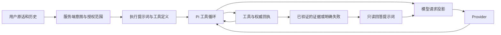

# 为什么健康对话输入仍然大

证据边界：2026-10-04 刷新 `origin/main=f201d85b4`，相对工作区起点仅有 voice 发布文档差异；本文分析实际执行源码与邻近测试。真实历史用量沿用 [最近三天审计](2026-10-04-prompt-token-audit.md)，不是新采集的线上 A/B。代码改动与本轮测量见 [Dossier](../dossiers/2026-10-04-prompt-architecture.md)。

## 固定提示词成本叠加多轮放大

输入消耗要按一次用户任务中所有模型调用求和：系统规则、用户证据、工具定义、历史与本轮工具结果会在后续轮次继续计入。缓存能降低一部分费用或 prefill，但不会消除无关信息，也不能用缓存命中代替任务正确性。

### 提示词尚未完全按职责分离

`AgentExecutor._build_system_prompt` 同时承担工具计划、记录示例、修改删除、提醒、媒体创作、医疗边界和最终回答。原 `static_rules_only=True` 只减少个人资料注入，仍保留工具操作手册。因此已经完成取数且工具关闭的饮食评价、跨领域只读回答仍承担执行阶段的固定输入。

本轮增加明确的 `synthesis_only` 阶段，仅从已有服务端控制的无工具回答入口选择。移除执行手册，保留临床来源、R4、基因警示、分诊与当前证据。失败读取也可能进入终态回答，所以明确禁止把失败、缺失或未知当成已核验事实。普通 Pi 循环不能仅凭“刚调用过工具”就进入这个阶段。

### 工具选择与工具内部说明是两层预算

上一轮已把工具子集真正接到 provider 请求。但留下的 `health_query` 本身仍包含所有维度的长说明，`health_record` 包含多种记录样例。本地紧凑 JSON 序列化的完整定义为 39,889 UTF-8 bytes；这个数是本轮静态测量，不是架构 roster 或 API token。

只移除 description 行首空白和重复空行可减少 970 bytes（2.43%），收益不足，未实施。后续应由服务端冻结的 read scope 选择固定的领域说明，同时保持参数、枚举、required、数值约束与网关校验一致。未知领域、混合写入和未解析追问保留完整说明；不能让模型自行声明权限，也不能直接重建全注册表绕过已有过滤。

### 历史消息条数不是 token 预算

`AgentConversationService.build_messages` 限制消息条数，不限制每条历史正文的长度。`history_compaction` 处理窗口外的旧消息，再把摘要加回；窗口内的长回答仍会重复发送。后台摘要的保留窗口与部分领域请求窗口也不一致，缓存摘要可能无法命中 exact-overflow 校验。

下一步需要有状态的历史投影：保留当前原话、明确引用的往轮、未完成任务、指代绑定、时间承诺、急症主诉和真实回执，再预算剩余叙事。摘要仍要标明来源和时间，不能变成当前事实、医嘱或新授权。直接取最后若干字符、只保留最近 assistant 或用新的摘要抹掉原始约束，都不满足这个边界。本轮没有改变历史内容。

### 深度分析存在重复合成

`orchestrator._synthesize` 接收 Twin、个人证据矩阵、知识库与专家 findings；结果回到 Agent 后，又可能以 synthesis/findings 摘要形式进入外层回答。现有 `orchestrator_synthesis_passthrough` 在当前 Pi 路径没有设置 `passthrough_taken=True` 的有效执行接线，打开配置不能证明省去一轮。

后续应建立同一份可引用的证据 packet：稳定 evidence ID、来源、观测时间、缺口和安全裁决。若所有用户子任务已完成且答案通过安全与输出契约，才可交付内层答案；若仍有写入、追问或复合任务，外层只处理剩余子任务。直接透传或把所有 findings 删除都可能漏任务。这是下一阶段优先于继续微调词句的改造。

### 传输与观测应集中在 provider 边界

本轮对合法工具 JSON 仅移除字符串外的空白。数字原始表示、重复键、字符串、字段顺序、调用 ID 和原始 Pi 回执均保留；非法/非 JSON 和多模态内容不改写。投影接在流式、非流式及直连网关的实际发送入口，失败回退复用同一投影，不新增模型调用。

预算日志将工具结果与普通对话内容分开，并补记此前未覆盖的 tool-call 参数开销；旧指标保持便于比较，新指标仍明确是字符近似而非实际 tokenizer 用量。`read_synthesis` 标记使最终回答阶段可单独关联 run_id 和请求序号。日志不记录正文。

## 验证和后续验收

本轮优先交付阶段分离、无损工具 JSON 投影和预算归因。它们不会消除首轮规划的全部固定成本，也不能解决任意长度的历史或跨层重复合成。

后续架构改动应在同一组受控真实任务上分别比较：首轮输入、回答轮输入、调用次数、任务总输入、缓存 token、失败/重试次数、完成率以及 P50/P95/P99。质量底线包括用户隔离、未完成意图不丢失、字段/单位/来源/缺口保留、急症与用药边界不下降、写入回执可核验。任一项退化都应停止推进；不能用小样本平均耗时或字符数代替线上长尾和实际成本。
